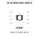
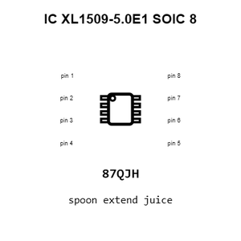
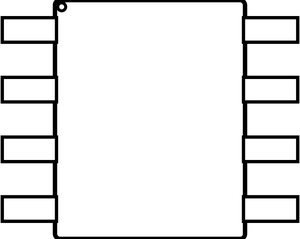
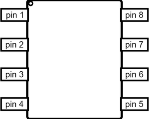
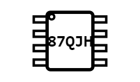
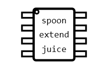
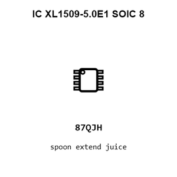
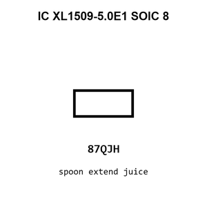
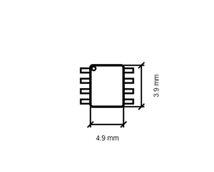

# IC XL1509-5.0E1 SOIC 8

`electronic_ic_soic_8_power_management_buck_converter_xlsemi_xl1509_5_0e1`

IC XL1509-5.0E1 SOIC 8 is an OOMP electronic ic definition. It uses the soic 8 package or form factor. Its nominal drawing size is 4.9 &#x00D7; 3.9 mm.

## At a glance

| Detail | Value |
| --- | --- |
| OOMP ID | `electronic_ic_soic_8_power_management_buck_converter_xlsemi_xl1509_5_0e1` |
| Type | Ic |
| Package / style | soic 8 |
| Nominal size | 4.9 &#x00D7; 3.9 mm |

## Classification

| Level | Value |
| --- | --- |
| 1 | `electronic` |
| 2 | `ic` |
| 3 | `soic_8` |
| 4 | `power_management` |
| 5 | `buck_converter` |
| 14 | `xlsemi` |
| 15 | `xl1509_5_0e1` |

## Nominal dimensions

| Measurement | Value |
| --- | ---: |
| Length | 4.9 mm |
| Width | 3.9 mm |

## Identifiers

| Identifier | Value |
| --- | --- |
| Manufacturer part number | `XL1509-5.0E1` |
| LCSC | [`C61063`](https://www.lcsc.com/product-detail/C61063.html) |
| JLCPCB | [`C61063`](https://jlcpcb.com/partdetail/XLSEMI-XL1509_50E1/C61063) |

## Files

[KiCad symbol, machine-solder and hand-solder footprints](data/kicad/README.md) · [Availability and source masters](data/kicad/manifest.yaml)

[View this part on GitHub](https://github.com/oomlout/oomp_electronic_version_5/tree/main/parts/electronic_ic_soic_8_power_management_buck_converter_xlsemi_xl1509_5_0e1)

[Browse this category](../../navigation/electronic/ic/soic_8/power_management/buck_converter/xlsemi/README.md)

---

This page is generated from the OOMP part definition by a Roboclick Jinja template. Edit the source taxonomy or template rather than this generated file.