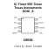
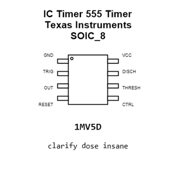
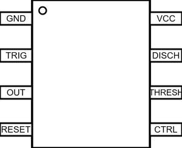
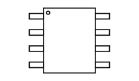
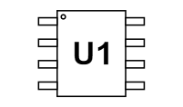
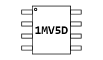
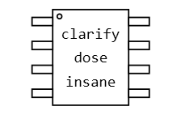
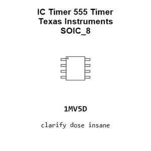
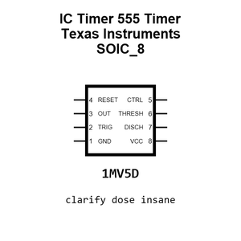

# IC Timer 555 Timer Texas Instruments SOIC_8

`electronic_ic_soic_8_timer_555_timer_texas_instruments_ne555dr`

IC Timer 555 Timer Texas Instruments SOIC_8 is an OOMP electronic ic definition. It uses the soic 8 package or form factor. Its nominal drawing size is 4.9 &#x00D7; 3.9 mm. The definition includes 8 documented pins.

## At a glance

| Detail | Value |
| --- | --- |
| OOMP ID | `electronic_ic_soic_8_timer_555_timer_texas_instruments_ne555dr` |
| Type | Ic |
| Package / style | soic 8 |
| Nominal size | 4.9 &#x00D7; 3.9 mm |
| Documented pins | 8 |

## Classification

| Level | Value |
| --- | --- |
| 1 | `electronic` |
| 2 | `ic` |
| 3 | `soic_8` |
| 4 | `timer` |
| 5 | `555_timer` |
| 14 | `texas_instruments` |
| 15 | `ne555dr` |

## Nominal dimensions

| Measurement | Value |
| --- | ---: |
| Height | 1.75 mm |
| Length | 4.9 mm |
| Width | 3.9 mm |

## Pins

| Pin | Name | Type |
| ---: | --- | --- |
| 1 | GND | gnd |
| 2 | TRIG | signal |
| 3 | OUT | signal |
| 4 | RESET | signal |
| 5 | CTRL | signal |
| 6 | THRESH | signal |
| 7 | DISCH | signal |
| 8 | VCC | power |

## Used in projects

| Project | Quantity | References | Explore |
| --- | ---: | --- | --- |
| [Project soldered_electronics/PIR-Movement-sensor-board-hardware-design PIR Movement Sensor current](https://github.com/SolderedElectronics/PIR-Movement-sensor-board-hardware-design) | 1 | U3 | [Board explorer](https://oomlout.github.io/oomp_electronic_version_5/parts/oomp_project_github_soldered_electronics_pir_movement_sensor_board_hardware_design_sensor_pir_movement_current/board_explorer.html) · [OOMP project](https://github.com/oomlout/oomp_electronic_version_5/tree/main/parts/oomp_project_github_soldered_electronics_pir_movement_sensor_board_hardware_design_sensor_pir_movement_current) |

## Files

[KiCad symbol, machine-solder and hand-solder footprints](data/kicad/README.md) · [Availability and source masters](data/kicad/manifest.yaml)

[View this part on GitHub](https://github.com/oomlout/oomp_electronic_version_5/tree/main/parts/electronic_ic_soic_8_timer_555_timer_texas_instruments_ne555dr)

[Browse this category](../../navigation/electronic/ic/soic_8/timer/555_timer/texas_instruments/README.md)

---

This page is generated from the OOMP part definition by a Roboclick Jinja template. Edit the source taxonomy or template rather than this generated file.