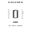
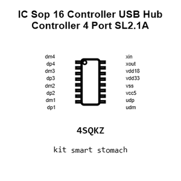
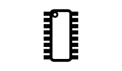
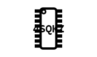
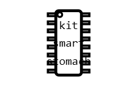
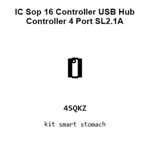

# IC SL2.1A SOP_16

`electronic_ic_sop_16_controller_usb_hub_controller_4_port_corechips_sl21a`

IC SL2.1A SOP_16 is an OOMP electronic ic definition. It uses the sop 16 package or form factor. Its nominal drawing size is 10.0 &#x00D7; 3.9 mm. The definition includes 16 documented pins.

## At a glance

| Detail | Value |
| --- | --- |
| OOMP ID | `electronic_ic_sop_16_controller_usb_hub_controller_4_port_corechips_sl21a` |
| Type | Ic |
| Package / style | sop 16 |
| Nominal size | 10.0 &#x00D7; 3.9 mm |
| Documented pins | 16 |

## Classification

| Level | Value |
| --- | --- |
| 1 | `electronic` |
| 2 | `ic` |
| 3 | `sop_16` |
| 4 | `controller` |
| 5 | `usb_hub_controller_4_port` |
| 14 | `corechips` |
| 15 | `sl21a` |

## Nominal dimensions

| Measurement | Value |
| --- | ---: |
| Length | 10.0 mm |
| Width | 3.9 mm |

## Identifiers

| Identifier | Value |
| --- | --- |
| Manufacturer part number | `SL2.1A` |
| LCSC | [`C192893`](https://www.lcsc.com/product-detail/C192893.html) |

## Pins

| Pin | Name | Type |
| ---: | --- | --- |
| 1 | dm4 | signal |
| 2 | dp4 | signal |
| 3 | dm3 | signal |
| 4 | dp3 | signal |
| 5 | dm2 | signal |
| 6 | dp2 | signal |
| 7 | dm1 | signal |
| 8 | dp1 | signal |
| 9 | udm | signal |
| 10 | udp | signal |
| 11 | vcc5 | power |
| 12 | vss | gnd |
| 13 | vdd33 | power |
| 14 | vdd18 | power |
| 15 | xout | signal |
| 16 | xin | signal |

## Datasheet

[View the datasheet](data/datasheet.pdf)

## Files

[View this part on GitHub](https://github.com/oomlout/oomp_electronic_version_5/tree/main/parts/electronic_ic_sop_16_controller_usb_hub_controller_4_port_corechips_sl21a)

[Browse this category](../../navigation/electronic/ic/sop_16/controller/usb_hub_controller_4_port/corechips/README.md)

---

This page is generated from the OOMP part definition by a Roboclick Jinja template. Edit the source taxonomy or template rather than this generated file.