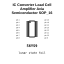
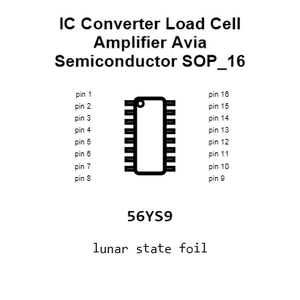
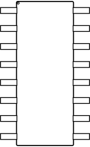
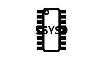
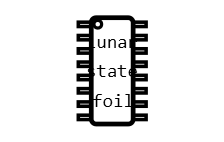
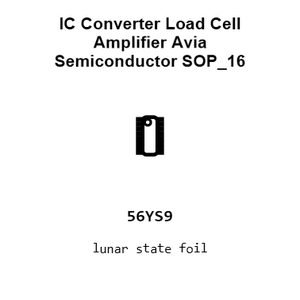
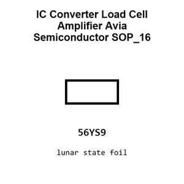
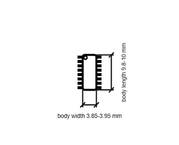

# IC Converter Load Cell Amplifier Avia Semiconductor SOP_16

`electronic_ic_sop_16_converter_load_cell_amplifier_avia_semiconductor_hx711`

IC Converter Load Cell Amplifier Avia Semiconductor SOP_16 is an OOMP electronic ic definition. It uses the sop 16 package or form factor. Its nominal drawing size is 10.0 &#x00D7; 3.9 mm.

## At a glance

| Detail | Value |
| --- | --- |
| OOMP ID | `electronic_ic_sop_16_converter_load_cell_amplifier_avia_semiconductor_hx711` |
| Type | Ic |
| Package / style | sop 16 |
| Nominal size | 10.0 &#x00D7; 3.9 mm |

## Classification

| Level | Value |
| --- | --- |
| 1 | `electronic` |
| 2 | `ic` |
| 3 | `sop_16` |
| 4 | `converter` |
| 5 | `load_cell_amplifier` |
| 14 | `avia_semiconductor` |
| 15 | `hx711` |

## Nominal dimensions

| Measurement | Value |
| --- | ---: |
| Length | 10.0 mm |
| Width | 3.9 mm |

## Used in projects

| Project | Quantity | References | Explore |
| --- | ---: | --- | --- |
| [Project soldered_electronics/Load-cell-ampfilier-HX711-board-hardware-design HX711 Load Cell current](https://github.com/SolderedElectronics/Load-cell-ampfilier-HX711-board-hardware-design) | 1 | U1 | [Board explorer](https://oomlout.github.io/oomp_electronic_version_5/parts/oomp_project_github_soldered_electronics_load_cell_ampfilier_hx711_board_hardware_design_sensor_load_cell_hx711_current/board_explorer.html) · [OOMP project](https://github.com/oomlout/oomp_electronic_version_5/tree/main/parts/oomp_project_github_soldered_electronics_load_cell_ampfilier_hx711_board_hardware_design_sensor_load_cell_hx711_current) |
| [Project soldered_electronics/Load-cell-ampfilier-HX711-board-qwiic-hardware-design HX711 Load Cell qwiic current](https://github.com/SolderedElectronics/Load-cell-amplifier-HX711-board-qwiic-hardware-design) | 1 | U1 | [Board explorer](https://oomlout.github.io/oomp_electronic_version_5/parts/oomp_project_github_soldered_electronics_load_cell_ampfilier_hx711_board_qwiic_hardware_design_sensor_load_cell_hx711_qwiic_current/board_explorer.html) · [OOMP project](https://github.com/oomlout/oomp_electronic_version_5/tree/main/parts/oomp_project_github_soldered_electronics_load_cell_ampfilier_hx711_board_qwiic_hardware_design_sensor_load_cell_hx711_qwiic_current) |
| [Project soldered_electronics/Load-cell-ampfilier-HX711-board-with-easy-C-hardware-design HX711 Load Cell easyC current](https://github.com/SolderedElectronics/Load-cell-ampfilier-HX711-board-with-easy-C-hardware-design) | 1 | U1 | [Board explorer](https://oomlout.github.io/oomp_electronic_version_5/parts/oomp_project_github_soldered_electronics_load_cell_ampfilier_hx711_board_with_easy_c_hardware_design_sensor_load_cell_hx711_easyc_current/board_explorer.html) · [OOMP project](https://github.com/oomlout/oomp_electronic_version_5/tree/main/parts/oomp_project_github_soldered_electronics_load_cell_ampfilier_hx711_board_with_easy_c_hardware_design_sensor_load_cell_hx711_easyc_current) |

## Files

[KiCad symbol, machine-solder and hand-solder footprints](data/kicad/README.md) · [Availability and source masters](data/kicad/manifest.yaml)

[View this part on GitHub](https://github.com/oomlout/oomp_electronic_version_5/tree/main/parts/electronic_ic_sop_16_converter_load_cell_amplifier_avia_semiconductor_hx711)

[Browse this category](../../navigation/electronic/ic/sop_16/converter/load_cell_amplifier/avia_semiconductor/README.md)

---

This page is generated from the OOMP part definition by a Roboclick Jinja template. Edit the source taxonomy or template rather than this generated file.