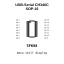
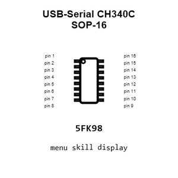
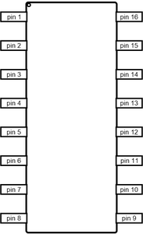
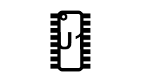
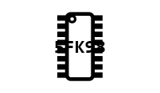
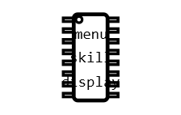
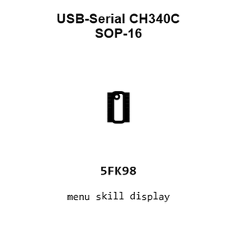
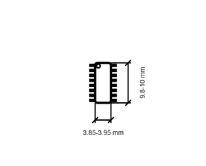

# USB-Serial CH340C SOP-16

`electronic_ic_sop_16_converter_usb_to_serial_converter_wch_ch340c`

USB-Serial CH340C SOP-16 is an OOMP electronic ic definition. It uses the sop 16 package or form factor. Its nominal drawing size is 9.9 &#x00D7; 3.9 mm.

## At a glance

| Detail | Value |
| --- | --- |
| OOMP ID | `electronic_ic_sop_16_converter_usb_to_serial_converter_wch_ch340c` |
| Type | Ic |
| Package / style | sop 16 |
| Nominal size | 9.9 &#x00D7; 3.9 mm |

## Classification

| Level | Value |
| --- | --- |
| 1 | `electronic` |
| 2 | `ic` |
| 3 | `sop_16` |
| 4 | `converter` |
| 5 | `usb_to_serial_converter` |
| 14 | `wch` |
| 15 | `ch340c` |

## Nominal dimensions

| Measurement | Value |
| --- | ---: |
| Length | 9.9 mm |
| Width | 3.9 mm |

## Identifiers

| Identifier | Value |
| --- | --- |
| Manufacturer part number | `CH340C` |
| LCSC | [`C84681`](https://www.lcsc.com/product-detail/C84681.html) |

## Datasheet

[View the datasheet](data/datasheet.pdf)

## Files

[KiCad symbol, machine-solder and hand-solder footprints](data/kicad/README.md) · [Availability and source masters](data/kicad/manifest.yaml)

[View this part on GitHub](https://github.com/oomlout/oomp_electronic_version_5/tree/main/parts/electronic_ic_sop_16_converter_usb_to_serial_converter_wch_ch340c)

[Browse this category](../../navigation/electronic/ic/sop_16/converter/usb_to_serial_converter/wch/README.md)

---

This page is generated from the OOMP part definition by a Roboclick Jinja template. Edit the source taxonomy or template rather than this generated file.