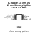
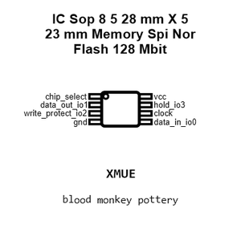
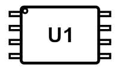
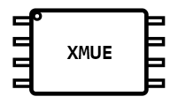
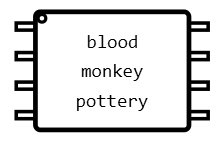
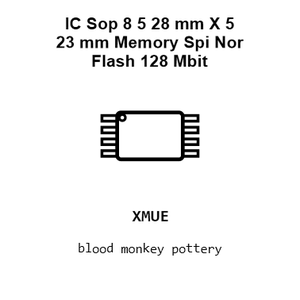
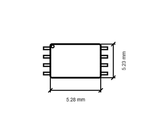
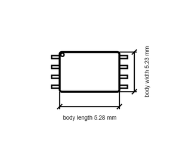

# IC Sop 8 5 28 mm X 5 23 mm Memory Spi Nor Flash 128 Mbit W25Q128JVSIQ

`electronic_ic_sop_8_5_28_mm_x_5_23_mm_memory_spi_nor_flash_128_mbit_winbond_w25q128jvsiq`

IC Sop 8 5 28 mm X 5 23 mm Memory Spi Nor Flash 128 Mbit W25Q128JVSIQ is an OOMP electronic ic definition. It uses the sop 8 5 28 mm x 5 23 mm package or form factor. Its nominal drawing size is 5.28 &#x00D7; 5.23 mm. The definition includes 8 documented pins.

## At a glance

| Detail | Value |
| --- | --- |
| OOMP ID | `electronic_ic_sop_8_5_28_mm_x_5_23_mm_memory_spi_nor_flash_128_mbit_winbond_w25q128jvsiq` |
| Type | Ic |
| Package / style | sop 8 5 28 mm x 5 23 mm |
| Nominal size | 5.28 &#x00D7; 5.23 mm |
| Documented pins | 8 |

## Classification

| Level | Value |
| --- | --- |
| 1 | `electronic` |
| 2 | `ic` |
| 3 | `sop_8_5_28_mm_x_5_23_mm` |
| 4 | `memory` |
| 5 | `spi_nor_flash_128_mbit` |
| 14 | `winbond` |
| 15 | `w25q128jvsiq` |

## Nominal dimensions

| Measurement | Value |
| --- | ---: |
| Length | 5.28 mm |
| Width | 5.23 mm |

## Identifiers

| Identifier | Value |
| --- | --- |
| Manufacturer part number | `W25Q128JVSIQ` |
| LCSC | `C97521` |

## Pins

| Pin | Name | Type |
| ---: | --- | --- |
| 1 | chip_select | signal |
| 2 | data_out_io1 | signal |
| 3 | write_protect_io2 | signal |
| 4 | gnd | signal |
| 5 | data_in_io0 | signal |
| 6 | clock | signal |
| 7 | hold_io3 | signal |
| 8 | vcc | signal |

## Datasheet

[View the datasheet](datasheet.pdf)

## Files

[View this part on GitHub](https://github.com/oomlout/oomp_electronic_version_5/tree/main/parts/electronic_ic_sop_8_5_28_mm_x_5_23_mm_memory_spi_nor_flash_128_mbit_winbond_w25q128jvsiq)

---

This page is generated from the OOMP part definition by a Roboclick Jinja template. Edit the source taxonomy or template rather than this generated file.