# Regulator AMS1117-5.0 5V SOT-223

`electronic_ic_sot_223_3_power_management_linear_voltage_regulator_5_volt_advanced_monolithic_systems_ams1117_5`

Regulator AMS1117-5.0 5V SOT-223 is an OOMP electronic ic definition. It uses the sot 223 3 package or form factor. Its nominal drawing size is 6.5 &#x00D7; 7.0 mm. The definition includes 3 documented pins.

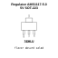

## At a glance

| Detail | Value |
| --- | --- |
| OOMP ID | `electronic_ic_sot_223_3_power_management_linear_voltage_regulator_5_volt_advanced_monolithic_systems_ams1117_5` |
| Type | Ic |
| Package / style | sot 223 3 |
| Nominal size | 6.5 &#x00D7; 7.0 mm |
| Documented pins | 3 |

## Classification

| Level | Value |
| --- | --- |
| 1 | `electronic` |
| 2 | `ic` |
| 3 | `sot_223_3` |
| 4 | `power_management` |
| 5 | `linear_voltage_regulator_5_volt` |
| 14 | `advanced_monolithic_systems` |
| 15 | `ams1117_5` |

## Nominal dimensions

| Measurement | Value |
| --- | ---: |
| Length | 6.5 mm |
| Width | 7.0 mm |

## Identifiers

| Identifier | Value |
| --- | --- |
| Manufacturer part number | `AMS1117-5.0` |
| LCSC | [`C6187`](https://www.lcsc.com/product-detail/C6187.html) |

## Pins

| Pin | Name | Type |
| ---: | --- | --- |
| 1 | gnd | gnd |
| 2 | vout | power |
| 3 | vin | power |

## Used in projects

| Project | Quantity | References | Explore |
| --- | ---: | --- | --- |
| [Project hanqaqa/easyduino ATmega328P Arduino Uno current](https://github.com/Hanqaqa/Easyduino/tree/master/Atmega328p%20Arduino%20Uno) | 1 | U3 | [Board explorer](https://oomlout.github.io/oomp_electronic_version_5/parts/oomp_project_github_hanqaqa_easyduino_atmega328p_arduino_uno_current/board_explorer.html) · [OOMP project](https://github.com/oomlout/oomp_electronic_version_5/tree/main/parts/oomp_project_github_hanqaqa_easyduino_atmega328p_arduino_uno_current) |

## Files

[KiCad symbol, machine-solder and hand-solder footprints](data/kicad/README.md) · [Availability and source masters](data/kicad/manifest.yaml)

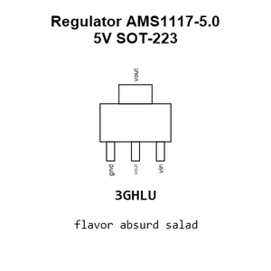

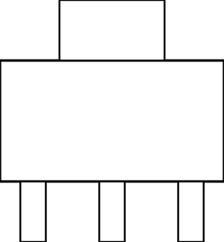

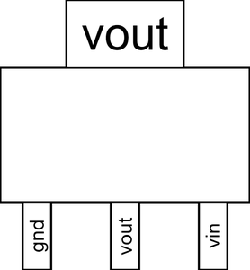

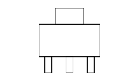

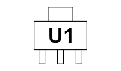

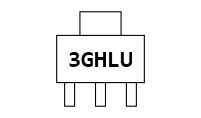

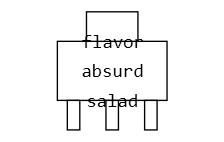

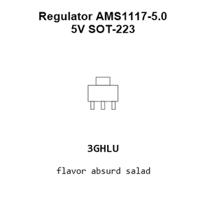

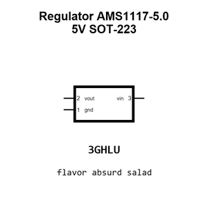

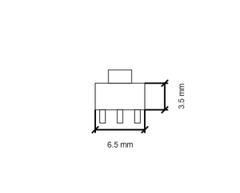

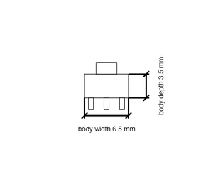

[View this part on GitHub](https://github.com/oomlout/oomp_electronic_version_5/tree/main/parts/electronic_ic_sot_223_3_power_management_linear_voltage_regulator_5_volt_advanced_monolithic_systems_ams1117_5)

[Browse this category](../../navigation/electronic/ic/sot_223_3/power_management/linear_voltage_regulator_5_volt/advanced_monolithic_systems/README.md)

---

This page is generated from the OOMP part definition by a Roboclick Jinja template. Edit the source taxonomy or template rather than this generated file.