# IC Power Management Linear Voltage Regulator 3 3 Volt St SOT_223_4

`electronic_ic_sot_223_4_power_management_linear_voltage_regulator_3_3_volt_st_ld1117_3_3`

IC Power Management Linear Voltage Regulator 3 3 Volt St SOT_223_4 is an OOMP electronic ic definition. It uses the sot 223 4 package or form factor. Its nominal drawing size is 6.5 &#x00D7; 7.0 mm. The definition includes 4 documented pins.

## At a glance

| Detail | Value |
| --- | --- |
| OOMP ID | `electronic_ic_sot_223_4_power_management_linear_voltage_regulator_3_3_volt_st_ld1117_3_3` |
| Type | Ic |
| Package / style | sot 223 4 |
| Nominal size | 6.5 &#x00D7; 7.0 mm |
| Documented pins | 4 |

## Classification

| Level | Value |
| --- | --- |
| 1 | `electronic` |
| 2 | `ic` |
| 3 | `sot_223_4` |
| 4 | `power_management` |
| 5 | `linear_voltage_regulator_3_3_volt` |
| 14 | `st` |
| 15 | `ld1117_3_3` |

## Nominal dimensions

| Measurement | Value |
| --- | ---: |
| Height | 1.8 mm |
| Length | 6.5 mm |
| Width | 7.0 mm |

## Pins

| Pin | Name | Type |
| ---: | --- | --- |
| 1 | GND | gnd |
| 2 | VOUT | signal |
| 3 | VIN | power |
| 4 | VOUT | signal |

## Used in projects

| Project | Quantity | References | Explore |
| --- | ---: | --- | --- |
| [Project electrolama/oshcamp23-badge OSHCamp 2023 Badge current](https://github.com/electrolama/oshcamp23-badge/tree/main/oomp/version_current/working) | 1 | IC2 | [Board explorer](https://oomlout.github.io/oomp_electronic_version_5/parts/oomp_project_github_electrolama_oshcamp23_badge_oshcamp23_badge_current/board_explorer.html) · [OOMP project](https://github.com/oomlout/oomp_electronic_version_5/tree/main/parts/oomp_project_github_electrolama_oshcamp23_badge_oshcamp23_badge_current) |

## Files

[KiCad symbol, machine-solder and hand-solder footprints](data/kicad/README.md) · [Availability and source masters](data/kicad/manifest.yaml)

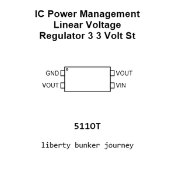

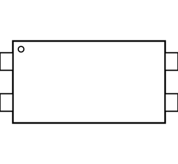

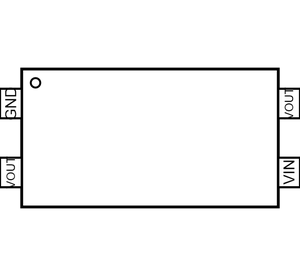

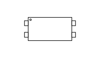

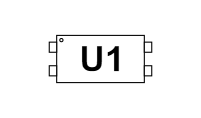

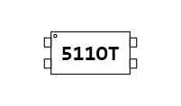

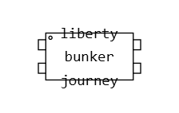

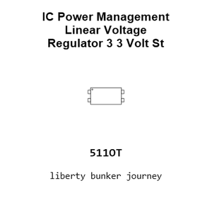

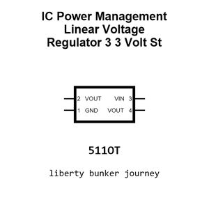

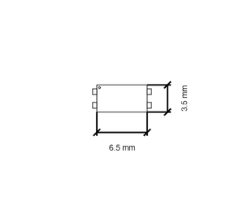

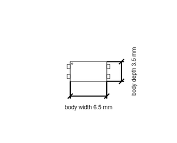

[View this part on GitHub](https://github.com/oomlout/oomp_electronic_version_5/tree/main/parts/electronic_ic_sot_223_4_power_management_linear_voltage_regulator_3_3_volt_st_ld1117_3_3)

[Browse this category](../../navigation/electronic/ic/sot_223_4/power_management/linear_voltage_regulator_3_3_volt/st/README.md)

---

This page is generated from the OOMP part definition by a Roboclick Jinja template. Edit the source taxonomy or template rather than this generated file.