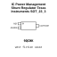
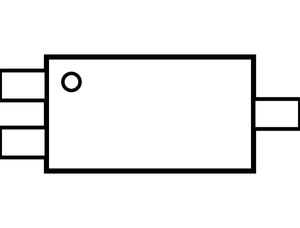
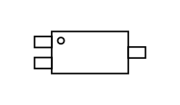
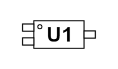
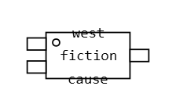
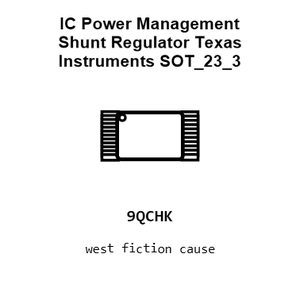
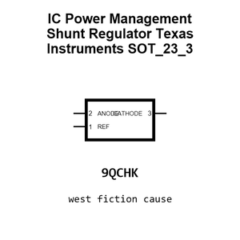
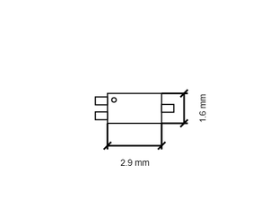
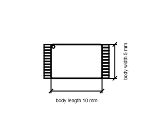

# IC Power Management Shunt Regulator Texas Instruments SOT_23_3

`electronic_ic_sot_23_3_power_management_shunt_regulator_texas_instruments_tl431acdbz`

IC Power Management Shunt Regulator Texas Instruments SOT_23_3 is an OOMP electronic ic definition. It uses the sot 23 3 package or form factor. Its nominal drawing size is 2.9 &#x00D7; 1.6 mm. The definition includes 3 documented pins.

## At a glance

| Detail | Value |
| --- | --- |
| OOMP ID | `electronic_ic_sot_23_3_power_management_shunt_regulator_texas_instruments_tl431acdbz` |
| Type | Ic |
| Package / style | sot 23 3 |
| Nominal size | 2.9 &#x00D7; 1.6 mm |
| Documented pins | 3 |

## Classification

| Level | Value |
| --- | --- |
| 1 | `electronic` |
| 2 | `ic` |
| 3 | `sot_23_3` |
| 4 | `power_management` |
| 5 | `shunt_regulator` |
| 14 | `texas_instruments` |
| 15 | `tl431acdbz` |

## Nominal dimensions

| Measurement | Value |
| --- | ---: |
| Height | 1.1 mm |
| Length | 2.9 mm |
| Width | 1.6 mm |

## Pins

| Pin | Name | Type |
| ---: | --- | --- |
| 1 | REF | signal |
| 2 | ANODE | signal |
| 3 | CATHODE | signal |

## Files

[KiCad symbol, machine-solder and hand-solder footprints](data/kicad/README.md) · [Availability and source masters](data/kicad/manifest.yaml)

[View this part on GitHub](https://github.com/oomlout/oomp_electronic_version_5/tree/main/parts/electronic_ic_sot_23_3_power_management_shunt_regulator_texas_instruments_tl431acdbz)

[Browse this category](../../navigation/electronic/ic/sot_23_3/power_management/shunt_regulator/texas_instruments/README.md)

---

This page is generated from the OOMP part definition by a Roboclick Jinja template. Edit the source taxonomy or template rather than this generated file.