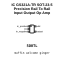
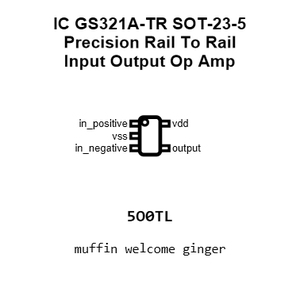
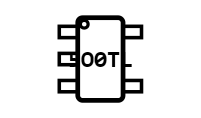
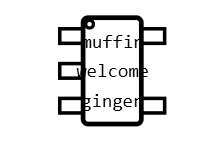
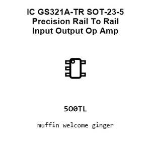
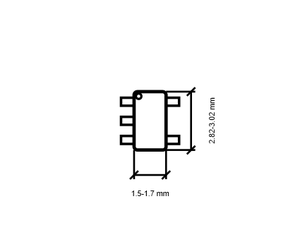
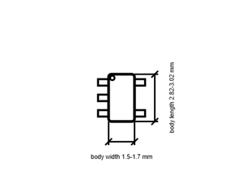

# IC GS321A-TR SOT-23-5 Precision Rail To Rail Input Output Op Amp

`electronic_ic_sot_23_5_amplifier_operational_single_precision_rail_to_rail_input_output_gainsil_gs321a_tr`

IC GS321A-TR SOT-23-5 Precision Rail To Rail Input Output Op Amp is an OOMP electronic ic definition. It uses the sot 23 5 package or form factor. Its nominal drawing size is 2.92 &#x00D7; 2.8 mm. The definition includes 5 documented pins.

## At a glance

| Detail | Value |
| --- | --- |
| OOMP ID | `electronic_ic_sot_23_5_amplifier_operational_single_precision_rail_to_rail_input_output_gainsil_gs321a_tr` |
| Type | Ic |
| Package / style | sot 23 5 |
| Nominal size | 2.92 &#x00D7; 2.8 mm |
| Documented pins | 5 |

## Classification

| Level | Value |
| --- | --- |
| 1 | `electronic` |
| 2 | `ic` |
| 3 | `sot_23_5` |
| 4 | `amplifier` |
| 5 | `operational_single_precision_rail_to_rail_input_output` |
| 14 | `gainsil` |
| 15 | `gs321a_tr` |

## Nominal dimensions

| Measurement | Value |
| --- | ---: |
| Length | 2.92 mm |
| Width | 2.8 mm |

## Identifiers

| Identifier | Value |
| --- | --- |
| Manufacturer part number | `GS321A-TR` |
| LCSC | `C431318` |

## Pins

| Pin | Name | Type |
| ---: | --- | --- |
| 1 | in_positive | input |
| 2 | vss | power |
| 3 | in_negative | input |
| 4 | output | output |
| 5 | vdd | power |

## Datasheet

[View the datasheet](datasheet.pdf)

## Files

[View this part on GitHub](https://github.com/oomlout/oomp_electronic_version_5/tree/main/parts/electronic_ic_sot_23_5_amplifier_operational_single_precision_rail_to_rail_input_output_gainsil_gs321a_tr)

---

This page is generated from the OOMP part definition by a Roboclick Jinja template. Edit the source taxonomy or template rather than this generated file.