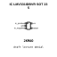
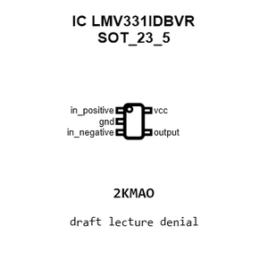
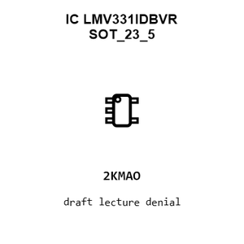
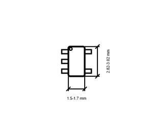
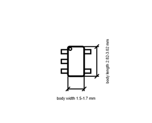

# IC LMV331IDBVR SOT 23 5

`electronic_ic_sot_23_5_comparator_single_open_collector_texas_instruments_lmv331idbvr`

IC LMV331IDBVR SOT 23 5 is an OOMP electronic ic definition. It uses the sot 23 5 package or form factor. Its nominal drawing size is 2.9 &#x00D7; 2.8 mm. The definition includes 5 documented pins.

## At a glance

| Detail | Value |
| --- | --- |
| OOMP ID | `electronic_ic_sot_23_5_comparator_single_open_collector_texas_instruments_lmv331idbvr` |
| Type | Ic |
| Package / style | sot 23 5 |
| Nominal size | 2.9 &#x00D7; 2.8 mm |
| Documented pins | 5 |

## Classification

| Level | Value |
| --- | --- |
| 1 | `electronic` |
| 2 | `ic` |
| 3 | `sot_23_5` |
| 4 | `comparator` |
| 5 | `single_open_collector` |
| 14 | `texas_instruments` |
| 15 | `lmv331idbvr` |

## Nominal dimensions

| Measurement | Value |
| --- | ---: |
| Length | 2.9 mm |
| Width | 2.8 mm |

## Identifiers

| Identifier | Value |
| --- | --- |
| Manufacturer part number | `LMV331IDBVR` |
| LCSC | [`C34731`](https://www.lcsc.com/product-detail/C34731.html) |

## Pins

| Pin | Name | Type |
| ---: | --- | --- |
| 1 | in_positive | input |
| 2 | gnd | power |
| 3 | in_negative | input |
| 4 | output | open_collector_output |
| 5 | vcc | power |

## Datasheet

[View the datasheet](data/datasheet.pdf)

## Files

[KiCad symbol, machine-solder and hand-solder footprints](data/kicad/README.md) · [Availability and source masters](data/kicad/manifest.yaml)

[View this part on GitHub](https://github.com/oomlout/oomp_electronic_version_5/tree/main/parts/electronic_ic_sot_23_5_comparator_single_open_collector_texas_instruments_lmv331idbvr)

[Browse this category](../../navigation/electronic/ic/sot_23_5/comparator/single_open_collector/texas_instruments/README.md)

---

This page is generated from the OOMP part definition by a Roboclick Jinja template. Edit the source taxonomy or template rather than this generated file.