# IC 74LVC1G17GV,125 SOT 23 5

`electronic_ic_sot_23_5_logic_single_schmitt_trigger_buffer_nexperia_74lvc1g17gv_125`

IC 74LVC1G17GV,125 SOT 23 5 is an OOMP electronic ic definition. It uses the sot 23 5 package or form factor. Its nominal drawing size is 2.9 &#x00D7; 1.6 mm. The definition includes 5 documented pins.

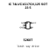

## At a glance

| Detail | Value |
| --- | --- |
| OOMP ID | `electronic_ic_sot_23_5_logic_single_schmitt_trigger_buffer_nexperia_74lvc1g17gv_125` |
| Type | Ic |
| Package / style | sot 23 5 |
| Nominal size | 2.9 &#x00D7; 1.6 mm |
| Documented pins | 5 |

## Classification

| Level | Value |
| --- | --- |
| 1 | `electronic` |
| 2 | `ic` |
| 3 | `sot_23_5` |
| 4 | `logic` |
| 5 | `single_schmitt_trigger_buffer` |
| 14 | `nexperia` |
| 15 | `74lvc1g17gv_125` |

## Nominal dimensions

| Measurement | Value |
| --- | ---: |
| Height | 1.1 mm |
| Length | 2.9 mm |
| Width | 1.6 mm |

## Identifiers

| Identifier | Value |
| --- | --- |
| Manufacturer part number | `74LVC1G17GV,125` |
| LCSC | [`C6076`](https://www.lcsc.com/product-detail/C6076.html) |
| JLCPCB | [`C6076`](https://jlcpcb.com/partdetail/Nexperia-74LVC1G17GV125/C6076) |

## Pins

| Pin | Name | Type |
| ---: | --- | --- |
| 1 | NC | nc |
| 2 | A | in |
| 3 | GND | pwr |
| 4 | Y | out |
| 5 | VCC | pwr |

## Datasheet

[View the datasheet](data/datasheet.pdf)

## Files

[KiCad symbol, machine-solder and hand-solder footprints](data/kicad/README.md) · [Availability and source masters](data/kicad/manifest.yaml)

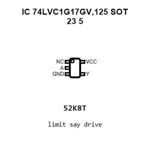

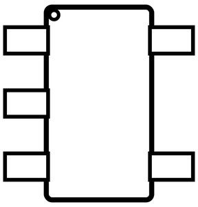

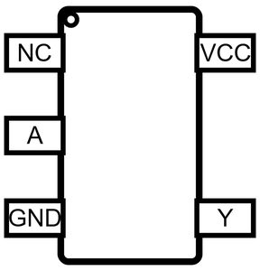

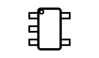

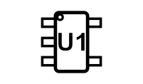

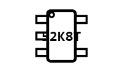

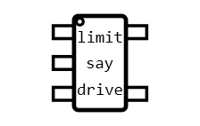

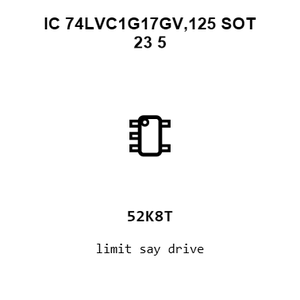

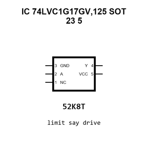

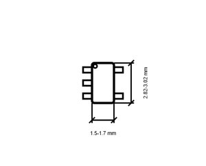

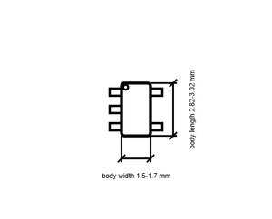

[View this part on GitHub](https://github.com/oomlout/oomp_electronic_version_5/tree/main/parts/electronic_ic_sot_23_5_logic_single_schmitt_trigger_buffer_nexperia_74lvc1g17gv_125)

[Browse this category](../../navigation/electronic/ic/sot_23_5/logic/single_schmitt_trigger_buffer/nexperia/README.md)

---

This page is generated from the OOMP part definition by a Roboclick Jinja template. Edit the source taxonomy or template rather than this generated file.