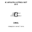
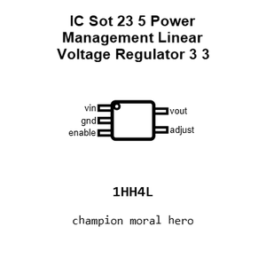
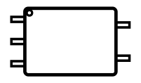
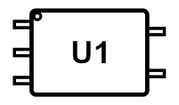
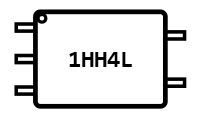
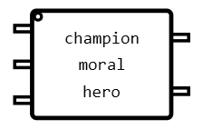
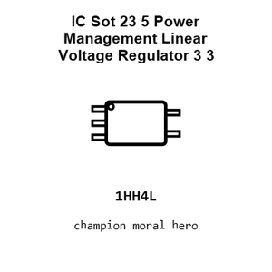
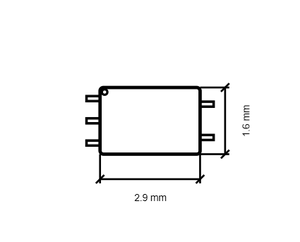

# IC AP2127K-3.3TRG1 SOT_23_5

`electronic_ic_sot_23_5_power_management_linear_voltage_regulator_3_3_volt_diodes_ap2127k_3_3trg1`

IC AP2127K-3.3TRG1 SOT_23_5 is an OOMP electronic ic definition. It uses the sot 23 5 package or form factor. Its nominal drawing size is 2.9 &#x00D7; 1.6 mm. The definition includes 5 documented pins.

## At a glance

| Detail | Value |
| --- | --- |
| OOMP ID | `electronic_ic_sot_23_5_power_management_linear_voltage_regulator_3_3_volt_diodes_ap2127k_3_3trg1` |
| Type | Ic |
| Package / style | sot 23 5 |
| Nominal size | 2.9 &#x00D7; 1.6 mm |
| Documented pins | 5 |

## Classification

| Level | Value |
| --- | --- |
| 1 | `electronic` |
| 2 | `ic` |
| 3 | `sot_23_5` |
| 4 | `power_management` |
| 5 | `linear_voltage_regulator_3_3_volt` |
| 14 | `diodes` |
| 15 | `ap2127k_3_3trg1` |

## Nominal dimensions

| Measurement | Value |
| --- | ---: |
| Length | 2.9 mm |
| Width | 1.6 mm |

## Identifiers

| Identifier | Value |
| --- | --- |
| Manufacturer part number | `AP2127K-3.3TRG1` |
| LCSC | [`C156285`](https://www.lcsc.com/product-detail/C156285.html) |

## Pins

| Pin | Name | Type |
| ---: | --- | --- |
| 1 | vin | signal |
| 2 | gnd | signal |
| 3 | enable | signal |
| 4 | adjust | signal |
| 5 | vout | signal |

## Datasheet

[View the datasheet](data/datasheet.pdf)

## Files

[View this part on GitHub](https://github.com/oomlout/oomp_electronic_version_5/tree/main/parts/electronic_ic_sot_23_5_power_management_linear_voltage_regulator_3_3_volt_diodes_ap2127k_3_3trg1)

[Browse this category](../../navigation/electronic/ic/sot_23_5/power_management/linear_voltage_regulator_3_3_volt/diodes/README.md)

---

This page is generated from the OOMP part definition by a Roboclick Jinja template. Edit the source taxonomy or template rather than this generated file.