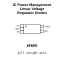
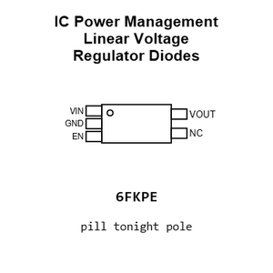
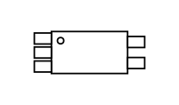
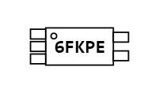
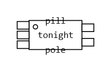
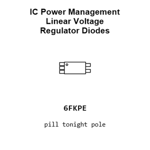
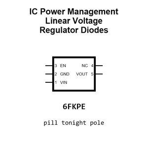
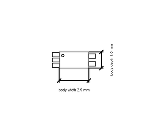

# IC Power Management Linear Voltage Regulator Diodes SOT_23_5

`electronic_ic_sot_23_5_power_management_linear_voltage_regulator_diodes_ap2112k_3_3`

IC Power Management Linear Voltage Regulator Diodes SOT_23_5 is an OOMP electronic ic definition. It uses the sot 23 5 package or form factor. Its nominal drawing size is 2.9 &#x00D7; 1.6 mm. The definition includes 5 documented pins.

## At a glance

| Detail | Value |
| --- | --- |
| OOMP ID | `electronic_ic_sot_23_5_power_management_linear_voltage_regulator_diodes_ap2112k_3_3` |
| Type | Ic |
| Package / style | sot 23 5 |
| Nominal size | 2.9 &#x00D7; 1.6 mm |
| Documented pins | 5 |

## Classification

| Level | Value |
| --- | --- |
| 1 | `electronic` |
| 2 | `ic` |
| 3 | `sot_23_5` |
| 4 | `power_management` |
| 5 | `linear_voltage_regulator` |
| 14 | `diodes` |
| 15 | `ap2112k_3_3` |

## Nominal dimensions

| Measurement | Value |
| --- | ---: |
| Height | 1.1 mm |
| Length | 2.9 mm |
| Width | 1.6 mm |

## Pins

| Pin | Name | Type |
| ---: | --- | --- |
| 1 | VIN | power |
| 2 | GND | gnd |
| 3 | EN | signal |
| 4 | NC | no_connect |
| 5 | VOUT | signal |

## Used in projects

| Project | Quantity | References | Explore |
| --- | ---: | --- | --- |
| [Project adafruit/Adafruit-128x32-I2C-OLED-Breakout-PCB Adafruit OLED 128x32 Mono I2 C STEMMA QT current](https://github.com/adafruit/Adafruit-128x32-I2C-OLED-Breakout-PCB/blob/master/Adafruit%20OLED%20128x32%20Mono%20I2C%20STEMMA%20QT%20rev%20B.brd) | 1 | U2 | [Board explorer](https://oomlout.github.io/oomp_electronic_version_5/parts/oomp_project_github_adafruit_adafruit_128x32_i2_c_oled_breakout_pcb_adafruit_oled_128x32_mono_i2_c_stemma_qt_current/board_explorer.html) · [OOMP project](https://github.com/oomlout/oomp_electronic_version_5/tree/main/parts/oomp_project_github_adafruit_adafruit_128x32_i2_c_oled_breakout_pcb_adafruit_oled_128x32_mono_i2_c_stemma_qt_current) |
| [Project adafruit/Adafruit-128x64-Monochrome-OLED-PCB 0.96in 128x64 OLED STEMMA QT current](https://github.com/adafruit/Adafruit-128x64-Monochrome-OLED-PCB/blob/master/Adafruit%200.96in%20128x64%20OLED%20STEMMA%20QT.brd) | 1 | U2 | [Board explorer](https://oomlout.github.io/oomp_electronic_version_5/parts/oomp_project_github_adafruit_adafruit_128x64_monochrome_oled_pcb_0_96in_128x64_oled_stemma_qt_current/board_explorer.html) · [OOMP project](https://github.com/oomlout/oomp_electronic_version_5/tree/main/parts/oomp_project_github_adafruit_adafruit_128x64_monochrome_oled_pcb_0_96in_128x64_oled_stemma_qt_current) |
| [Project adafruit/Adafruit-1.28-240x240-Round-Display-PCB Adafruit 1.28 240x240 Round Display current](https://github.com/adafruit/Adafruit-1.28-240x240-Round-Display-PCB/blob/main/Adafruit%201.28%20240x240%20Round%20Display.brd) | 1 | U2 | [Board explorer](https://oomlout.github.io/oomp_electronic_version_5/parts/oomp_project_github_adafruit_adafruit_1_28_240x240_round_display_pcb_adafruit_1_28_240x240_round_display_current/board_explorer.html) · [OOMP project](https://github.com/oomlout/oomp_electronic_version_5/tree/main/parts/oomp_project_github_adafruit_adafruit_1_28_240x240_round_display_pcb_adafruit_1_28_240x240_round_display_current) |
| [Project adafruit/Adafruit-1.3-inch-240x240-TFT-PCB Adafruit 1.3in 240x240 IPS TFT current](https://github.com/adafruit/Adafruit-1.3-inch-240x240-TFT-PCB/blob/master/Adafruit%201.3in%20240x240%20IPS%20TFT.brd) | 1 | IC2 | [Board explorer](https://oomlout.github.io/oomp_electronic_version_5/parts/oomp_project_github_adafruit_adafruit_1_3_inch_240x240_tft_pcb_adafruit_1_3in_240x240_ips_tft_current/board_explorer.html) · [OOMP project](https://github.com/oomlout/oomp_electronic_version_5/tree/main/parts/oomp_project_github_adafruit_adafruit_1_3_inch_240x240_tft_pcb_adafruit_1_3in_240x240_ips_tft_current) |
| [Project adafruit/Adafruit-2.0-inch-240x320-TFT-PCB Adafruit 2.0 inch 240x320 IPS TFT current](https://github.com/adafruit/Adafruit-2.0-inch-240x320-TFT-PCB/blob/master/Adafruit%202.0%20inch%20240x320%20IPS%20TFT.brd) | 1 | U2 | [Board explorer](https://oomlout.github.io/oomp_electronic_version_5/parts/oomp_project_github_adafruit_adafruit_2_0_inch_240x320_tft_pcb_adafruit_2_0_inch_240x320_ips_tft_current/board_explorer.html) · [OOMP project](https://github.com/oomlout/oomp_electronic_version_5/tree/main/parts/oomp_project_github_adafruit_adafruit_2_0_inch_240x320_tft_pcb_adafruit_2_0_inch_240x320_ips_tft_current) |
| [Project adafruit/Adafruit_ADXL345_PCB ADXL345 STEMMA QT current](https://github.com/adafruit/Adafruit_ADXL345_PCB/blob/master/ADXL345%20STEMMA%20QT.brd) | 1 | U2 | [Board explorer](https://oomlout.github.io/oomp_electronic_version_5/parts/oomp_project_github_adafruit_adafruit_adxl345_pcb_adxl345_stemma_qt_current/board_explorer.html) · [OOMP project](https://github.com/oomlout/oomp_electronic_version_5/tree/main/parts/oomp_project_github_adafruit_adafruit_adxl345_pcb_adxl345_stemma_qt_current) |
| [Project adafruit/Adafruit-LIS3DH-Breakout-PCB LIS3DH Breakout current](https://github.com/adafruit/Adafruit-LIS3DH-Breakout-PCB/blob/master/Adafruit%20LIS3DH.brd) | 1 | U2 | [Board explorer](https://oomlout.github.io/oomp_electronic_version_5/parts/oomp_project_github_adafruit_adafruit_lis3_dh_breakout_pcb_lis3dh_breakout_current/board_explorer.html) · [OOMP project](https://github.com/oomlout/oomp_electronic_version_5/tree/main/parts/oomp_project_github_adafruit_adafruit_lis3_dh_breakout_pcb_lis3dh_breakout_current) |
| [Project sparkfun/SparkFun_u-blox_NEO-F10N u-blox NEO-F10N current](https://github.com/sparkfun/SparkFun_u-blox_NEO-F10N) | 1 | U2 | [Board explorer](https://oomlout.github.io/oomp_electronic_version_5/parts/oomp_project_github_sparkfun_spark_fun_u_blox_neo_f10_n_ublox_neo_f10n_current/board_explorer.html) · [OOMP project](https://github.com/oomlout/oomp_electronic_version_5/tree/main/parts/oomp_project_github_sparkfun_spark_fun_u_blox_neo_f10_n_ublox_neo_f10n_current) |

## Files

[KiCad symbol, machine-solder and hand-solder footprints](data/kicad/README.md) · [Availability and source masters](data/kicad/manifest.yaml)

[View this part on GitHub](https://github.com/oomlout/oomp_electronic_version_5/tree/main/parts/electronic_ic_sot_23_5_power_management_linear_voltage_regulator_diodes_ap2112k_3_3)

[Browse this category](../../navigation/electronic/ic/sot_23_5/power_management/linear_voltage_regulator/diodes/README.md)

---

This page is generated from the OOMP part definition by a Roboclick Jinja template. Edit the source taxonomy or template rather than this generated file.