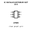
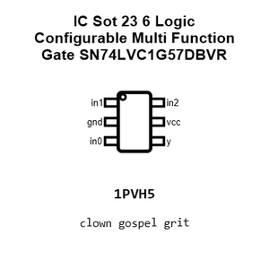
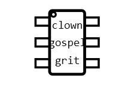
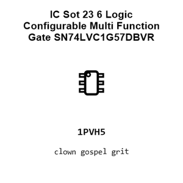
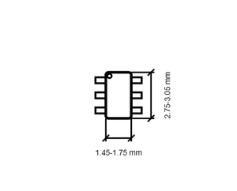

# IC SN74LVC1G57DBVR SOT_23_6

`electronic_ic_sot_23_6_logic_configurable_multi_function_gate_texas_instruments_sn74lvc1g57dbvr`

IC SN74LVC1G57DBVR SOT_23_6 is an OOMP electronic ic definition. It uses the sot 23 6 package or form factor. Its nominal drawing size is 2.9 &#x00D7; 1.6 mm. The definition includes 6 documented pins.

## At a glance

| Detail | Value |
| --- | --- |
| OOMP ID | `electronic_ic_sot_23_6_logic_configurable_multi_function_gate_texas_instruments_sn74lvc1g57dbvr` |
| Type | Ic |
| Package / style | sot 23 6 |
| Nominal size | 2.9 &#x00D7; 1.6 mm |
| Documented pins | 6 |

## Classification

| Level | Value |
| --- | --- |
| 1 | `electronic` |
| 2 | `ic` |
| 3 | `sot_23_6` |
| 4 | `logic` |
| 5 | `configurable_multi_function_gate` |
| 14 | `texas_instruments` |
| 15 | `sn74lvc1g57dbvr` |

## Nominal dimensions

| Measurement | Value |
| --- | ---: |
| Length | 2.9 mm |
| Width | 1.6 mm |

## Identifiers

| Identifier | Value |
| --- | --- |
| Manufacturer part number | `SN74LVC1G57DBVR` |
| LCSC | [`C485080`](https://www.lcsc.com/product-detail/C485080.html) |

## Pins

| Pin | Name | Type |
| ---: | --- | --- |
| 1 | in1 | signal |
| 2 | gnd | gnd |
| 3 | in0 | signal |
| 4 | y | signal |
| 5 | vcc | power |
| 6 | in2 | signal |

## Datasheet

[View the datasheet](data/datasheet.pdf)

## Files

[View this part on GitHub](https://github.com/oomlout/oomp_electronic_version_5/tree/main/parts/electronic_ic_sot_23_6_logic_configurable_multi_function_gate_texas_instruments_sn74lvc1g57dbvr)

[Browse this category](../../navigation/electronic/ic/sot_23_6/logic/configurable_multi_function_gate/texas_instruments/README.md)

---

This page is generated from the OOMP part definition by a Roboclick Jinja template. Edit the source taxonomy or template rather than this generated file.