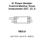
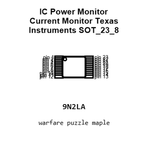
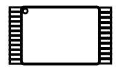
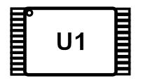
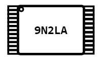
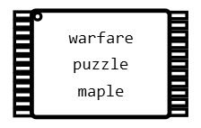
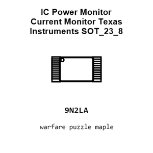
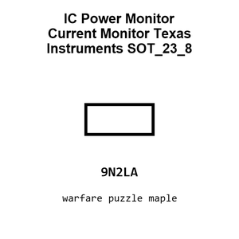
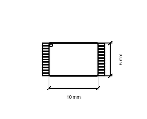
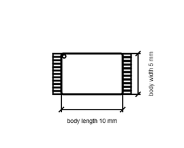

# IC Power Monitor Current Monitor Texas Instruments SOT_23_8

`electronic_ic_sot_23_8_power_monitor_current_monitor_texas_instruments_ina219`

IC Power Monitor Current Monitor Texas Instruments SOT_23_8 is an OOMP electronic ic definition. It uses the sot 23 8 package or form factor. Its nominal drawing size is 10.0 &#x00D7; 5.0 mm.

## At a glance

| Detail | Value |
| --- | --- |
| OOMP ID | `electronic_ic_sot_23_8_power_monitor_current_monitor_texas_instruments_ina219` |
| Type | Ic |
| Package / style | sot 23 8 |
| Nominal size | 10.0 &#x00D7; 5.0 mm |

## Classification

| Level | Value |
| --- | --- |
| 1 | `electronic` |
| 2 | `ic` |
| 3 | `sot_23_8` |
| 4 | `power_monitor` |
| 5 | `current_monitor` |
| 14 | `texas_instruments` |
| 15 | `ina219` |

## Nominal dimensions

| Measurement | Value |
| --- | ---: |
| Length | 10.0 mm |
| Width | 5.0 mm |

## Files

[KiCad symbol, machine-solder and hand-solder footprints](data/kicad/README.md) · [Availability and source masters](data/kicad/manifest.yaml)

[View this part on GitHub](https://github.com/oomlout/oomp_electronic_version_5/tree/main/parts/electronic_ic_sot_23_8_power_monitor_current_monitor_texas_instruments_ina219)

[Browse this category](../../navigation/electronic/ic/sot_23_8/power_monitor/current_monitor/texas_instruments/README.md)

---

This page is generated from the OOMP part definition by a Roboclick Jinja template. Edit the source taxonomy or template rather than this generated file.