# Regulator XC6206P332MR 3.3V SOT-23

`electronic_ic_sot_23_power_management_linear_voltage_regulator_3_3_volt_torex_xc6206p332mr`

Regulator XC6206P332MR 3.3V SOT-23 is an OOMP electronic ic definition. It uses the sot 23 package or form factor. Its nominal drawing size is 2.92 &#x00D7; 2.8 mm. The definition includes 3 documented pins.

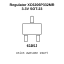

## At a glance

| Detail | Value |
| --- | --- |
| OOMP ID | `electronic_ic_sot_23_power_management_linear_voltage_regulator_3_3_volt_torex_xc6206p332mr` |
| Type | Ic |
| Package / style | sot 23 |
| Nominal size | 2.92 &#x00D7; 2.8 mm |
| Documented pins | 3 |

## Classification

| Level | Value |
| --- | --- |
| 1 | `electronic` |
| 2 | `ic` |
| 3 | `sot_23` |
| 4 | `power_management` |
| 5 | `linear_voltage_regulator_3_3_volt` |
| 14 | `torex` |
| 15 | `xc6206p332mr` |

## Nominal dimensions

| Measurement | Value |
| --- | ---: |
| Length | 2.92 mm |
| Width | 2.8 mm |

## Identifiers

| Identifier | Value |
| --- | --- |
| Manufacturer part number | `XC6206P332MR` |
| LCSC | [`C51489`](https://www.lcsc.com/product-detail/C51489.html) |

## Pins

| Pin | Name | Type |
| ---: | --- | --- |
| 1 | vss | gnd |
| 2 | vout | power |
| 3 | vin | power |

## Datasheet

[View the datasheet](data/datasheet.pdf)

## Files

[KiCad symbol, machine-solder and hand-solder footprints](data/kicad/README.md) · [Availability and source masters](data/kicad/manifest.yaml)

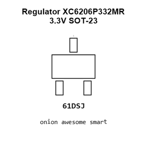

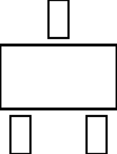

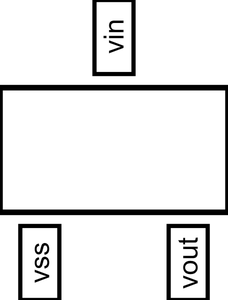

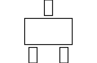

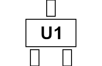

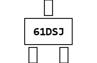

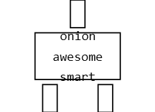

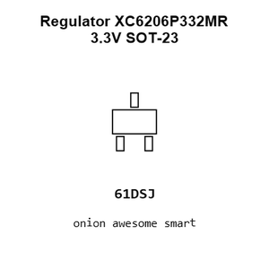

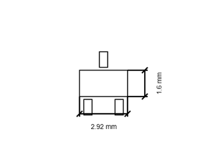

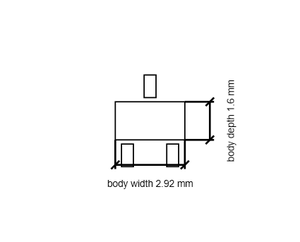

[View this part on GitHub](https://github.com/oomlout/oomp_electronic_version_5/tree/main/parts/electronic_ic_sot_23_power_management_linear_voltage_regulator_3_3_volt_torex_xc6206p332mr)

[Browse this category](../../navigation/electronic/ic/sot_23/power_management/linear_voltage_regulator_3_3_volt/torex/README.md)

---

This page is generated from the OOMP part definition by a Roboclick Jinja template. Edit the source taxonomy or template rather than this generated file.