# IC Sensor Hall Effect Silicon Labs SOT_23

`electronic_ic_sot_23_sensor_hall_effect_silicon_labs_si7201_b_06_iv`

IC Sensor Hall Effect Silicon Labs SOT_23 is an OOMP electronic ic definition. It uses the sot 23 package or form factor. Its nominal drawing size is 2.9 &#x00D7; 2.6 mm.

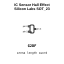

## At a glance

| Detail | Value |
| --- | --- |
| OOMP ID | `electronic_ic_sot_23_sensor_hall_effect_silicon_labs_si7201_b_06_iv` |
| Type | Ic |
| Package / style | sot 23 |
| Nominal size | 2.9 &#x00D7; 2.6 mm |

## Classification

| Level | Value |
| --- | --- |
| 1 | `electronic` |
| 2 | `ic` |
| 3 | `sot_23` |
| 4 | `sensor` |
| 5 | `hall_effect` |
| 14 | `silicon_labs` |
| 15 | `si7201_b_06_iv` |

## Nominal dimensions

| Measurement | Value |
| --- | ---: |
| Length | 2.9 mm |
| Width | 2.6 mm |

## Used in projects

| Project | Quantity | References | Explore |
| --- | ---: | --- | --- |
| [Project soldered_electronics/Hall-effect-sensor-breakout-with-digital-output---easyC-hardware-design Hall Effect Digital Output easyC current](https://github.com/SolderedElectronics/Hall-effect-sensor-breakout-with-digital-output---easyC-hardware-design) | 1 | U1 | [Board explorer](https://oomlout.github.io/oomp_electronic_version_5/parts/oomp_project_github_soldered_electronics_hall_effect_sensor_breakout_with_digital_output_easy_c_hardware_design_sensor_hall_digital_easyc_current/board_explorer.html) · [OOMP project](https://github.com/oomlout/oomp_electronic_version_5/tree/main/parts/oomp_project_github_soldered_electronics_hall_effect_sensor_breakout_with_digital_output_easy_c_hardware_design_sensor_hall_digital_easyc_current) |
| [Project soldered_electronics/Hall-effect-sensor-breakout-with-digital-output-hardware-design Hall Effect Digital Output current](https://github.com/SolderedElectronics/Hall-effect-sensor-breakout-with-digital-output-hardware-design) | 1 | U1 | [Board explorer](https://oomlout.github.io/oomp_electronic_version_5/parts/oomp_project_github_soldered_electronics_hall_effect_sensor_breakout_with_digital_output_hardware_design_sensor_hall_digital_current/board_explorer.html) · [OOMP project](https://github.com/oomlout/oomp_electronic_version_5/tree/main/parts/oomp_project_github_soldered_electronics_hall_effect_sensor_breakout_with_digital_output_hardware_design_sensor_hall_digital_current) |
| [Project soldered_electronics/Hall-effect-sensor-breakout-with-digital-output---qwiic-hardware-design Hall Effect Digital Output qwiic current](https://github.com/SolderedElectronics/Hall-effect-sensor-breakout-with-digital-output---qwiic-hardware-design) | 1 | U1 | [Board explorer](https://oomlout.github.io/oomp_electronic_version_5/parts/oomp_project_github_soldered_electronics_hall_effect_sensor_breakout_with_digital_output_qwiic_hardware_design_sensor_hall_digital_qwiic_current/board_explorer.html) · [OOMP project](https://github.com/oomlout/oomp_electronic_version_5/tree/main/parts/oomp_project_github_soldered_electronics_hall_effect_sensor_breakout_with_digital_output_qwiic_hardware_design_sensor_hall_digital_qwiic_current) |

## Files

[KiCad symbol, machine-solder and hand-solder footprints](data/kicad/README.md) · [Availability and source masters](data/kicad/manifest.yaml)

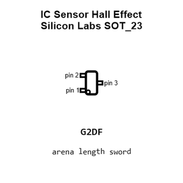

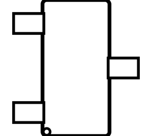

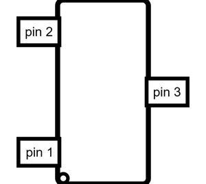

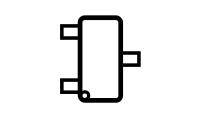

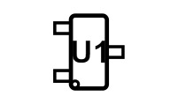

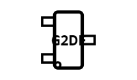

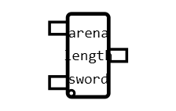

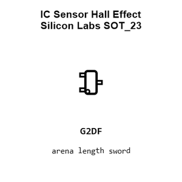

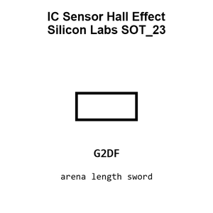

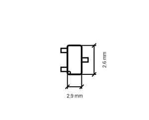

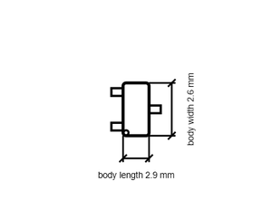

[View this part on GitHub](https://github.com/oomlout/oomp_electronic_version_5/tree/main/parts/electronic_ic_sot_23_sensor_hall_effect_silicon_labs_si7201_b_06_iv)

[Browse this category](../../navigation/electronic/ic/sot_23/sensor/hall_effect/silicon_labs/README.md)

---

This page is generated from the OOMP part definition by a Roboclick Jinja template. Edit the source taxonomy or template rather than this generated file.