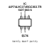
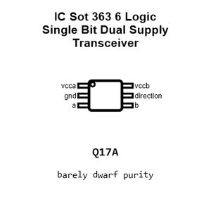
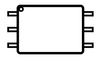
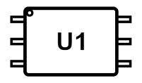
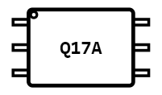
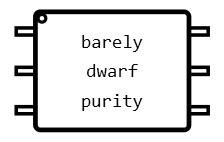
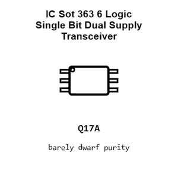
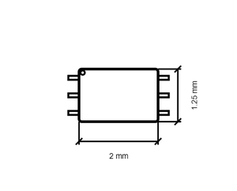
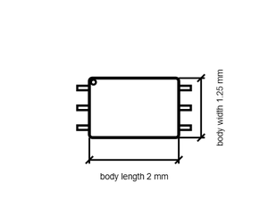

# IC AiP74LVC1T45GC363.TR SOT_363_6

`electronic_ic_sot_363_6_logic_single_bit_dual_supply_transceiver_wuxi_i_core_elec_aip74lvc1t45gc363_tr`

IC AiP74LVC1T45GC363.TR SOT_363_6 is an OOMP electronic ic definition. It uses the sot 363 6 package or form factor. Its nominal drawing size is 2.0 &#x00D7; 1.25 mm. The definition includes 6 documented pins.

## At a glance

| Detail | Value |
| --- | --- |
| OOMP ID | `electronic_ic_sot_363_6_logic_single_bit_dual_supply_transceiver_wuxi_i_core_elec_aip74lvc1t45gc363_tr` |
| Type | Ic |
| Package / style | sot 363 6 |
| Nominal size | 2.0 &#x00D7; 1.25 mm |
| Documented pins | 6 |

## Classification

| Level | Value |
| --- | --- |
| 1 | `electronic` |
| 2 | `ic` |
| 3 | `sot_363_6` |
| 4 | `logic` |
| 5 | `single_bit_dual_supply_transceiver` |
| 14 | `wuxi_i_core_elec` |
| 15 | `aip74lvc1t45gc363_tr` |

## Nominal dimensions

| Measurement | Value |
| --- | ---: |
| Length | 2.0 mm |
| Width | 1.25 mm |

## Identifiers

| Identifier | Value |
| --- | --- |
| Manufacturer part number | `AiP74LVC1T45GC363.TR` |
| LCSC | [`C5162250`](https://www.lcsc.com/product-detail/C5162250.html) |

## Pins

| Pin | Name | Type |
| ---: | --- | --- |
| 1 | vcca | signal |
| 2 | gnd | signal |
| 3 | a | signal |
| 4 | b | signal |
| 5 | direction | signal |
| 6 | vccb | signal |

## Datasheet

[View the datasheet](data/datasheet.pdf)

## Files

[View this part on GitHub](https://github.com/oomlout/oomp_electronic_version_5/tree/main/parts/electronic_ic_sot_363_6_logic_single_bit_dual_supply_transceiver_wuxi_i_core_elec_aip74lvc1t45gc363_tr)

[Browse this category](../../navigation/electronic/ic/sot_363_6/logic/single_bit_dual_supply_transceiver/wuxi_i_core_elec/README.md)

---

This page is generated from the OOMP part definition by a Roboclick Jinja template. Edit the source taxonomy or template rather than this generated file.