# IC 74LVC2G14GW,125 SOT 363

`electronic_ic_sot_363_logic_dual_schmitt_trigger_inverter_nexperia_74lvc2g14gw_125`

IC 74LVC2G14GW,125 SOT 363 is an OOMP electronic ic definition. It uses the sot 363 package or form factor. Its nominal drawing size is 2.1 &#x00D7; 2.1 mm. The definition includes 6 documented pins.

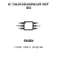

## At a glance

| Detail | Value |
| --- | --- |
| OOMP ID | `electronic_ic_sot_363_logic_dual_schmitt_trigger_inverter_nexperia_74lvc2g14gw_125` |
| Type | Ic |
| Package / style | sot 363 |
| Nominal size | 2.1 &#x00D7; 2.1 mm |
| Documented pins | 6 |

## Classification

| Level | Value |
| --- | --- |
| 1 | `electronic` |
| 2 | `ic` |
| 3 | `sot_363` |
| 4 | `logic` |
| 5 | `dual_schmitt_trigger_inverter` |
| 14 | `nexperia` |
| 15 | `74lvc2g14gw_125` |

## Nominal dimensions

| Measurement | Value |
| --- | ---: |
| Height | 1.0 mm |
| Length | 2.1 mm |
| Width | 2.1 mm |

## Identifiers

| Identifier | Value |
| --- | --- |
| Manufacturer part number | `74LVC2G14GW,125` |
| LCSC | [`C6085`](https://www.lcsc.com/product-detail/C6085.html) |
| JLCPCB | [`C6085`](https://jlcpcb.com/partdetail/Nexperia-74LVC2G14GW125/C6085) |

## Pins

| Pin | Name | Type |
| ---: | --- | --- |
| 1 | 1A | in |
| 2 | GND | pwr |
| 3 | 2A | in |
| 4 | 1Y | out |
| 5 | VCC | pwr |
| 6 | 2Y | out |

## Datasheet

[View the datasheet](data/datasheet.pdf)

## Files

[KiCad symbol, machine-solder and hand-solder footprints](data/kicad/README.md) · [Availability and source masters](data/kicad/manifest.yaml)

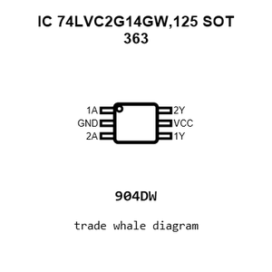

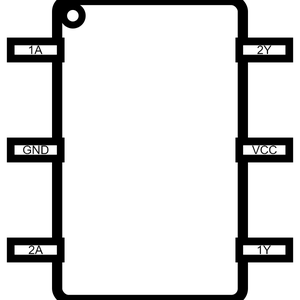

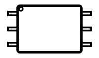

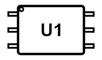

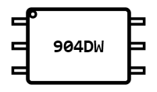

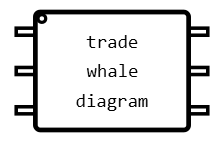

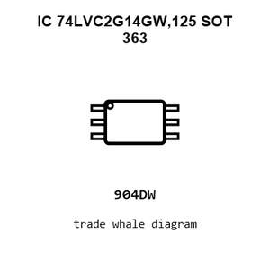

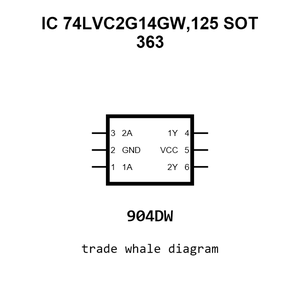

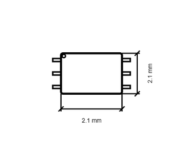

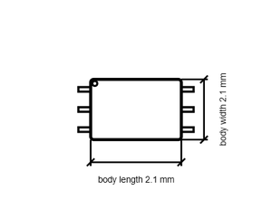

[View this part on GitHub](https://github.com/oomlout/oomp_electronic_version_5/tree/main/parts/electronic_ic_sot_363_logic_dual_schmitt_trigger_inverter_nexperia_74lvc2g14gw_125)

[Browse this category](../../navigation/electronic/ic/sot_363/logic/dual_schmitt_trigger_inverter/nexperia/README.md)

---

This page is generated from the OOMP part definition by a Roboclick Jinja template. Edit the source taxonomy or template rather than this generated file.