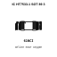
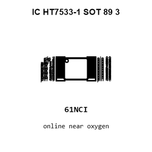
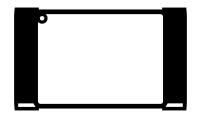
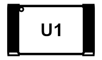
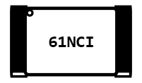
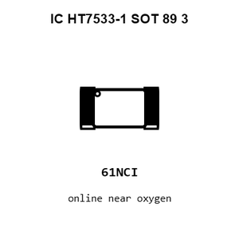
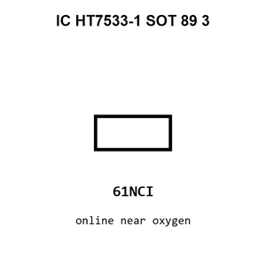
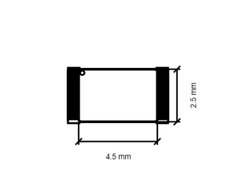
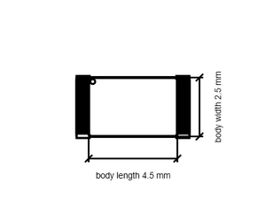

# IC HT7533-1 SOT 89 3

`electronic_ic_sot_89_3_power_management_linear_voltage_regulator_3_3_volt_holtek_semicon_ht7533_1`

IC HT7533-1 SOT 89 3 is an OOMP electronic ic definition. It uses the sot 89 3 package or form factor. Its nominal drawing size is 4.5 &#x00D7; 2.5 mm.

## At a glance

| Detail | Value |
| --- | --- |
| OOMP ID | `electronic_ic_sot_89_3_power_management_linear_voltage_regulator_3_3_volt_holtek_semicon_ht7533_1` |
| Type | Ic |
| Package / style | sot 89 3 |
| Nominal size | 4.5 &#x00D7; 2.5 mm |

## Classification

| Level | Value |
| --- | --- |
| 1 | `electronic` |
| 2 | `ic` |
| 3 | `sot_89_3` |
| 4 | `power_management` |
| 5 | `linear_voltage_regulator_3_3_volt` |
| 14 | `holtek_semicon` |
| 15 | `ht7533_1` |

## Nominal dimensions

| Measurement | Value |
| --- | ---: |
| Length | 4.5 mm |
| Width | 2.5 mm |

## Identifiers

| Identifier | Value |
| --- | --- |
| Manufacturer part number | `HT7533-1` |
| LCSC | [`C14289`](https://www.lcsc.com/product-detail/C14289.html) |
| JLCPCB | [`C14289`](https://jlcpcb.com/partdetail/HoltekSemicon-HT75331/C14289) |

## Files

[KiCad symbol, machine-solder and hand-solder footprints](data/kicad/README.md) · [Availability and source masters](data/kicad/manifest.yaml)

[View this part on GitHub](https://github.com/oomlout/oomp_electronic_version_5/tree/main/parts/electronic_ic_sot_89_3_power_management_linear_voltage_regulator_3_3_volt_holtek_semicon_ht7533_1)

[Browse this category](../../navigation/electronic/ic/sot_89_3/power_management/linear_voltage_regulator_3_3_volt/holtek_semicon/README.md)

---

This page is generated from the OOMP part definition by a Roboclick Jinja template. Edit the source taxonomy or template rather than this generated file.