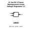
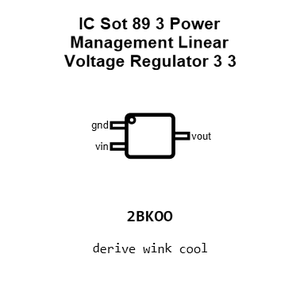
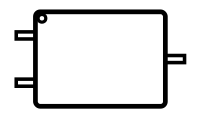
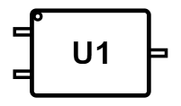
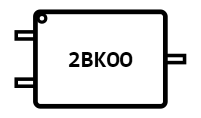
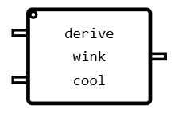
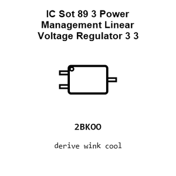
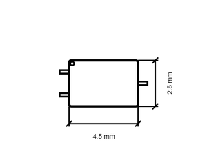
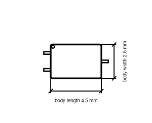

# IC Sot 89 3 Power Management Linear Voltage Regulator 3 3 Volt ME6211A33PG_N

`electronic_ic_sot_89_3_power_management_linear_voltage_regulator_3_3_volt_microne_me6211a33pg_n`

IC Sot 89 3 Power Management Linear Voltage Regulator 3 3 Volt ME6211A33PG_N is an OOMP electronic ic definition. It uses the sot 89 3 package or form factor. Its nominal drawing size is 4.5 &#x00D7; 2.5 mm. The definition includes 3 documented pins.

## At a glance

| Detail | Value |
| --- | --- |
| OOMP ID | `electronic_ic_sot_89_3_power_management_linear_voltage_regulator_3_3_volt_microne_me6211a33pg_n` |
| Type | Ic |
| Package / style | sot 89 3 |
| Nominal size | 4.5 &#x00D7; 2.5 mm |
| Documented pins | 3 |

## Classification

| Level | Value |
| --- | --- |
| 1 | `electronic` |
| 2 | `ic` |
| 3 | `sot_89_3` |
| 4 | `power_management` |
| 5 | `linear_voltage_regulator_3_3_volt` |
| 14 | `microne` |
| 15 | `me6211a33pg_n` |

## Nominal dimensions

| Measurement | Value |
| --- | ---: |
| Length | 4.5 mm |
| Width | 2.5 mm |

## Identifiers

| Identifier | Value |
| --- | --- |
| Manufacturer part number | `ME6211A33PG-N` |
| LCSC | `C236673` |

## Pins

| Pin | Name | Type |
| ---: | --- | --- |
| 1 | gnd | signal |
| 2 | vin | signal |
| 3 | vout | signal |

## Datasheet

[View the datasheet](datasheet.pdf)

## Files

[View this part on GitHub](https://github.com/oomlout/oomp_electronic_version_5/tree/main/parts/electronic_ic_sot_89_3_power_management_linear_voltage_regulator_3_3_volt_microne_me6211a33pg_n)

---

This page is generated from the OOMP part definition by a Roboclick Jinja template. Edit the source taxonomy or template rather than this generated file.