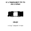
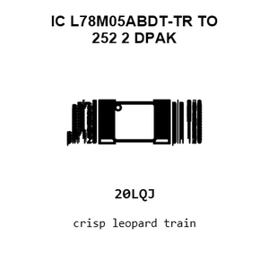
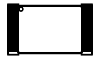
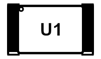
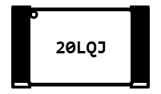
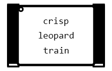
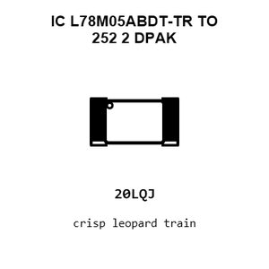
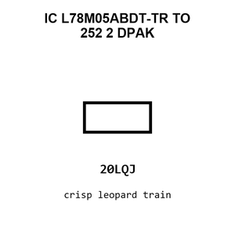
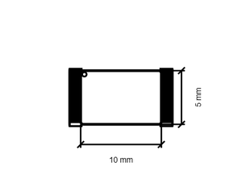
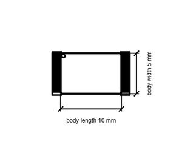

# IC L78M05ABDT-TR TO 252 2 DPAK

`electronic_ic_to_252_2_dpak_power_management_linear_voltage_regulator_5_volt_stmicroelectronics_l78m05abdt_tr`

IC L78M05ABDT-TR TO 252 2 DPAK is an OOMP electronic ic definition. It uses the to 252 2 dpak package or form factor. Its nominal drawing size is 10.0 &#x00D7; 5.0 mm.

## At a glance

| Detail | Value |
| --- | --- |
| OOMP ID | `electronic_ic_to_252_2_dpak_power_management_linear_voltage_regulator_5_volt_stmicroelectronics_l78m05abdt_tr` |
| Type | Ic |
| Package / style | to 252 2 dpak |
| Nominal size | 10.0 &#x00D7; 5.0 mm |

## Classification

| Level | Value |
| --- | --- |
| 1 | `electronic` |
| 2 | `ic` |
| 3 | `to_252_2_dpak` |
| 4 | `power_management` |
| 5 | `linear_voltage_regulator_5_volt` |
| 14 | `stmicroelectronics` |
| 15 | `l78m05abdt_tr` |

## Nominal dimensions

| Measurement | Value |
| --- | ---: |
| Length | 10.0 mm |
| Width | 5.0 mm |

## Identifiers

| Identifier | Value |
| --- | --- |
| Manufacturer part number | `L78M05ABDT-TR` |
| LCSC | [`C58069`](https://www.lcsc.com/product-detail/C58069.html) |
| JLCPCB | [`C58069`](https://jlcpcb.com/partdetail/STMicroelectronics-L78M05ABDTTR/C58069) |

## Files

[KiCad symbol, machine-solder and hand-solder footprints](data/kicad/README.md) · [Availability and source masters](data/kicad/manifest.yaml)

[View this part on GitHub](https://github.com/oomlout/oomp_electronic_version_5/tree/main/parts/electronic_ic_to_252_2_dpak_power_management_linear_voltage_regulator_5_volt_stmicroelectronics_l78m05abdt_tr)

[Browse this category](../../navigation/electronic/ic/to_252_2_dpak/power_management/linear_voltage_regulator_5_volt/stmicroelectronics/README.md)

---

This page is generated from the OOMP part definition by a Roboclick Jinja template. Edit the source taxonomy or template rather than this generated file.