# MCU ATmega328P-AU 8-bit AVR TQFP-32

`electronic_ic_tqfp_32_7_mm_x_7_mm_microcontroller_8_bit_avr_microchip_atmega328p_au`

MCU ATmega328P-AU 8-bit AVR TQFP-32 is an OOMP electronic ic definition. It uses the tqfp 32 7 mm x 7 mm package or form factor. Its nominal drawing size is 7.0 &#x00D7; 7.0 mm.

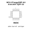

## At a glance

| Detail | Value |
| --- | --- |
| OOMP ID | `electronic_ic_tqfp_32_7_mm_x_7_mm_microcontroller_8_bit_avr_microchip_atmega328p_au` |
| Type | Ic |
| Package / style | tqfp 32 7 mm x 7 mm |
| Nominal size | 7.0 &#x00D7; 7.0 mm |

## Classification

| Level | Value |
| --- | --- |
| 1 | `electronic` |
| 2 | `ic` |
| 3 | `tqfp_32_7_mm_x_7_mm` |
| 4 | `microcontroller` |
| 5 | `8_bit_avr` |
| 14 | `microchip` |
| 15 | `atmega328p_au` |

## Nominal dimensions

| Measurement | Value |
| --- | ---: |
| Length | 7.0 mm |
| Width | 7.0 mm |

## Identifiers

| Identifier | Value |
| --- | --- |
| Manufacturer part number | `ATmega328P-AU` |
| LCSC | [`C14877`](https://www.lcsc.com/product-detail/C14877.html) |

## Files

[KiCad symbol, machine-solder and hand-solder footprints](data/kicad/README.md) · [Availability and source masters](data/kicad/manifest.yaml)

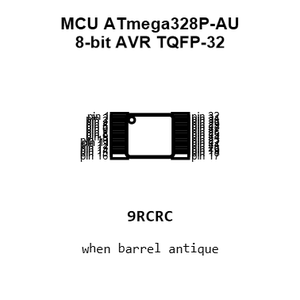

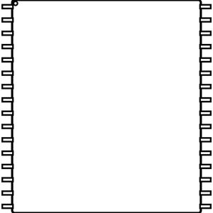

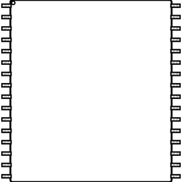

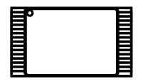

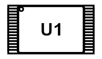

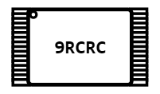

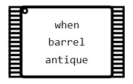

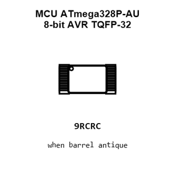

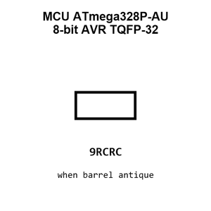

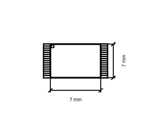

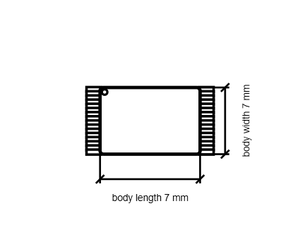

[View this part on GitHub](https://github.com/oomlout/oomp_electronic_version_5/tree/main/parts/electronic_ic_tqfp_32_7_mm_x_7_mm_microcontroller_8_bit_avr_microchip_atmega328p_au)

[Browse this category](../../navigation/electronic/ic/tqfp_32_7_mm_x_7_mm/microcontroller/8_bit_avr/microchip/README.md)

---

This page is generated from the OOMP part definition by a Roboclick Jinja template. Edit the source taxonomy or template rather than this generated file.