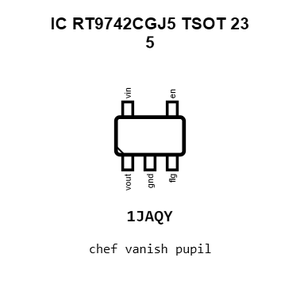
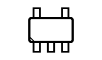
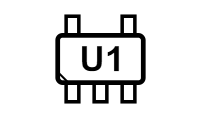
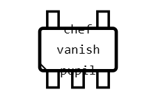
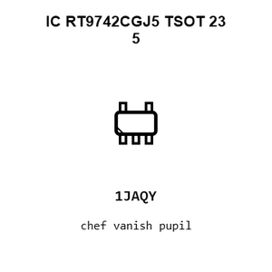
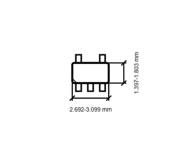

# IC RT9742CGJ5 TSOT 23 5

`electronic_ic_tsot_23_5_power_management_high_side_power_switch_with_flag_richtek_rt9742cgj5`

IC RT9742CGJ5 TSOT 23 5 is an OOMP electronic ic definition. It uses the tsot 23 5 package or form factor. Its nominal drawing size is 2.9 &#x00D7; 1.6 mm. The definition includes 5 documented pins.

## At a glance

| Detail | Value |
| --- | --- |
| OOMP ID | `electronic_ic_tsot_23_5_power_management_high_side_power_switch_with_flag_richtek_rt9742cgj5` |
| Type | Ic |
| Package / style | tsot 23 5 |
| Nominal size | 2.9 &#x00D7; 1.6 mm |
| Documented pins | 5 |

## Classification

| Level | Value |
| --- | --- |
| 1 | `electronic` |
| 2 | `ic` |
| 3 | `tsot_23_5` |
| 4 | `power_management` |
| 5 | `high_side_power_switch_with_flag` |
| 14 | `richtek` |
| 15 | `rt9742cgj5` |

## Nominal dimensions

| Measurement | Value |
| --- | ---: |
| Length | 2.9 mm |
| Width | 1.6 mm |

## Identifiers

| Identifier | Value |
| --- | --- |
| Manufacturer part number | `RT9742CGJ5` |
| LCSC | [`C250546`](https://www.lcsc.com/product-detail/C250546.html) |

## Pins

| Pin | Name | Type |
| ---: | --- | --- |
| 1 | vout | power |
| 2 | gnd | gnd |
| 3 | flg | signal |
| 4 | en | signal |
| 5 | vin | power |

## Datasheet

[View the datasheet](data/datasheet.pdf)

## Used in projects

| Project | Quantity | References | Explore |
| --- | ---: | --- | --- |
| [Project electrolama/pt1 current](https://github.com/electrolama/pt1) | 1 | IC4 | [Board explorer](https://oomlout.github.io/oomp_electronic_version_5/parts/oomp_project_github_electrolama_pt1_current/board_explorer.html) · [OOMP project](https://github.com/oomlout/oomp_electronic_version_5/tree/main/parts/oomp_project_github_electrolama_pt1_current) |

## Files

[KiCad symbol, machine-solder and hand-solder footprints](data/kicad/README.md) · [Availability and source masters](data/kicad/manifest.yaml)

[View this part on GitHub](https://github.com/oomlout/oomp_electronic_version_5/tree/main/parts/electronic_ic_tsot_23_5_power_management_high_side_power_switch_with_flag_richtek_rt9742cgj5)

[Browse this category](../../navigation/electronic/ic/tsot_23_5/power_management/high_side_power_switch_with_flag/richtek/README.md)

---

This page is generated from the OOMP part definition by a Roboclick Jinja template. Edit the source taxonomy or template rather than this generated file.