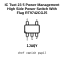
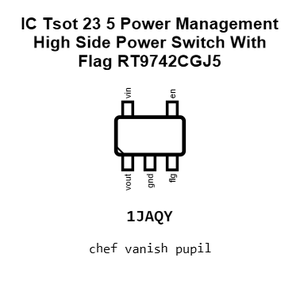
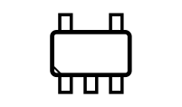
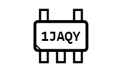
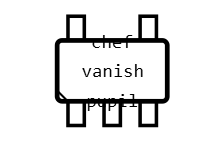
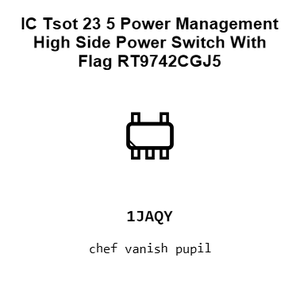
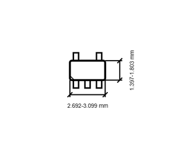
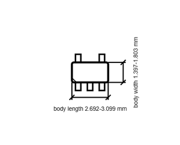

# IC Tsot 23 5 Power Management High Side Power Switch With Flag RT9742CGJ5

`electronic_ic_tsot_23_5_power_management_high_side_power_switch_with_flag_richtek_rt9742cgj5`

IC Tsot 23 5 Power Management High Side Power Switch With Flag RT9742CGJ5 is an OOMP electronic ic definition. It uses the tsot 23 5 package or form factor. Its nominal drawing size is 2.9 × 1.6 mm. The definition includes 5 documented pins.

## At a glance

| Detail | Value |
| --- | --- |
| OOMP ID | `electronic_ic_tsot_23_5_power_management_high_side_power_switch_with_flag_richtek_rt9742cgj5` |
| Type | Ic |
| Package / style | tsot 23 5 |
| Nominal size | 2.9 × 1.6 mm |
| Documented pins | 5 |

## Classification

| Level | Value |
| --- | --- |
| 1 | `electronic` |
| 2 | `ic` |
| 3 | `tsot_23_5` |
| 4 | `power_management` |
| 5 | `high_side_power_switch_with_flag` |
| 14 | `richtek` |
| 15 | `rt9742cgj5` |

## Nominal dimensions

| Measurement | Value |
| --- | ---: |
| Length | 2.9 mm |
| Width | 1.6 mm |

## Identifiers

| Identifier | Value |
| --- | --- |
| Manufacturer part number | `RT9742CGJ5` |
| LCSC | `C250546` |

## Pins

| Pin | Name | Type |
| ---: | --- | --- |
| 1 | vout | power |
| 2 | gnd | gnd |
| 3 | flg | signal |
| 4 | en | signal |
| 5 | vin | power |

## Datasheet

[View the datasheet](datasheet.pdf)

## Files

[View this part on GitHub](https://github.com/oomlout/oomp_electronic_version_5/tree/main/parts/electronic_ic_tsot_23_5_power_management_high_side_power_switch_with_flag_richtek_rt9742cgj5)

---

This page is generated from the OOMP part definition by a Roboclick Jinja template. Edit the source taxonomy or template rather than this generated file.
