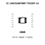
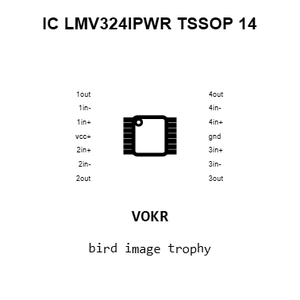
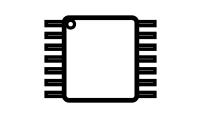
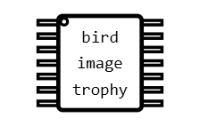
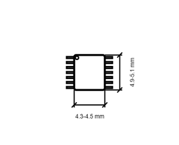
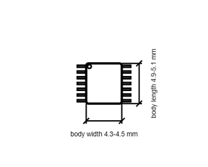

# IC LMV324IPWR TSSOP 14

`electronic_ic_tssop_14_amplifier_operational_quad_rail_to_rail_output_texas_instruments_lmv324ipwr`

IC LMV324IPWR TSSOP 14 is an OOMP electronic ic definition. It uses the tssop 14 package or form factor. Its nominal drawing size is 5.0 &#x00D7; 6.4 mm. The definition includes 14 documented pins.

## At a glance

| Detail | Value |
| --- | --- |
| OOMP ID | `electronic_ic_tssop_14_amplifier_operational_quad_rail_to_rail_output_texas_instruments_lmv324ipwr` |
| Type | Ic |
| Package / style | tssop 14 |
| Nominal size | 5.0 &#x00D7; 6.4 mm |
| Documented pins | 14 |

## Classification

| Level | Value |
| --- | --- |
| 1 | `electronic` |
| 2 | `ic` |
| 3 | `tssop_14` |
| 4 | `amplifier` |
| 5 | `operational_quad_rail_to_rail_output` |
| 14 | `texas_instruments` |
| 15 | `lmv324ipwr` |

## Nominal dimensions

| Measurement | Value |
| --- | ---: |
| Length | 5.0 mm |
| Width | 6.4 mm |

## Identifiers

| Identifier | Value |
| --- | --- |
| Manufacturer part number | `LMV324IPWR` |
| LCSC | [`C398929`](https://www.lcsc.com/product-detail/C398929.html) |

## Pins

| Pin | Name | Type |
| ---: | --- | --- |
| 1 | 1out | output |
| 2 | 1in- | input |
| 3 | 1in+ | input |
| 4 | vcc+ | power |
| 5 | 2in+ | input |
| 6 | 2in- | input |
| 7 | 2out | output |
| 8 | 3out | output |
| 9 | 3in- | input |
| 10 | 3in+ | input |
| 11 | gnd | power |
| 12 | 4in+ | input |
| 13 | 4in- | input |
| 14 | 4out | output |

## Datasheet

[View the datasheet](data/datasheet.pdf)

## Used in projects

| Project | Quantity | References | Explore |
| --- | ---: | --- | --- |
| [Project dangerousprototypes/buspirate5_hardware 5_rev10a](https://github.com/DangerousPrototypes/BusPirate5-hardware) | 2 | U504, U505 | [Board explorer](https://oomlout.github.io/oomp_electronic_version_5/parts/oomp_project_github_dangerousprototypes_buspirate5_hardware_5_rev10a/board_explorer.html) · [OOMP project](https://github.com/oomlout/oomp_electronic_version_5/tree/main/parts/oomp_project_github_dangerousprototypes_buspirate5_hardware_5_rev10a) |

## Files

[KiCad symbol, machine-solder and hand-solder footprints](data/kicad/README.md) · [Availability and source masters](data/kicad/manifest.yaml)

[View this part on GitHub](https://github.com/oomlout/oomp_electronic_version_5/tree/main/parts/electronic_ic_tssop_14_amplifier_operational_quad_rail_to_rail_output_texas_instruments_lmv324ipwr)

[Browse this category](../../navigation/electronic/ic/tssop_14/amplifier/operational_quad_rail_to_rail_output/texas_instruments/README.md)

---

This page is generated from the OOMP part definition by a Roboclick Jinja template. Edit the source taxonomy or template rather than this generated file.