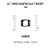
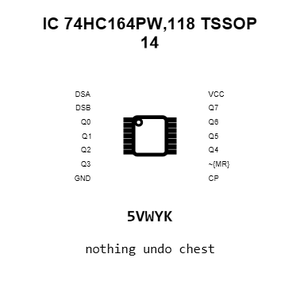
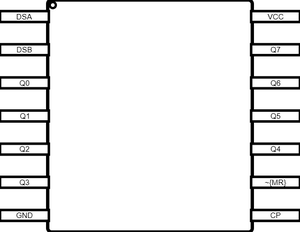
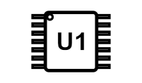
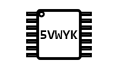
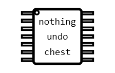
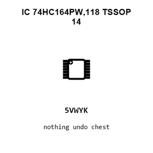
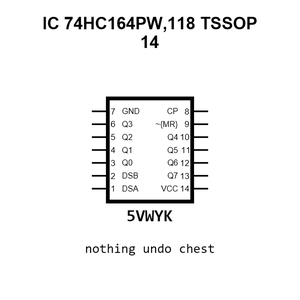
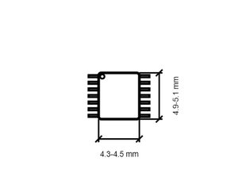

# IC 74HC164PW,118 TSSOP 14

`electronic_ic_tssop_14_logic_serial_in_parallel_out_shift_register_nexperia_74hc164pw_118`

IC 74HC164PW,118 TSSOP 14 is an OOMP electronic ic definition. It uses the tssop 14 package or form factor. Its nominal drawing size is 5.0 &#x00D7; 4.4 mm. The definition includes 14 documented pins.

## At a glance

| Detail | Value |
| --- | --- |
| OOMP ID | `electronic_ic_tssop_14_logic_serial_in_parallel_out_shift_register_nexperia_74hc164pw_118` |
| Type | Ic |
| Package / style | tssop 14 |
| Nominal size | 5.0 &#x00D7; 4.4 mm |
| Documented pins | 14 |

## Classification

| Level | Value |
| --- | --- |
| 1 | `electronic` |
| 2 | `ic` |
| 3 | `tssop_14` |
| 4 | `logic` |
| 5 | `serial_in_parallel_out_shift_register` |
| 14 | `nexperia` |
| 15 | `74hc164pw_118` |

## Nominal dimensions

| Measurement | Value |
| --- | ---: |
| Height | 1.1 mm |
| Length | 5.0 mm |
| Width | 4.4 mm |

## Identifiers

| Identifier | Value |
| --- | --- |
| Manufacturer part number | `74HC164PW,118` |
| LCSC | [`C5612`](https://www.lcsc.com/product-detail/C5612.html) |
| JLCPCB | [`C5612`](https://jlcpcb.com/partdetail/Nexperia-74HC164PW118/C5612) |

## Pins

| Pin | Name | Type |
| ---: | --- | --- |
| 1 | DSA | in |
| 2 | DSB | in |
| 3 | Q0 | out |
| 4 | Q1 | out |
| 5 | Q2 | out |
| 6 | Q3 | out |
| 7 | GND | pwr |
| 8 | CP | in |
| 9 | ~{MR} | in |
| 10 | Q4 | out |
| 11 | Q5 | out |
| 12 | Q6 | out |
| 13 | Q7 | out |
| 14 | VCC | pwr |

## Datasheet

[View the datasheet](data/datasheet.pdf)

## Files

[KiCad symbol, machine-solder and hand-solder footprints](data/kicad/README.md) · [Availability and source masters](data/kicad/manifest.yaml)

[View this part on GitHub](https://github.com/oomlout/oomp_electronic_version_5/tree/main/parts/electronic_ic_tssop_14_logic_serial_in_parallel_out_shift_register_nexperia_74hc164pw_118)

[Browse this category](../../navigation/electronic/ic/tssop_14/logic/serial_in_parallel_out_shift_register/nexperia/README.md)

---

This page is generated from the OOMP part definition by a Roboclick Jinja template. Edit the source taxonomy or template rather than this generated file.