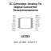
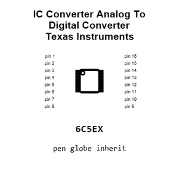
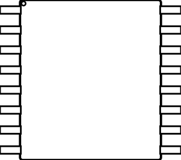
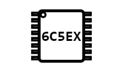
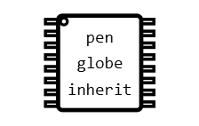
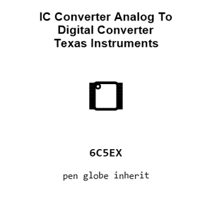
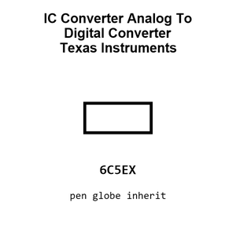

# IC Converter Analog To Digital Converter Texas Instruments TSSOP_16

`electronic_ic_tssop_16_converter_analog_to_digital_converter_texas_instruments_ads1219ipw`

IC Converter Analog To Digital Converter Texas Instruments TSSOP_16 is an OOMP electronic ic definition. It uses the tssop 16 package or form factor. Its nominal drawing size is 5.0 &#x00D7; 4.4 mm.

## At a glance

| Detail | Value |
| --- | --- |
| OOMP ID | `electronic_ic_tssop_16_converter_analog_to_digital_converter_texas_instruments_ads1219ipw` |
| Type | Ic |
| Package / style | tssop 16 |
| Nominal size | 5.0 &#x00D7; 4.4 mm |

## Classification

| Level | Value |
| --- | --- |
| 1 | `electronic` |
| 2 | `ic` |
| 3 | `tssop_16` |
| 4 | `converter` |
| 5 | `analog_to_digital_converter` |
| 14 | `texas_instruments` |
| 15 | `ads1219ipw` |

## Nominal dimensions

| Measurement | Value |
| --- | ---: |
| Length | 5.0 mm |
| Width | 4.4 mm |

## Files

[KiCad symbol, machine-solder and hand-solder footprints](data/kicad/README.md) · [Availability and source masters](data/kicad/manifest.yaml)

[View this part on GitHub](https://github.com/oomlout/oomp_electronic_version_5/tree/main/parts/electronic_ic_tssop_16_converter_analog_to_digital_converter_texas_instruments_ads1219ipw)

[Browse this category](../../navigation/electronic/ic/tssop_16/converter/analog_to_digital_converter/texas_instruments/README.md)

---

This page is generated from the OOMP part definition by a Roboclick Jinja template. Edit the source taxonomy or template rather than this generated file.