# IC 74HC4052PW,118 TSSOP 16

`electronic_ic_tssop_16_logic_dual_4_channel_analog_multiplexer_demultiplexer_nexperia_74hc4052pw_118`

IC 74HC4052PW,118 TSSOP 16 is an OOMP electronic ic definition. It uses the tssop 16 package or form factor. Its nominal drawing size is 5.0 &#x00D7; 4.4 mm. The definition includes 16 documented pins.

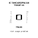

## At a glance

| Detail | Value |
| --- | --- |
| OOMP ID | `electronic_ic_tssop_16_logic_dual_4_channel_analog_multiplexer_demultiplexer_nexperia_74hc4052pw_118` |
| Type | Ic |
| Package / style | tssop 16 |
| Nominal size | 5.0 &#x00D7; 4.4 mm |
| Documented pins | 16 |

## Classification

| Level | Value |
| --- | --- |
| 1 | `electronic` |
| 2 | `ic` |
| 3 | `tssop_16` |
| 4 | `logic` |
| 5 | `dual_4_channel_analog_multiplexer_demultiplexer` |
| 14 | `nexperia` |
| 15 | `74hc4052pw_118` |

## Nominal dimensions

| Measurement | Value |
| --- | ---: |
| Height | 1.1 mm |
| Length | 5.0 mm |
| Width | 4.4 mm |

## Identifiers

| Identifier | Value |
| --- | --- |
| Manufacturer part number | `74HC4052PW,118` |
| LCSC | [`C5646`](https://www.lcsc.com/product-detail/C5646.html) |
| JLCPCB | [`C5646`](https://jlcpcb.com/partdetail/Nexperia-74HC4052PW118/C5646) |

## Pins

| Pin | Name | Type |
| ---: | --- | --- |
| 1 | Y0 | passive |
| 2 | Y2 | passive |
| 3 | Y | passive |
| 4 | Y3 | passive |
| 5 | Y1 | passive |
| 6 | Inh | in |
| 7 | VEE | pwr |
| 8 | VSS | pwr |
| 9 | B | in |
| 10 | A | in |
| 11 | X3 | passive |
| 12 | X0 | passive |
| 13 | X | passive |
| 14 | X1 | passive |
| 15 | X2 | passive |
| 16 | VDD | pwr |

## Datasheet

[View the datasheet](data/datasheet.pdf)

## Files

[KiCad symbol, machine-solder and hand-solder footprints](data/kicad/README.md) · [Availability and source masters](data/kicad/manifest.yaml)

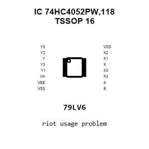

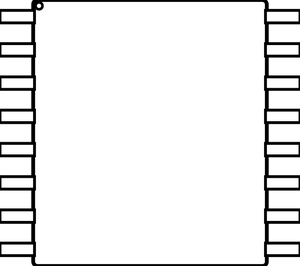

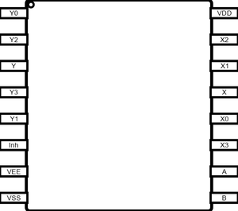

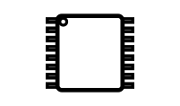

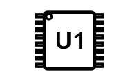

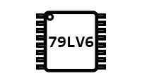

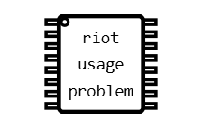

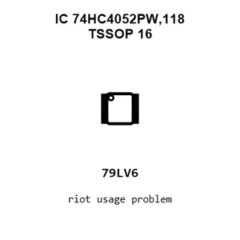

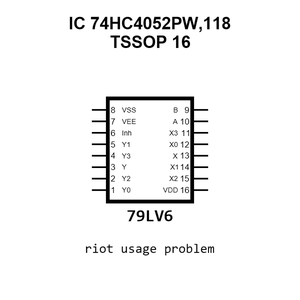

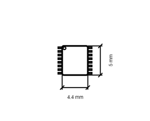

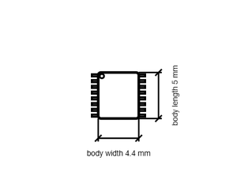

[View this part on GitHub](https://github.com/oomlout/oomp_electronic_version_5/tree/main/parts/electronic_ic_tssop_16_logic_dual_4_channel_analog_multiplexer_demultiplexer_nexperia_74hc4052pw_118)

[Browse this category](../../navigation/electronic/ic/tssop_16/logic/dual_4_channel_analog_multiplexer_demultiplexer/nexperia/README.md)

---

This page is generated from the OOMP part definition by a Roboclick Jinja template. Edit the source taxonomy or template rather than this generated file.