# IC Logic Io Expander Texas Instruments TSSOP_16

`electronic_ic_tssop_16_logic_io_expander_texas_instruments_pca9554pw`

IC Logic Io Expander Texas Instruments TSSOP_16 is an OOMP electronic ic definition. It uses the tssop 16 package or form factor. Its nominal drawing size is 5.0 &#x00D7; 4.4 mm. The definition includes 16 documented pins.

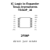

## At a glance

| Detail | Value |
| --- | --- |
| OOMP ID | `electronic_ic_tssop_16_logic_io_expander_texas_instruments_pca9554pw` |
| Type | Ic |
| Package / style | tssop 16 |
| Nominal size | 5.0 &#x00D7; 4.4 mm |
| Documented pins | 16 |

## Classification

| Level | Value |
| --- | --- |
| 1 | `electronic` |
| 2 | `ic` |
| 3 | `tssop_16` |
| 4 | `logic` |
| 5 | `io_expander` |
| 14 | `texas_instruments` |
| 15 | `pca9554pw` |

## Nominal dimensions

| Measurement | Value |
| --- | ---: |
| Height | 1.2 mm |
| Length | 5.0 mm |
| Width | 4.4 mm |

## Pins

| Pin | Name | Type |
| ---: | --- | --- |
| 1 | A0 | signal |
| 2 | A1 | signal |
| 3 | A2 | signal |
| 4 | P0 | signal |
| 5 | P1 | signal |
| 6 | P2 | signal |
| 7 | P3 | signal |
| 8 | VSS | gnd |
| 9 | P4 | signal |
| 10 | P5 | signal |
| 11 | P6 | signal |
| 12 | P7 | signal |
| 13 | INT | signal |
| 14 | SCL | signal |
| 15 | SDA | signal |
| 16 | VDD | power |

## Used in projects

| Project | Quantity | References | Explore |
| --- | ---: | --- | --- |
| [Project sparkfun/SparkFun_Qwiic_Directional_Pad Qwiic Directional Pad current](https://github.com/sparkfun/SparkFun_Qwiic_Directional_Pad) | 1 | U4 | [Board explorer](https://oomlout.github.io/oomp_electronic_version_5/parts/oomp_project_github_sparkfun_spark_fun_qwiic_directional_pad_qwiic_directional_pad_current/board_explorer.html) · [OOMP project](https://github.com/oomlout/oomp_electronic_version_5/tree/main/parts/oomp_project_github_sparkfun_spark_fun_qwiic_directional_pad_qwiic_directional_pad_current) |
| [Project sparkfun/SparkFun_Qwiic_Navigation_Switch Qwiic Navigation Switch current](https://github.com/sparkfun/SparkFun_Qwiic_Navigation_Switch) | 1 | U4 | [Board explorer](https://oomlout.github.io/oomp_electronic_version_5/parts/oomp_project_github_sparkfun_spark_fun_qwiic_navigation_switch_qwiic_navigation_switch_current/board_explorer.html) · [OOMP project](https://github.com/oomlout/oomp_electronic_version_5/tree/main/parts/oomp_project_github_sparkfun_spark_fun_qwiic_navigation_switch_qwiic_navigation_switch_current) |

## Files

[KiCad symbol, machine-solder and hand-solder footprints](data/kicad/README.md) · [Availability and source masters](data/kicad/manifest.yaml)

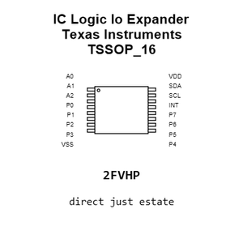

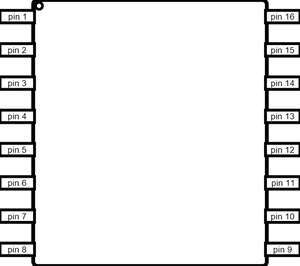

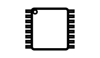

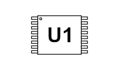

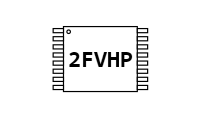

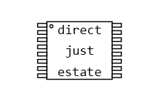

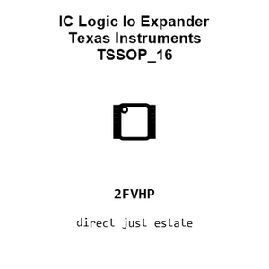

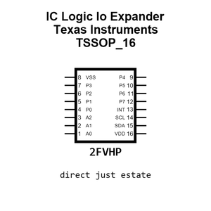

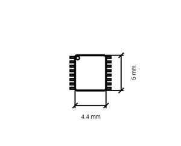

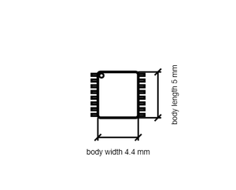

[View this part on GitHub](https://github.com/oomlout/oomp_electronic_version_5/tree/main/parts/electronic_ic_tssop_16_logic_io_expander_texas_instruments_pca9554pw)

[Browse this category](../../navigation/electronic/ic/tssop_16/logic/io_expander/texas_instruments/README.md)

---

This page is generated from the OOMP part definition by a Roboclick Jinja template. Edit the source taxonomy or template rather than this generated file.