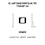
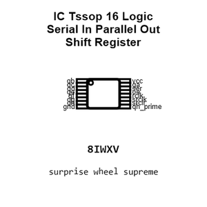
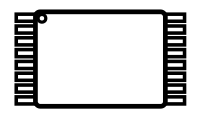
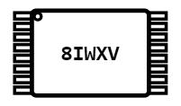
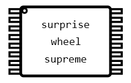
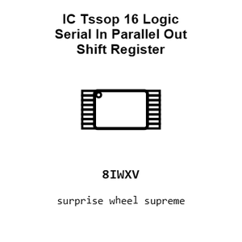
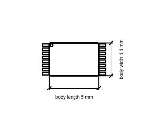

# IC AiP74HC595TA16.TR TSSOP_16

`electronic_ic_tssop_16_logic_serial_in_parallel_out_shift_register_wuxi_i_core_elec_aip74hc595ta16_tr`

IC AiP74HC595TA16.TR TSSOP_16 is an OOMP electronic ic definition. It uses the tssop 16 package or form factor. Its nominal drawing size is 5.0 &#x00D7; 4.4 mm. The definition includes 16 documented pins.

## At a glance

| Detail | Value |
| --- | --- |
| OOMP ID | `electronic_ic_tssop_16_logic_serial_in_parallel_out_shift_register_wuxi_i_core_elec_aip74hc595ta16_tr` |
| Type | Ic |
| Package / style | tssop 16 |
| Nominal size | 5.0 &#x00D7; 4.4 mm |
| Documented pins | 16 |

## Classification

| Level | Value |
| --- | --- |
| 1 | `electronic` |
| 2 | `ic` |
| 3 | `tssop_16` |
| 4 | `logic` |
| 5 | `serial_in_parallel_out_shift_register` |
| 14 | `wuxi_i_core_elec` |
| 15 | `aip74hc595ta16_tr` |

## Nominal dimensions

| Measurement | Value |
| --- | ---: |
| Length | 5.0 mm |
| Width | 4.4 mm |

## Identifiers

| Identifier | Value |
| --- | --- |
| Manufacturer part number | `AiP74HC595TA16.TR` |
| LCSC | [`C5121351`](https://www.lcsc.com/product-detail/C5121351.html) |

## Pins

| Pin | Name | Type |
| ---: | --- | --- |
| 1 | qb | signal |
| 2 | qc | signal |
| 3 | qd | signal |
| 4 | qe | signal |
| 5 | qf | signal |
| 6 | qg | signal |
| 7 | qh | signal |
| 8 | gnd | signal |
| 9 | qh_prime | signal |
| 10 | srclr | signal |
| 11 | srclk | signal |
| 12 | rclk | signal |
| 13 | oe | signal |
| 14 | ser | signal |
| 15 | qa | signal |
| 16 | vcc | signal |

## Datasheet

[View the datasheet](data/datasheet.pdf)

## Files

[View this part on GitHub](https://github.com/oomlout/oomp_electronic_version_5/tree/main/parts/electronic_ic_tssop_16_logic_serial_in_parallel_out_shift_register_wuxi_i_core_elec_aip74hc595ta16_tr)

[Browse this category](../../navigation/electronic/ic/tssop_16/logic/serial_in_parallel_out_shift_register/wuxi_i_core_elec/README.md)

---

This page is generated from the OOMP part definition by a Roboclick Jinja template. Edit the source taxonomy or template rather than this generated file.