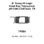
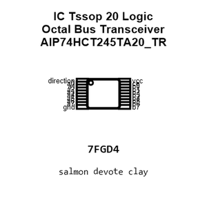
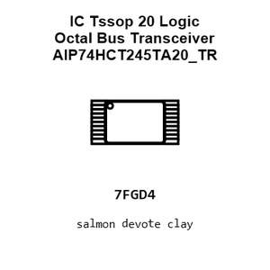
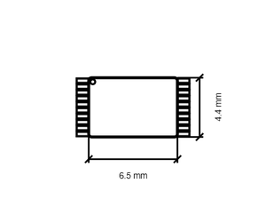
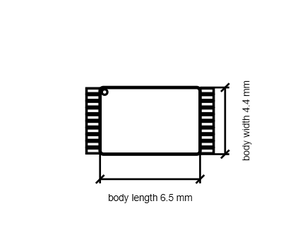

# IC Tssop 20 Logic Octal Bus Transceiver AIP74HCT245TA20_TR

`electronic_ic_tssop_20_logic_octal_bus_transceiver_wuxi_i_core_elec_aip74hct245ta20_tr`

IC Tssop 20 Logic Octal Bus Transceiver AIP74HCT245TA20_TR is an OOMP electronic ic definition. It uses the tssop 20 package or form factor. Its nominal drawing size is 6.5 &#x00D7; 4.4 mm. The definition includes 20 documented pins.

## At a glance

| Detail | Value |
| --- | --- |
| OOMP ID | `electronic_ic_tssop_20_logic_octal_bus_transceiver_wuxi_i_core_elec_aip74hct245ta20_tr` |
| Type | Ic |
| Package / style | tssop 20 |
| Nominal size | 6.5 &#x00D7; 4.4 mm |
| Documented pins | 20 |

## Classification

| Level | Value |
| --- | --- |
| 1 | `electronic` |
| 2 | `ic` |
| 3 | `tssop_20` |
| 4 | `logic` |
| 5 | `octal_bus_transceiver` |
| 14 | `wuxi_i_core_elec` |
| 15 | `aip74hct245ta20_tr` |

## Nominal dimensions

| Measurement | Value |
| --- | ---: |
| Length | 6.5 mm |
| Width | 4.4 mm |

## Identifiers

| Identifier | Value |
| --- | --- |
| Manufacturer part number | `AiP74HCT245TA20.TR` |
| LCSC | `C5354847` |

## Pins

| Pin | Name | Type |
| ---: | --- | --- |
| 1 | direction | signal |
| 2 | a0 | signal |
| 3 | a1 | signal |
| 4 | a2 | signal |
| 5 | a3 | signal |
| 6 | a4 | signal |
| 7 | a5 | signal |
| 8 | a6 | signal |
| 9 | a7 | signal |
| 10 | gnd | signal |
| 11 | b7 | signal |
| 12 | b6 | signal |
| 13 | b5 | signal |
| 14 | b4 | signal |
| 15 | b3 | signal |
| 16 | b2 | signal |
| 17 | b1 | signal |
| 18 | b0 | signal |
| 19 | ce | signal |
| 20 | vcc | signal |

## Datasheet

[View the datasheet](datasheet.pdf)

## Files

[View this part on GitHub](https://github.com/oomlout/oomp_electronic_version_5/tree/main/parts/electronic_ic_tssop_20_logic_octal_bus_transceiver_wuxi_i_core_elec_aip74hct245ta20_tr)

---

This page is generated from the OOMP part definition by a Roboclick Jinja template. Edit the source taxonomy or template rather than this generated file.