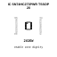
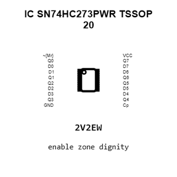
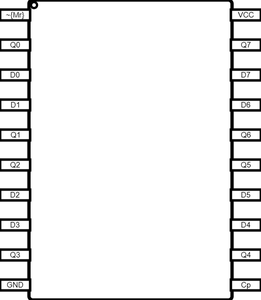
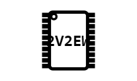
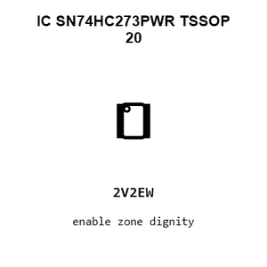
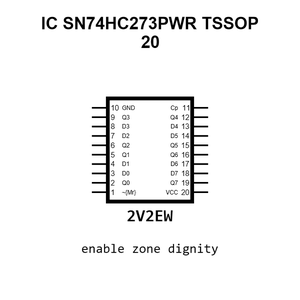

# IC SN74HC273PWR TSSOP 20

`electronic_ic_tssop_20_logic_octal_d_type_flip_flop_clear_texas_instruments_sn74hc273pwr`

IC SN74HC273PWR TSSOP 20 is an OOMP electronic ic definition. It uses the tssop 20 package or form factor. Its nominal drawing size is 6.5 &#x00D7; 4.4 mm. The definition includes 20 documented pins.

## At a glance

| Detail | Value |
| --- | --- |
| OOMP ID | `electronic_ic_tssop_20_logic_octal_d_type_flip_flop_clear_texas_instruments_sn74hc273pwr` |
| Type | Ic |
| Package / style | tssop 20 |
| Nominal size | 6.5 &#x00D7; 4.4 mm |
| Documented pins | 20 |

## Classification

| Level | Value |
| --- | --- |
| 1 | `electronic` |
| 2 | `ic` |
| 3 | `tssop_20` |
| 4 | `logic` |
| 5 | `octal_d_type_flip_flop_clear` |
| 14 | `texas_instruments` |
| 15 | `sn74hc273pwr` |

## Nominal dimensions

| Measurement | Value |
| --- | ---: |
| Height | 1.1 mm |
| Length | 6.5 mm |
| Width | 4.4 mm |

## Identifiers

| Identifier | Value |
| --- | --- |
| Manufacturer part number | `SN74HC273PWR` |
| LCSC | [`C6837`](https://www.lcsc.com/product-detail/C6837.html) |
| JLCPCB | [`C6837`](https://jlcpcb.com/partdetail/TexasInstruments-SN74HC273PWR/C6837) |

## Pins

| Pin | Name | Type |
| ---: | --- | --- |
| 1 | ~{Mr} | in |
| 2 | Q0 | out |
| 3 | D0 | in |
| 4 | D1 | in |
| 5 | Q1 | out |
| 6 | Q2 | out |
| 7 | D2 | in |
| 8 | D3 | in |
| 9 | Q3 | out |
| 10 | GND | pwr |
| 11 | Cp | in |
| 12 | Q4 | out |
| 13 | D4 | in |
| 14 | D5 | in |
| 15 | Q5 | out |
| 16 | Q6 | out |
| 17 | D6 | in |
| 18 | D7 | in |
| 19 | Q7 | out |
| 20 | VCC | pwr |

## Datasheet

[View the datasheet](data/datasheet.pdf)

## Files

[KiCad symbol, machine-solder and hand-solder footprints](data/kicad/README.md) · [Availability and source masters](data/kicad/manifest.yaml)

[View this part on GitHub](https://github.com/oomlout/oomp_electronic_version_5/tree/main/parts/electronic_ic_tssop_20_logic_octal_d_type_flip_flop_clear_texas_instruments_sn74hc273pwr)

[Browse this category](../../navigation/electronic/ic/tssop_20/logic/octal_d_type_flip_flop_clear/texas_instruments/README.md)

---

This page is generated from the OOMP part definition by a Roboclick Jinja template. Edit the source taxonomy or template rather than this generated file.