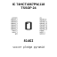
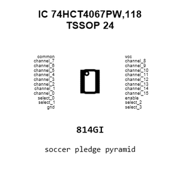
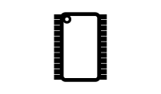
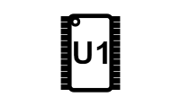
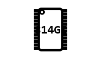
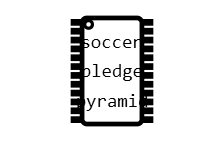
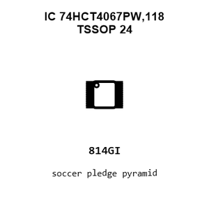
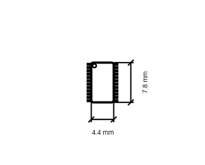
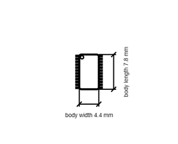

# IC 74HCT4067PW,118 TSSOP 24

`electronic_ic_tssop_24_logic_16_channel_analog_multiplexer_nexperia_74hct4067pw118`

IC 74HCT4067PW,118 TSSOP 24 is an OOMP electronic ic definition. It uses the tssop 24 package or form factor. Its nominal drawing size is 7.8 &#x00D7; 4.4 mm. The definition includes 24 documented pins.

## At a glance

| Detail | Value |
| --- | --- |
| OOMP ID | `electronic_ic_tssop_24_logic_16_channel_analog_multiplexer_nexperia_74hct4067pw118` |
| Type | Ic |
| Package / style | tssop 24 |
| Nominal size | 7.8 &#x00D7; 4.4 mm |
| Documented pins | 24 |

## Classification

| Level | Value |
| --- | --- |
| 1 | `electronic` |
| 2 | `ic` |
| 3 | `tssop_24` |
| 4 | `logic` |
| 5 | `16_channel_analog_multiplexer` |
| 14 | `nexperia` |
| 15 | `74hct4067pw118` |

## Nominal dimensions

| Measurement | Value |
| --- | ---: |
| Length | 7.8 mm |
| Width | 4.4 mm |

## Identifiers

| Identifier | Value |
| --- | --- |
| Manufacturer part number | `74HCT4067PW,118` |

## Pins

| Pin | Name | Type |
| ---: | --- | --- |
| 1 | common | signal |
| 2 | channel_7 | signal |
| 3 | channel_6 | signal |
| 4 | channel_5 | signal |
| 5 | channel_4 | signal |
| 6 | channel_3 | signal |
| 7 | channel_2 | signal |
| 8 | channel_1 | signal |
| 9 | channel_0 | signal |
| 10 | select_0 | signal |
| 11 | select_1 | signal |
| 12 | gnd | signal |
| 13 | select_3 | signal |
| 14 | select_2 | signal |
| 15 | enable | signal |
| 16 | channel_15 | signal |
| 17 | channel_14 | signal |
| 18 | channel_13 | signal |
| 19 | channel_12 | signal |
| 20 | channel_11 | signal |
| 21 | channel_10 | signal |
| 22 | channel_9 | signal |
| 23 | channel_8 | signal |
| 24 | vcc | signal |

## Datasheet

[View the datasheet](data/datasheet.pdf)

## Used in projects

| Project | Quantity | References | Explore |
| --- | ---: | --- | --- |
| [Project dangerousprototypes/buspirate5_hardware 5_rev10a](https://github.com/DangerousPrototypes/BusPirate5-hardware) | 1 | U402 | [Board explorer](https://oomlout.github.io/oomp_electronic_version_5/parts/oomp_project_github_dangerousprototypes_buspirate5_hardware_5_rev10a/board_explorer.html) · [OOMP project](https://github.com/oomlout/oomp_electronic_version_5/tree/main/parts/oomp_project_github_dangerousprototypes_buspirate5_hardware_5_rev10a) |

## Files

[KiCad symbol, machine-solder and hand-solder footprints](data/kicad/README.md) · [Availability and source masters](data/kicad/manifest.yaml)

[View this part on GitHub](https://github.com/oomlout/oomp_electronic_version_5/tree/main/parts/electronic_ic_tssop_24_logic_16_channel_analog_multiplexer_nexperia_74hct4067pw118)

[Browse this category](../../navigation/electronic/ic/tssop_24/logic/16_channel_analog_multiplexer/nexperia/README.md)

---

This page is generated from the OOMP part definition by a Roboclick Jinja template. Edit the source taxonomy or template rather than this generated file.