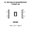
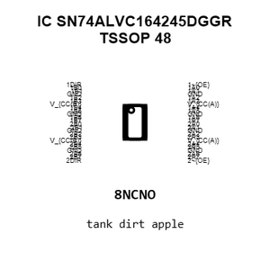
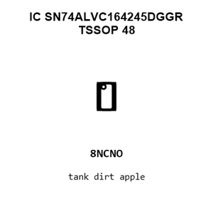
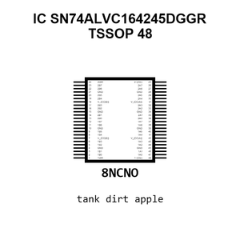
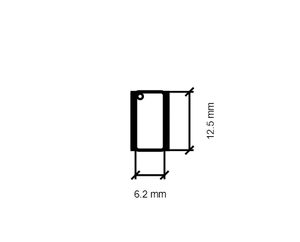
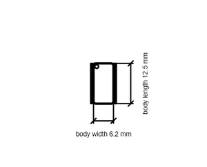

# IC SN74ALVC164245DGGR TSSOP 48

`electronic_ic_tssop_48_logic_16_bit_bus_transceiver_tri_state_texas_instruments_sn74alvc164245dggr`

IC SN74ALVC164245DGGR TSSOP 48 is an OOMP electronic ic definition. It uses the tssop 48 package or form factor. Its nominal drawing size is 12.5 &#x00D7; 6.2 mm. The definition includes 48 documented pins.

## At a glance

| Detail | Value |
| --- | --- |
| OOMP ID | `electronic_ic_tssop_48_logic_16_bit_bus_transceiver_tri_state_texas_instruments_sn74alvc164245dggr` |
| Type | Ic |
| Package / style | tssop 48 |
| Nominal size | 12.5 &#x00D7; 6.2 mm |
| Documented pins | 48 |

## Classification

| Level | Value |
| --- | --- |
| 1 | `electronic` |
| 2 | `ic` |
| 3 | `tssop_48` |
| 4 | `logic` |
| 5 | `16_bit_bus_transceiver_tri_state` |
| 14 | `texas_instruments` |
| 15 | `sn74alvc164245dggr` |

## Nominal dimensions

| Measurement | Value |
| --- | ---: |
| Height | 1.1 mm |
| Length | 12.5 mm |
| Width | 6.2 mm |

## Identifiers

| Identifier | Value |
| --- | --- |
| Manufacturer part number | `SN74ALVC164245DGGR` |
| LCSC | [`C7128`](https://www.lcsc.com/product-detail/C7128.html) |
| JLCPCB | [`C7128`](https://jlcpcb.com/partdetail/TexasInstruments-SN74ALVC164245DGGR/C7128) |

## Pins

| Pin | Name | Type |
| ---: | --- | --- |
| 1 | 1DIR | in |
| 2 | 1B0 | bidirectional |
| 3 | 1B1 | bidirectional |
| 4 | GND | pwr |
| 5 | 1B2 | bidirectional |
| 6 | 1B3 | bidirectional |
| 7 | V_{CC(B)} | pwr |
| 8 | 1B4 | bidirectional |
| 9 | 1B5 | bidirectional |
| 10 | GND | passive |
| 11 | 1B6 | bidirectional |
| 12 | 1B7 | bidirectional |
| 13 | 2B0 | bidirectional |
| 14 | 2B1 | bidirectional |
| 15 | GND | passive |
| 16 | 2B2 | bidirectional |
| 17 | 2B3 | bidirectional |
| 18 | V_{CC(B)} | passive |
| 19 | 2B4 | bidirectional |
| 20 | 2B5 | bidirectional |
| 21 | GND | passive |
| 22 | 2B6 | bidirectional |
| 23 | 2B7 | bidirectional |
| 24 | 2DIR | in |
| 25 | 2~{OE} | in |
| 26 | 2A7 | bidirectional |
| 27 | 2A6 | bidirectional |
| 28 | GND | passive |
| 29 | 2A5 | bidirectional |
| 30 | 2A4 | bidirectional |
| 31 | V_{CC(A)} | pwr |
| 32 | 2A3 | bidirectional |
| 33 | 2A2 | bidirectional |
| 34 | GND | passive |
| 35 | 2A1 | bidirectional |
| 36 | 2A0 | bidirectional |
| 37 | 1A7 | bidirectional |
| 38 | 1A6 | bidirectional |
| 39 | GND | passive |
| 40 | 1A5 | bidirectional |
| 41 | 1A4 | bidirectional |
| 42 | V_{CC(A)} | passive |
| 43 | 1A3 | bidirectional |
| 44 | 1A2 | bidirectional |
| 45 | GND | passive |
| 46 | 1A1 | bidirectional |
| 47 | 1A0 | bidirectional |
| 48 | 1~{OE} | in |

## Datasheet

[View the datasheet](data/datasheet.pdf)

## Files

[KiCad symbol, machine-solder and hand-solder footprints](data/kicad/README.md) · [Availability and source masters](data/kicad/manifest.yaml)

[View this part on GitHub](https://github.com/oomlout/oomp_electronic_version_5/tree/main/parts/electronic_ic_tssop_48_logic_16_bit_bus_transceiver_tri_state_texas_instruments_sn74alvc164245dggr)

[Browse this category](../../navigation/electronic/ic/tssop_48/logic/16_bit_bus_transceiver_tri_state/texas_instruments/README.md)

---

This page is generated from the OOMP part definition by a Roboclick Jinja template. Edit the source taxonomy or template rather than this generated file.