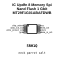
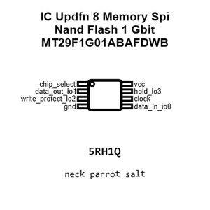
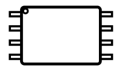
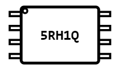
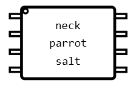
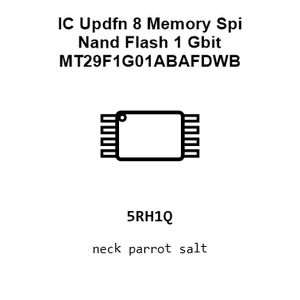
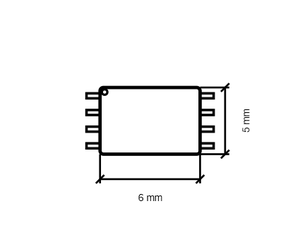
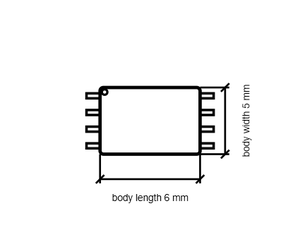

# IC Updfn 8 Memory Spi Nand Flash 1 Gbit MT29F1G01ABAFDWB

`electronic_ic_updfn_8_memory_spi_nand_flash_1_gbit_micron_mt29f1g01abafdwb`

IC Updfn 8 Memory Spi Nand Flash 1 Gbit MT29F1G01ABAFDWB is an OOMP electronic ic definition. It uses the updfn 8 package or form factor. Its nominal drawing size is 6.0 &#x00D7; 5.0 mm. The definition includes 8 documented pins.

## At a glance

| Detail | Value |
| --- | --- |
| OOMP ID | `electronic_ic_updfn_8_memory_spi_nand_flash_1_gbit_micron_mt29f1g01abafdwb` |
| Type | Ic |
| Package / style | updfn 8 |
| Nominal size | 6.0 &#x00D7; 5.0 mm |
| Documented pins | 8 |

## Classification

| Level | Value |
| --- | --- |
| 1 | `electronic` |
| 2 | `ic` |
| 3 | `updfn_8` |
| 4 | `memory` |
| 5 | `spi_nand_flash_1_gbit` |
| 14 | `micron` |
| 15 | `mt29f1g01abafdwb` |

## Nominal dimensions

| Measurement | Value |
| --- | ---: |
| Length | 6.0 mm |
| Width | 5.0 mm |

## Identifiers

| Identifier | Value |
| --- | --- |
| Manufacturer part number | `MT29F1G01ABAFDWB` |
| LCSC | `C2905686` |

## Pins

| Pin | Name | Type |
| ---: | --- | --- |
| 1 | chip_select | signal |
| 2 | data_out_io1 | signal |
| 3 | write_protect_io2 | signal |
| 4 | gnd | signal |
| 5 | data_in_io0 | signal |
| 6 | clock | signal |
| 7 | hold_io3 | signal |
| 8 | vcc | signal |

## Datasheet

[View the datasheet](datasheet.pdf)

## Files

[View this part on GitHub](https://github.com/oomlout/oomp_electronic_version_5/tree/main/parts/electronic_ic_updfn_8_memory_spi_nand_flash_1_gbit_micron_mt29f1g01abafdwb)

---

This page is generated from the OOMP part definition by a Roboclick Jinja template. Edit the source taxonomy or template rather than this generated file.