# IC Power Monitor Current Monitor Texas Instruments VSSOP_10

`electronic_ic_vssop_10_power_monitor_current_monitor_texas_instruments_ina228`

IC Power Monitor Current Monitor Texas Instruments VSSOP_10 is an OOMP electronic ic definition. It uses the vssop 10 package or form factor. Its nominal drawing size is 4.9 &#x00D7; 3.0 mm. The definition includes 10 documented pins.

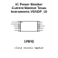

## At a glance

| Detail | Value |
| --- | --- |
| OOMP ID | `electronic_ic_vssop_10_power_monitor_current_monitor_texas_instruments_ina228` |
| Type | Ic |
| Package / style | vssop 10 |
| Nominal size | 4.9 &#x00D7; 3.0 mm |
| Documented pins | 10 |

## Classification

| Level | Value |
| --- | --- |
| 1 | `electronic` |
| 2 | `ic` |
| 3 | `vssop_10` |
| 4 | `power_monitor` |
| 5 | `current_monitor` |
| 14 | `texas_instruments` |
| 15 | `ina228` |

## Nominal dimensions

| Measurement | Value |
| --- | ---: |
| Height | 1.1 mm |
| Length | 4.9 mm |
| Width | 3.0 mm |

## Pins

| Pin | Name | Type |
| ---: | --- | --- |
| 1 | IN_PLUS | signal |
| 2 | IN_MINUS | signal |
| 3 | VBUS | signal |
| 4 | GND | gnd |
| 5 | VCC | power |
| 6 | SCL | signal |
| 7 | SDA | signal |
| 8 | ALERT | signal |
| 9 | A0 | signal |
| 10 | A1 | signal |

## Used in projects

| Project | Quantity | References | Explore |
| --- | ---: | --- | --- |
| [Project adafruit/Adafruit-INA228-PCB Adafruit INA228 I2 C Power Monitor current](https://github.com/adafruit/Adafruit-INA228-PCB/blob/main/Adafruit%20INA228%20I2C%20Power%20Monitor.brd) | 1 | IC1 | [Board explorer](https://oomlout.github.io/oomp_electronic_version_5/parts/oomp_project_github_adafruit_adafruit_ina228_pcb_adafruit_ina228_i2_c_power_monitor_current/board_explorer.html) · [OOMP project](https://github.com/oomlout/oomp_electronic_version_5/tree/main/parts/oomp_project_github_adafruit_adafruit_ina228_pcb_adafruit_ina228_i2_c_power_monitor_current) |
| [Project sparkfun/SparkFun_Qwiic_Current_Sensor_INA2XX Qwiic Current Sensor INA2XX current](https://github.com/sparkfun/SparkFun_Qwiic_Current_Sensor_INA2XX) | 1 | U2 | [Board explorer](https://oomlout.github.io/oomp_electronic_version_5/parts/oomp_project_github_sparkfun_spark_fun_qwiic_current_sensor_ina2_xx_qwiic_current_sensor_ina2xx_current/board_explorer.html) · [OOMP project](https://github.com/oomlout/oomp_electronic_version_5/tree/main/parts/oomp_project_github_sparkfun_spark_fun_qwiic_current_sensor_ina2_xx_qwiic_current_sensor_ina2xx_current) |

## Files

[KiCad symbol, machine-solder and hand-solder footprints](data/kicad/README.md) · [Availability and source masters](data/kicad/manifest.yaml)

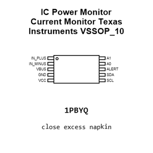

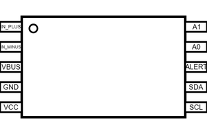

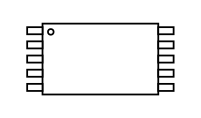

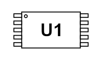

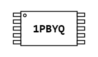

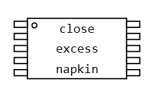

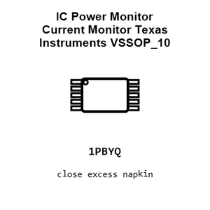

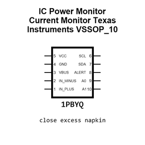

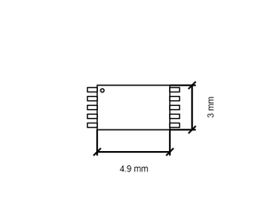

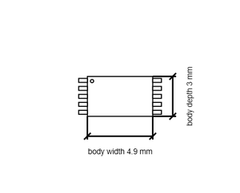

[View this part on GitHub](https://github.com/oomlout/oomp_electronic_version_5/tree/main/parts/electronic_ic_vssop_10_power_monitor_current_monitor_texas_instruments_ina228)

[Browse this category](../../navigation/electronic/ic/vssop_10/power_monitor/current_monitor/texas_instruments/README.md)

---

This page is generated from the OOMP part definition by a Roboclick Jinja template. Edit the source taxonomy or template rather than this generated file.