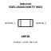
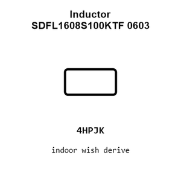
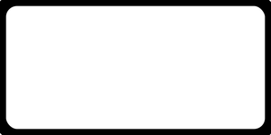
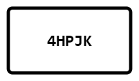
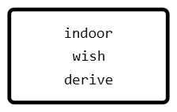
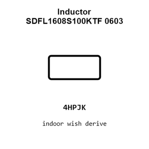
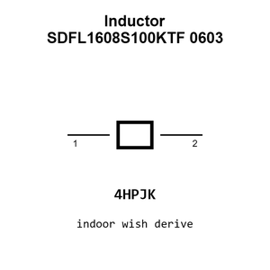
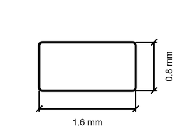
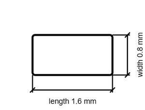

# Inductor SDFL1608S100KTF 0603

`electronic_inductor_0603_10_micro_henry_sunlord_sdfl1608s100ktf`

Inductor SDFL1608S100KTF 0603 is an OOMP electronic inductor definition. It uses the 0603 package or form factor. Its nominal drawing size is 1.6 &#x00D7; 0.8 mm.

## At a glance

| Detail | Value |
| --- | --- |
| OOMP ID | `electronic_inductor_0603_10_micro_henry_sunlord_sdfl1608s100ktf` |
| Type | Inductor |
| Package / style | 0603 |
| Nominal size | 1.6 &#x00D7; 0.8 mm |

## Classification

| Level | Value |
| --- | --- |
| 1 | `electronic` |
| 2 | `inductor` |
| 3 | `0603` |
| 4 | `10_micro_henry` |
| 14 | `sunlord` |
| 15 | `sdfl1608s100ktf` |

## Nominal dimensions

| Measurement | Value |
| --- | ---: |
| Length | 1.6 mm |
| Width | 0.8 mm |

## Identifiers

| Identifier | Value |
| --- | --- |
| Manufacturer part number | `SDFL1608S100KTF` |
| LCSC | [`C1035`](https://www.lcsc.com/product-detail/C1035.html) |
| JLCPCB | [`C1035`](https://jlcpcb.com/partdetail/Sunlord-SDFL1608S100KTF/C1035) |

## Files

[KiCad symbol, machine-solder and hand-solder footprints](data/kicad/README.md) · [Availability and source masters](data/kicad/manifest.yaml)

[View this part on GitHub](https://github.com/oomlout/oomp_electronic_version_5/tree/main/parts/electronic_inductor_0603_10_micro_henry_sunlord_sdfl1608s100ktf)

[Browse this category](../../navigation/electronic/inductor/0603/10_micro_henry/sunlord/README.md)

---

This page is generated from the OOMP part definition by a Roboclick Jinja template. Edit the source taxonomy or template rather than this generated file.