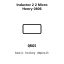
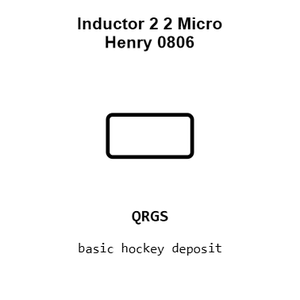
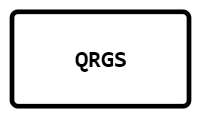
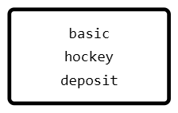
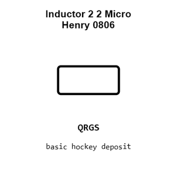
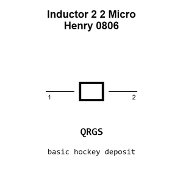

# Inductor 2 2 Micro Henry 0806

`electronic_inductor_0806_2_2_micro_henry`

Inductor 2 2 Micro Henry 0806 is an OOMP electronic inductor definition. It uses the 0806 package or form factor. Its nominal drawing size is 10.0 &#x00D7; 5.0 mm.

## At a glance

| Detail | Value |
| --- | --- |
| OOMP ID | `electronic_inductor_0806_2_2_micro_henry` |
| Type | Inductor |
| Package / style | 0806 |
| Nominal size | 10.0 &#x00D7; 5.0 mm |

## Classification

| Level | Value |
| --- | --- |
| 1 | `electronic` |
| 2 | `inductor` |
| 3 | `0806` |
| 4 | `2_2_micro_henry` |

## Nominal dimensions

| Measurement | Value |
| --- | ---: |
| Length | 10.0 mm |
| Width | 5.0 mm |

## Used in projects

| Project | Quantity | References | Explore |
| --- | ---: | --- | --- |
| [Project soldered_electronics/Air-quality-sensor-MQ135-breakout-qwiic-hardware-design MQ135 Breakout qwiic current](https://github.com/SolderedElectronics/Air-quality-sensor-MQ135-breakout-qwiic-hardware-design) | 1 | L1 | [Board explorer](https://oomlout.github.io/oomp_electronic_version_5/parts/oomp_project_github_soldered_electronics_air_quality_sensor_mq135_breakout_qwiic_hardware_design_sensor_gas_mq135_qwiic_current/board_explorer.html) · [OOMP project](https://github.com/oomlout/oomp_electronic_version_5/tree/main/parts/oomp_project_github_soldered_electronics_air_quality_sensor_mq135_breakout_qwiic_hardware_design_sensor_gas_mq135_qwiic_current) |
| [Project soldered_electronics/Air-quality-sensor-MQ135-breakout-with-easyC-hardware-design MQ135 Breakout easyC current](https://github.com/SolderedElectronics/Air-quality-sensor-MQ135-breakout-with-easyC-hardware-design) | 1 | L1 | [Board explorer](https://oomlout.github.io/oomp_electronic_version_5/parts/oomp_project_github_soldered_electronics_air_quality_sensor_mq135_breakout_with_easy_c_hardware_design_sensor_gas_mq135_easyc_current/board_explorer.html) · [OOMP project](https://github.com/oomlout/oomp_electronic_version_5/tree/main/parts/oomp_project_github_soldered_electronics_air_quality_sensor_mq135_breakout_with_easy_c_hardware_design_sensor_gas_mq135_easyc_current) |
| [Project soldered_electronics/Alcohol--Ethanol-sensor-MQ3-breakout-qwiic-hardware-design MQ3 Breakout qwiic current](https://github.com/SolderedElectronics/Alcohol--Ethanol-sensor-MQ3-breakout-qwiic-hardware-design) | 1 | L1 | [Board explorer](https://oomlout.github.io/oomp_electronic_version_5/parts/oomp_project_github_soldered_electronics_alcohol_ethanol_sensor_mq3_breakout_qwiic_hardware_design_sensor_gas_mq3_qwiic_current/board_explorer.html) · [OOMP project](https://github.com/oomlout/oomp_electronic_version_5/tree/main/parts/oomp_project_github_soldered_electronics_alcohol_ethanol_sensor_mq3_breakout_qwiic_hardware_design_sensor_gas_mq3_qwiic_current) |
| [Project soldered_electronics/Alcohol--Ethanol-sensor-MQ3-breakout-with-easyC-hardware-design MQ3 Breakout easyC current](https://github.com/SolderedElectronics/Alcohol--Ethanol-sensor-MQ3-breakout-with-easyC-hardware-design) | 1 | L1 | [Board explorer](https://oomlout.github.io/oomp_electronic_version_5/parts/oomp_project_github_soldered_electronics_alcohol_ethanol_sensor_mq3_breakout_with_easy_c_hardware_design_sensor_gas_mq3_easyc_current/board_explorer.html) · [OOMP project](https://github.com/oomlout/oomp_electronic_version_5/tree/main/parts/oomp_project_github_soldered_electronics_alcohol_ethanol_sensor_mq3_breakout_with_easy_c_hardware_design_sensor_gas_mq3_easyc_current) |
| [Project soldered_electronics/Ammonia-sensor-MQ137-breakout-qwiic-hardware-design MQ137 Breakout qwiic current](https://github.com/SolderedElectronics/Ammonia-sensor-MQ137-breakout-qwiic-hardware-design) | 1 | L1 | [Board explorer](https://oomlout.github.io/oomp_electronic_version_5/parts/oomp_project_github_soldered_electronics_ammonia_sensor_mq137_breakout_qwiic_hardware_design_sensor_gas_mq137_qwiic_current/board_explorer.html) · [OOMP project](https://github.com/oomlout/oomp_electronic_version_5/tree/main/parts/oomp_project_github_soldered_electronics_ammonia_sensor_mq137_breakout_qwiic_hardware_design_sensor_gas_mq137_qwiic_current) |
| [Project soldered_electronics/Ammonia-sensor-MQ137-breakout-with-easyC-hardware-design MQ137 Breakout easyC current](https://github.com/SolderedElectronics/Ammonia-sensor-MQ137-breakout-with-easyC-hardware-design) | 1 | L1 | [Board explorer](https://oomlout.github.io/oomp_electronic_version_5/parts/oomp_project_github_soldered_electronics_ammonia_sensor_mq137_breakout_with_easy_c_hardware_design_sensor_gas_mq137_easyc_current/board_explorer.html) · [OOMP project](https://github.com/oomlout/oomp_electronic_version_5/tree/main/parts/oomp_project_github_soldered_electronics_ammonia_sensor_mq137_breakout_with_easy_c_hardware_design_sensor_gas_mq137_easyc_current) |
| [Project soldered_electronics/Benzene--Toluene--Acetone--Formaldehyde-sensor-MQ138-breakout-with-easyC-hardware-design MQ138 Breakout easyC current](https://github.com/SolderedElectronics/Benzene--Toluene--Acetone--Formaldehyde-sensor-MQ138-breakout-with-easyC-hardware-design) | 1 | L1 | [Board explorer](https://oomlout.github.io/oomp_electronic_version_5/parts/oomp_project_github_soldered_electronics_benzene_toluene_acetone_formaldehyde_sensor_mq138_breakout_with_easy_c_hardware_design_sensor_gas_mq138_easyc_current/board_explorer.html) · [OOMP project](https://github.com/oomlout/oomp_electronic_version_5/tree/main/parts/oomp_project_github_soldered_electronics_benzene_toluene_acetone_formaldehyde_sensor_mq138_breakout_with_easy_c_hardware_design_sensor_gas_mq138_easyc_current) |
| [Project soldered_electronics/Butane--LPG---Smoke-sensor-MQ2-breakout-qwiic-hardware-design MQ2 Breakout qwiic current](https://github.com/SolderedElectronics/Butane--LPG---Smoke-sensor-MQ2-breakout-qwiic-hardware-design) | 1 | L1 | [Board explorer](https://oomlout.github.io/oomp_electronic_version_5/parts/oomp_project_github_soldered_electronics_butane_lpg_smoke_sensor_mq2_breakout_qwiic_hardware_design_sensor_gas_mq2_qwiic_current/board_explorer.html) · [OOMP project](https://github.com/oomlout/oomp_electronic_version_5/tree/main/parts/oomp_project_github_soldered_electronics_butane_lpg_smoke_sensor_mq2_breakout_qwiic_hardware_design_sensor_gas_mq2_qwiic_current) |
| [Project soldered_electronics/Butane--LPG---Smoke-sensor-MQ2-breakout-with-easyC-hardware-design MQ2 Breakout easyC current](https://github.com/SolderedElectronics/Butane--LPG---Smoke-sensor-MQ2-breakout-qwiic-hardware-design) | 1 | L1 | [Board explorer](https://oomlout.github.io/oomp_electronic_version_5/parts/oomp_project_github_soldered_electronics_butane_lpg_smoke_sensor_mq2_breakout_with_easy_c_hardware_design_sensor_gas_mq2_easyc_current/board_explorer.html) · [OOMP project](https://github.com/oomlout/oomp_electronic_version_5/tree/main/parts/oomp_project_github_soldered_electronics_butane_lpg_smoke_sensor_mq2_breakout_with_easy_c_hardware_design_sensor_gas_mq2_easyc_current) |
| [Project soldered_electronics/CO--flammable-gasses-sensor-MQ9-breakout-qwiic-hardware-design MQ9 Breakout qwiic current](https://github.com/SolderedElectronics/CO--flammable-gasses-sensor-MQ9-breakout-qwiic-hardware-design) | 1 | L1 | [Board explorer](https://oomlout.github.io/oomp_electronic_version_5/parts/oomp_project_github_soldered_electronics_co_flammable_gasses_sensor_mq9_breakout_qwiic_hardware_design_sensor_gas_mq9_qwiic_current/board_explorer.html) · [OOMP project](https://github.com/oomlout/oomp_electronic_version_5/tree/main/parts/oomp_project_github_soldered_electronics_co_flammable_gasses_sensor_mq9_breakout_qwiic_hardware_design_sensor_gas_mq9_qwiic_current) |
| [Project soldered_electronics/CO--flammable-gasses-sensor-MQ9-breakout-with-easyC-hardware-design MQ9 Breakout easyC current](https://github.com/SolderedElectronics/CO--flammable-gasses-sensor-MQ9-breakout-with-easyC-hardware-design) | 1 | L1 | [Board explorer](https://oomlout.github.io/oomp_electronic_version_5/parts/oomp_project_github_soldered_electronics_co_flammable_gasses_sensor_mq9_breakout_with_easy_c_hardware_design_sensor_gas_mq9_easyc_current/board_explorer.html) · [OOMP project](https://github.com/oomlout/oomp_electronic_version_5/tree/main/parts/oomp_project_github_soldered_electronics_co_flammable_gasses_sensor_mq9_breakout_with_easy_c_hardware_design_sensor_gas_mq9_easyc_current) |
| [Project soldered_electronics/CO-sensor-MQ7-breakout-qwiic-hardware-design MQ7 Breakout qwiic current](https://github.com/SolderedElectronics/CO-sensor-MQ7-breakout-qwiic-hardware-design) | 1 | L1 | [Board explorer](https://oomlout.github.io/oomp_electronic_version_5/parts/oomp_project_github_soldered_electronics_co_sensor_mq7_breakout_qwiic_hardware_design_sensor_gas_mq7_qwiic_current/board_explorer.html) · [OOMP project](https://github.com/oomlout/oomp_electronic_version_5/tree/main/parts/oomp_project_github_soldered_electronics_co_sensor_mq7_breakout_qwiic_hardware_design_sensor_gas_mq7_qwiic_current) |
| [Project soldered_electronics/CO-sensor-MQ7-breakout-with-easyC-hardware-design MQ7 Breakout easyC current](https://github.com/SolderedElectronics/CO-sensor-MQ7-breakout-with-easyC-hardware-design) | 1 | L1 | [Board explorer](https://oomlout.github.io/oomp_electronic_version_5/parts/oomp_project_github_soldered_electronics_co_sensor_mq7_breakout_with_easy_c_hardware_design_sensor_gas_mq7_easyc_current/board_explorer.html) · [OOMP project](https://github.com/oomlout/oomp_electronic_version_5/tree/main/parts/oomp_project_github_soldered_electronics_co_sensor_mq7_breakout_with_easy_c_hardware_design_sensor_gas_mq7_easyc_current) |
| [Project soldered_electronics/Hydrogen-sensor-MQ8-breakout-qwiic-hardware-design MQ8 Breakout qwiic current](https://github.com/SolderedElectronics/Hydrogen-sensor-MQ8-breakout-qwiic-hardware-design) | 1 | L1 | [Board explorer](https://oomlout.github.io/oomp_electronic_version_5/parts/oomp_project_github_soldered_electronics_hydrogen_sensor_mq8_breakout_qwiic_hardware_design_sensor_gas_mq8_qwiic_current/board_explorer.html) · [OOMP project](https://github.com/oomlout/oomp_electronic_version_5/tree/main/parts/oomp_project_github_soldered_electronics_hydrogen_sensor_mq8_breakout_qwiic_hardware_design_sensor_gas_mq8_qwiic_current) |
| [Project soldered_electronics/Hydrogen-sensor-MQ8-breakout-with-easyC-hardware-design MQ8 Breakout easyC current](https://github.com/SolderedElectronics/Hydrogen-sensor-MQ8-breakout-with-easyC-hardware-design) | 1 | L1 | [Board explorer](https://oomlout.github.io/oomp_electronic_version_5/parts/oomp_project_github_soldered_electronics_hydrogen_sensor_mq8_breakout_with_easy_c_hardware_design_sensor_gas_mq8_easyc_current/board_explorer.html) · [OOMP project](https://github.com/oomlout/oomp_electronic_version_5/tree/main/parts/oomp_project_github_soldered_electronics_hydrogen_sensor_mq8_breakout_with_easy_c_hardware_design_sensor_gas_mq8_easyc_current) |
| [Project soldered_electronics/Hydrogen-Sulfide-sensor-MQ136-breakout-with-easyC-hardware-design MQ136 Breakout easyC current](https://github.com/SolderedElectronics/Hydrogen-Sulfide-sensor-MQ136-breakout-with-easyC-hardware-design) | 1 | L1 | [Board explorer](https://oomlout.github.io/oomp_electronic_version_5/parts/oomp_project_github_soldered_electronics_hydrogen_sulfide_sensor_mq136_breakout_with_easy_c_hardware_design_sensor_gas_mq136_easyc_current/board_explorer.html) · [OOMP project](https://github.com/oomlout/oomp_electronic_version_5/tree/main/parts/oomp_project_github_soldered_electronics_hydrogen_sulfide_sensor_mq136_breakout_with_easy_c_hardware_design_sensor_gas_mq136_easyc_current) |
| [Project soldered_electronics/LPG--Butane-sensor-MQ6-breakout-qwiic-hardware-design MQ6 Breakout qwiic current](https://github.com/SolderedElectronics/LPG--Butane-sensor-MQ6-breakout-qwiic-hardware-design) | 1 | L1 | [Board explorer](https://oomlout.github.io/oomp_electronic_version_5/parts/oomp_project_github_soldered_electronics_lpg_butane_sensor_mq6_breakout_qwiic_hardware_design_sensor_gas_mq6_qwiic_current/board_explorer.html) · [OOMP project](https://github.com/oomlout/oomp_electronic_version_5/tree/main/parts/oomp_project_github_soldered_electronics_lpg_butane_sensor_mq6_breakout_qwiic_hardware_design_sensor_gas_mq6_qwiic_current) |
| [Project soldered_electronics/LPG--Butane-sensor-MQ6-breakout-with-easyC-hardware-design MQ6 Breakout easyC current](https://github.com/SolderedElectronics/LPG--Butane-sensor-MQ6-breakout-with-easyC-hardware-design) | 1 | L1 | [Board explorer](https://oomlout.github.io/oomp_electronic_version_5/parts/oomp_project_github_soldered_electronics_lpg_butane_sensor_mq6_breakout_with_easy_c_hardware_design_sensor_gas_mq6_easyc_current/board_explorer.html) · [OOMP project](https://github.com/oomlout/oomp_electronic_version_5/tree/main/parts/oomp_project_github_soldered_electronics_lpg_butane_sensor_mq6_breakout_with_easy_c_hardware_design_sensor_gas_mq6_easyc_current) |
| [Project soldered_electronics/Methane--CNG-sensor-MQ4-breakout-qwiic-hardware-design MQ4 Breakout qwiic current](https://github.com/SolderedElectronics/Methane--CNG-sensor-MQ4-breakout-qwiic-hardware-design) | 1 | L1 | [Board explorer](https://oomlout.github.io/oomp_electronic_version_5/parts/oomp_project_github_soldered_electronics_methane_cng_sensor_mq4_breakout_qwiic_hardware_design_sensor_gas_mq4_qwiic_current/board_explorer.html) · [OOMP project](https://github.com/oomlout/oomp_electronic_version_5/tree/main/parts/oomp_project_github_soldered_electronics_methane_cng_sensor_mq4_breakout_qwiic_hardware_design_sensor_gas_mq4_qwiic_current) |
| [Project soldered_electronics/Methane--CNG-sensor-MQ4-breakout-with-easyC-hardware-design MQ4 Breakout easyC current](https://github.com/SolderedElectronics/Methane--CNG-sensor-MQ4-breakout-with-easyC-hardware-design) | 1 | L1 | [Board explorer](https://oomlout.github.io/oomp_electronic_version_5/parts/oomp_project_github_soldered_electronics_methane_cng_sensor_mq4_breakout_with_easy_c_hardware_design_sensor_gas_mq4_easyc_current/board_explorer.html) · [OOMP project](https://github.com/oomlout/oomp_electronic_version_5/tree/main/parts/oomp_project_github_soldered_electronics_methane_cng_sensor_mq4_breakout_with_easy_c_hardware_design_sensor_gas_mq4_easyc_current) |
| [Project soldered_electronics/Methane--Natural-gas-sensor-MQ214-breakout-with-easyC-hardware-design MQ214 Breakout easyC current](https://github.com/SolderedElectronics/Methane--Natural-gas-sensor-MQ214-breakout-with-easyC-hardware-design) | 1 | L1 | [Board explorer](https://oomlout.github.io/oomp_electronic_version_5/parts/oomp_project_github_soldered_electronics_methane_natural_gas_sensor_mq214_breakout_with_easy_c_hardware_design_sensor_gas_mq214_easyc_current/board_explorer.html) · [OOMP project](https://github.com/oomlout/oomp_electronic_version_5/tree/main/parts/oomp_project_github_soldered_electronics_methane_natural_gas_sensor_mq214_breakout_with_easy_c_hardware_design_sensor_gas_mq214_easyc_current) |
| [Project soldered_electronics/Natural-gas--LPG-sensor-MQ5-breakout-qwiic-hardware-design MQ5 Breakout qwiic current](https://github.com/SolderedElectronics/Natural-gas--LPG-sensor-MQ5-breakout-qwiic-hardware-design) | 1 | L1 | [Board explorer](https://oomlout.github.io/oomp_electronic_version_5/parts/oomp_project_github_soldered_electronics_natural_gas_lpg_sensor_mq5_breakout_qwiic_hardware_design_sensor_gas_mq5_qwiic_current/board_explorer.html) · [OOMP project](https://github.com/oomlout/oomp_electronic_version_5/tree/main/parts/oomp_project_github_soldered_electronics_natural_gas_lpg_sensor_mq5_breakout_qwiic_hardware_design_sensor_gas_mq5_qwiic_current) |
| [Project soldered_electronics/Natural-gas--LPG-sensor-MQ5-breakout-with-easyC-hardware-design MQ5 Breakout easyC current](https://github.com/SolderedElectronics/Natural-gas--LPG-sensor-MQ5-breakout-with-easyC-hardware-design) | 1 | L1 | [Board explorer](https://oomlout.github.io/oomp_electronic_version_5/parts/oomp_project_github_soldered_electronics_natural_gas_lpg_sensor_mq5_breakout_with_easy_c_hardware_design_sensor_gas_mq5_easyc_current/board_explorer.html) · [OOMP project](https://github.com/oomlout/oomp_electronic_version_5/tree/main/parts/oomp_project_github_soldered_electronics_natural_gas_lpg_sensor_mq5_breakout_with_easy_c_hardware_design_sensor_gas_mq5_easyc_current) |
| [Project soldered_electronics/Ozone-sensor-MQ131-breakout-qwiic-hardware-design MQ131 Breakout qwiic current](https://github.com/SolderedElectronics/Ozone-sensor-MQ131-breakout-qwiic-hardware-design) | 1 | L1 | [Board explorer](https://oomlout.github.io/oomp_electronic_version_5/parts/oomp_project_github_soldered_electronics_ozone_sensor_mq131_breakout_qwiic_hardware_design_sensor_gas_mq131_qwiic_current/board_explorer.html) · [OOMP project](https://github.com/oomlout/oomp_electronic_version_5/tree/main/parts/oomp_project_github_soldered_electronics_ozone_sensor_mq131_breakout_qwiic_hardware_design_sensor_gas_mq131_qwiic_current) |
| [Project soldered_electronics/Ozone-sensor-MQ131-breakout-with-easyC-hardware-design MQ131 Breakout easyC current](https://github.com/SolderedElectronics/Ozone-sensor-MQ131-breakout-with-easyC-hardware-design) | 1 | L1 | [Board explorer](https://oomlout.github.io/oomp_electronic_version_5/parts/oomp_project_github_soldered_electronics_ozone_sensor_mq131_breakout_with_easy_c_hardware_design_sensor_gas_mq131_easyc_current/board_explorer.html) · [OOMP project](https://github.com/oomlout/oomp_electronic_version_5/tree/main/parts/oomp_project_github_soldered_electronics_ozone_sensor_mq131_breakout_with_easy_c_hardware_design_sensor_gas_mq131_easyc_current) |
| [Project soldered_electronics/PMS7003-sensor-adapter-hardware-design PMS7003 Adapter current](https://github.com/SolderedElectronics/PMS7003-sensor-adapter-hardware-design) | 1 | L1 | [Board explorer](https://oomlout.github.io/oomp_electronic_version_5/parts/oomp_project_github_soldered_electronics_pms7003_sensor_adapter_hardware_design_sensor_pms7003_adapter_current/board_explorer.html) · [OOMP project](https://github.com/oomlout/oomp_electronic_version_5/tree/main/parts/oomp_project_github_soldered_electronics_pms7003_sensor_adapter_hardware_design_sensor_pms7003_adapter_current) |
| [Project soldered_electronics/Ultrasonic-sensor-qwiic-hardware-design Ultrasonic Sensor qwiic current](https://github.com/SolderedElectronics/Ultrasonic-sensor-qwiic-hardware-design) | 1 | L1 | [Board explorer](https://oomlout.github.io/oomp_electronic_version_5/parts/oomp_project_github_soldered_electronics_ultrasonic_sensor_qwiic_hardware_design_sensor_ultrasonic_qwiic_current/board_explorer.html) · [OOMP project](https://github.com/oomlout/oomp_electronic_version_5/tree/main/parts/oomp_project_github_soldered_electronics_ultrasonic_sensor_qwiic_hardware_design_sensor_ultrasonic_qwiic_current) |
| [Project soldered_electronics/Ultrasonic-sensor-with-easyC-hardware-design Ultrasonic Sensor easyC current](https://github.com/SolderedElectronics/Ultrasonic-sensor-with-easyC-hardware-design) | 1 | L1 | [Board explorer](https://oomlout.github.io/oomp_electronic_version_5/parts/oomp_project_github_soldered_electronics_ultrasonic_sensor_with_easy_c_hardware_design_sensor_ultrasonic_easyc_current/board_explorer.html) · [OOMP project](https://github.com/oomlout/oomp_electronic_version_5/tree/main/parts/oomp_project_github_soldered_electronics_ultrasonic_sensor_with_easy_c_hardware_design_sensor_ultrasonic_easyc_current) |

## Files

[KiCad symbol, machine-solder and hand-solder footprints](data/kicad/README.md) · [Availability and source masters](data/kicad/manifest.yaml)

[View this part on GitHub](https://github.com/oomlout/oomp_electronic_version_5/tree/main/parts/electronic_inductor_0806_2_2_micro_henry)

[Browse this category](../../navigation/electronic/inductor/0806/README.md)

---

This page is generated from the OOMP part definition by a Roboclick Jinja template. Edit the source taxonomy or template rather than this generated file.