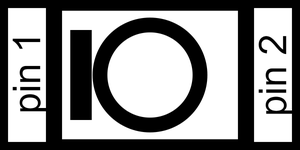
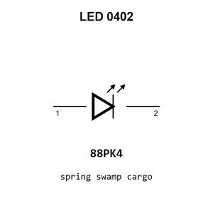

# LED  0402

`electronic_led_0402`

LED  0402 is an OOMP electronic led definition. It uses the 0402 package or form factor. Its nominal drawing size is 1.0 &#x00D7; 0.5 mm.

## At a glance

| Detail | Value |
| --- | --- |
| OOMP ID | `electronic_led_0402` |
| Type | Led |
| Package / style | 0402 |
| Nominal size | 1.0 &#x00D7; 0.5 mm |

## Classification

| Level | Value |
| --- | --- |
| 1 | `electronic` |
| 2 | `led` |
| 3 | `0402` |

## Nominal dimensions

| Measurement | Value |
| --- | ---: |
| Length | 1.0 mm |
| Width | 0.5 mm |

## Used in projects

| Project | Quantity | References | Explore |
| --- | ---: | --- | --- |
| [Project hanqaqa/easyduino ATmega328P Arduino Nano current](https://github.com/Hanqaqa/Easyduino/tree/master/Atmega328p%20Arduino%20Nano) | 2 | D1, D3 | [Board explorer](https://oomlout.github.io/oomp_electronic_version_5/parts/oomp_project_github_hanqaqa_easyduino_atmega328p_arduino_nano_current/board_explorer.html) · [OOMP project](https://github.com/oomlout/oomp_electronic_version_5/tree/main/parts/oomp_project_github_hanqaqa_easyduino_atmega328p_arduino_nano_current) |
| [Project hanqaqa/easyduino ESP32S3 current](https://github.com/Hanqaqa/Easyduino/tree/master/ESP32S3) | 2 | D1, D4 | [Board explorer](https://oomlout.github.io/oomp_electronic_version_5/parts/oomp_project_github_hanqaqa_easyduino_esp32s3_current/board_explorer.html) · [OOMP project](https://github.com/oomlout/oomp_electronic_version_5/tree/main/parts/oomp_project_github_hanqaqa_easyduino_esp32s3_current) |
| [Project hanqaqa/easyduino Raspberry Pi Pico 2040 current](https://github.com/Hanqaqa/Easyduino/tree/master/Raspberry%20Pi%20Pico%202040) | 3 | D2, D3, D4 | [Board explorer](https://oomlout.github.io/oomp_electronic_version_5/parts/oomp_project_github_hanqaqa_easyduino_raspberry_pi_pico_2040_current/board_explorer.html) · [OOMP project](https://github.com/oomlout/oomp_electronic_version_5/tree/main/parts/oomp_project_github_hanqaqa_easyduino_raspberry_pi_pico_2040_current) |
| [Project hanqaqa/easyduino STM32F103 Bluepill current](https://github.com/Hanqaqa/Easyduino/tree/master/STM32F103%20Bluepill) | 2 | D1, D2 | [Board explorer](https://oomlout.github.io/oomp_electronic_version_5/parts/oomp_project_github_hanqaqa_easyduino_stm32f103_bluepill_current/board_explorer.html) · [OOMP project](https://github.com/oomlout/oomp_electronic_version_5/tree/main/parts/oomp_project_github_hanqaqa_easyduino_stm32f103_bluepill_current) |
| [Project soldered_electronics/Air-quality-sensor-MQ135-breakout-hardware-design MQ135 Breakout current](https://github.com/SolderedElectronics/Air-quality-sensor-MQ135-breakout-hardware-design) | 1 | D1 | [Board explorer](https://oomlout.github.io/oomp_electronic_version_5/parts/oomp_project_github_soldered_electronics_air_quality_sensor_mq135_breakout_hardware_design_sensor_gas_mq135_breakout_current/board_explorer.html) · [OOMP project](https://github.com/oomlout/oomp_electronic_version_5/tree/main/parts/oomp_project_github_soldered_electronics_air_quality_sensor_mq135_breakout_hardware_design_sensor_gas_mq135_breakout_current) |
| [Project soldered_electronics/Air-quality-sensor-MQ135-breakout-qwiic-hardware-design MQ135 Breakout qwiic current](https://github.com/SolderedElectronics/Air-quality-sensor-MQ135-breakout-qwiic-hardware-design) | 1 | D1 | [Board explorer](https://oomlout.github.io/oomp_electronic_version_5/parts/oomp_project_github_soldered_electronics_air_quality_sensor_mq135_breakout_qwiic_hardware_design_sensor_gas_mq135_qwiic_current/board_explorer.html) · [OOMP project](https://github.com/oomlout/oomp_electronic_version_5/tree/main/parts/oomp_project_github_soldered_electronics_air_quality_sensor_mq135_breakout_qwiic_hardware_design_sensor_gas_mq135_qwiic_current) |
| [Project soldered_electronics/Air-quality-sensor-MQ135-breakout-with-easyC-hardware-design MQ135 Breakout easyC current](https://github.com/SolderedElectronics/Air-quality-sensor-MQ135-breakout-with-easyC-hardware-design) | 1 | D1 | [Board explorer](https://oomlout.github.io/oomp_electronic_version_5/parts/oomp_project_github_soldered_electronics_air_quality_sensor_mq135_breakout_with_easy_c_hardware_design_sensor_gas_mq135_easyc_current/board_explorer.html) · [OOMP project](https://github.com/oomlout/oomp_electronic_version_5/tree/main/parts/oomp_project_github_soldered_electronics_air_quality_sensor_mq135_breakout_with_easy_c_hardware_design_sensor_gas_mq135_easyc_current) |
| [Project soldered_electronics/Alcohol--Ethanol-sensor-MQ3-breakout-hardware-design MQ3 Breakout current](https://github.com/SolderedElectronics/Alcohol--Ethanol-sensor-MQ3-breakout-hardware-design) | 1 | D1 | [Board explorer](https://oomlout.github.io/oomp_electronic_version_5/parts/oomp_project_github_soldered_electronics_alcohol_ethanol_sensor_mq3_breakout_hardware_design_sensor_gas_mq3_breakout_current/board_explorer.html) · [OOMP project](https://github.com/oomlout/oomp_electronic_version_5/tree/main/parts/oomp_project_github_soldered_electronics_alcohol_ethanol_sensor_mq3_breakout_hardware_design_sensor_gas_mq3_breakout_current) |
| [Project soldered_electronics/Alcohol--Ethanol-sensor-MQ3-breakout-qwiic-hardware-design MQ3 Breakout qwiic current](https://github.com/SolderedElectronics/Alcohol--Ethanol-sensor-MQ3-breakout-qwiic-hardware-design) | 1 | D1 | [Board explorer](https://oomlout.github.io/oomp_electronic_version_5/parts/oomp_project_github_soldered_electronics_alcohol_ethanol_sensor_mq3_breakout_qwiic_hardware_design_sensor_gas_mq3_qwiic_current/board_explorer.html) · [OOMP project](https://github.com/oomlout/oomp_electronic_version_5/tree/main/parts/oomp_project_github_soldered_electronics_alcohol_ethanol_sensor_mq3_breakout_qwiic_hardware_design_sensor_gas_mq3_qwiic_current) |
| [Project soldered_electronics/Alcohol--Ethanol-sensor-MQ3-breakout-with-easyC-hardware-design MQ3 Breakout easyC current](https://github.com/SolderedElectronics/Alcohol--Ethanol-sensor-MQ3-breakout-with-easyC-hardware-design) | 1 | D1 | [Board explorer](https://oomlout.github.io/oomp_electronic_version_5/parts/oomp_project_github_soldered_electronics_alcohol_ethanol_sensor_mq3_breakout_with_easy_c_hardware_design_sensor_gas_mq3_easyc_current/board_explorer.html) · [OOMP project](https://github.com/oomlout/oomp_electronic_version_5/tree/main/parts/oomp_project_github_soldered_electronics_alcohol_ethanol_sensor_mq3_breakout_with_easy_c_hardware_design_sensor_gas_mq3_easyc_current) |
| [Project soldered_electronics/Ammonia-sensor-MQ137-breakout-hardware-design MQ137 Breakout current](https://github.com/SolderedElectronics/Ammonia-sensor-MQ137-breakout-hardware-design) | 1 | D1 | [Board explorer](https://oomlout.github.io/oomp_electronic_version_5/parts/oomp_project_github_soldered_electronics_ammonia_sensor_mq137_breakout_hardware_design_sensor_gas_mq137_breakout_current/board_explorer.html) · [OOMP project](https://github.com/oomlout/oomp_electronic_version_5/tree/main/parts/oomp_project_github_soldered_electronics_ammonia_sensor_mq137_breakout_hardware_design_sensor_gas_mq137_breakout_current) |
| [Project soldered_electronics/Ammonia-sensor-MQ137-breakout-qwiic-hardware-design MQ137 Breakout qwiic current](https://github.com/SolderedElectronics/Ammonia-sensor-MQ137-breakout-qwiic-hardware-design) | 1 | D1 | [Board explorer](https://oomlout.github.io/oomp_electronic_version_5/parts/oomp_project_github_soldered_electronics_ammonia_sensor_mq137_breakout_qwiic_hardware_design_sensor_gas_mq137_qwiic_current/board_explorer.html) · [OOMP project](https://github.com/oomlout/oomp_electronic_version_5/tree/main/parts/oomp_project_github_soldered_electronics_ammonia_sensor_mq137_breakout_qwiic_hardware_design_sensor_gas_mq137_qwiic_current) |
| [Project soldered_electronics/Ammonia-sensor-MQ137-breakout-with-easyC-hardware-design MQ137 Breakout easyC current](https://github.com/SolderedElectronics/Ammonia-sensor-MQ137-breakout-with-easyC-hardware-design) | 1 | D1 | [Board explorer](https://oomlout.github.io/oomp_electronic_version_5/parts/oomp_project_github_soldered_electronics_ammonia_sensor_mq137_breakout_with_easy_c_hardware_design_sensor_gas_mq137_easyc_current/board_explorer.html) · [OOMP project](https://github.com/oomlout/oomp_electronic_version_5/tree/main/parts/oomp_project_github_soldered_electronics_ammonia_sensor_mq137_breakout_with_easy_c_hardware_design_sensor_gas_mq137_easyc_current) |
| [Project soldered_electronics/Benzene--Toluene--Acetone--Formaldehyde-sensor-MQ138-breakout-hardware-design MQ138 Breakout current](https://github.com/SolderedElectronics/Benzene--Toluene--Acetone--Formaldehyde-sensor-MQ138-breakout-hardware-design) | 1 | D1 | [Board explorer](https://oomlout.github.io/oomp_electronic_version_5/parts/oomp_project_github_soldered_electronics_benzene_toluene_acetone_formaldehyde_sensor_mq138_breakout_hardware_design_sensor_gas_mq138_breakout_current/board_explorer.html) · [OOMP project](https://github.com/oomlout/oomp_electronic_version_5/tree/main/parts/oomp_project_github_soldered_electronics_benzene_toluene_acetone_formaldehyde_sensor_mq138_breakout_hardware_design_sensor_gas_mq138_breakout_current) |
| [Project soldered_electronics/Benzene--Toluene--Acetone--Formaldehyde-sensor-MQ138-breakout-with-easyC-hardware-design MQ138 Breakout easyC current](https://github.com/SolderedElectronics/Benzene--Toluene--Acetone--Formaldehyde-sensor-MQ138-breakout-with-easyC-hardware-design) | 1 | D1 | [Board explorer](https://oomlout.github.io/oomp_electronic_version_5/parts/oomp_project_github_soldered_electronics_benzene_toluene_acetone_formaldehyde_sensor_mq138_breakout_with_easy_c_hardware_design_sensor_gas_mq138_easyc_current/board_explorer.html) · [OOMP project](https://github.com/oomlout/oomp_electronic_version_5/tree/main/parts/oomp_project_github_soldered_electronics_benzene_toluene_acetone_formaldehyde_sensor_mq138_breakout_with_easy_c_hardware_design_sensor_gas_mq138_easyc_current) |
| [Project soldered_electronics/Butane--LPG---Smoke-sensor-MQ2-breakout-hardware-design MQ2 Breakout current](https://github.com/SolderedElectronics/Butane--LPG---Smoke-sensor-MQ2-breakout-hardware-design) | 1 | D1 | [Board explorer](https://oomlout.github.io/oomp_electronic_version_5/parts/oomp_project_github_soldered_electronics_butane_lpg_smoke_sensor_mq2_breakout_hardware_design_sensor_gas_mq2_breakout_current/board_explorer.html) · [OOMP project](https://github.com/oomlout/oomp_electronic_version_5/tree/main/parts/oomp_project_github_soldered_electronics_butane_lpg_smoke_sensor_mq2_breakout_hardware_design_sensor_gas_mq2_breakout_current) |
| [Project soldered_electronics/Butane--LPG---Smoke-sensor-MQ2-breakout-qwiic-hardware-design MQ2 Breakout qwiic current](https://github.com/SolderedElectronics/Butane--LPG---Smoke-sensor-MQ2-breakout-qwiic-hardware-design) | 1 | D1 | [Board explorer](https://oomlout.github.io/oomp_electronic_version_5/parts/oomp_project_github_soldered_electronics_butane_lpg_smoke_sensor_mq2_breakout_qwiic_hardware_design_sensor_gas_mq2_qwiic_current/board_explorer.html) · [OOMP project](https://github.com/oomlout/oomp_electronic_version_5/tree/main/parts/oomp_project_github_soldered_electronics_butane_lpg_smoke_sensor_mq2_breakout_qwiic_hardware_design_sensor_gas_mq2_qwiic_current) |
| [Project soldered_electronics/CO--flammable-gasses-sensor-MQ9-breakout-hardware-design MQ9 Breakout current](https://github.com/SolderedElectronics/CO--flammable-gasses-sensor-MQ9-breakout-hardware-design) | 1 | D1 | [Board explorer](https://oomlout.github.io/oomp_electronic_version_5/parts/oomp_project_github_soldered_electronics_co_flammable_gasses_sensor_mq9_breakout_hardware_design_sensor_gas_mq9_breakout_current/board_explorer.html) · [OOMP project](https://github.com/oomlout/oomp_electronic_version_5/tree/main/parts/oomp_project_github_soldered_electronics_co_flammable_gasses_sensor_mq9_breakout_hardware_design_sensor_gas_mq9_breakout_current) |
| [Project soldered_electronics/CO--flammable-gasses-sensor-MQ9-breakout-qwiic-hardware-design MQ9 Breakout qwiic current](https://github.com/SolderedElectronics/CO--flammable-gasses-sensor-MQ9-breakout-qwiic-hardware-design) | 1 | D1 | [Board explorer](https://oomlout.github.io/oomp_electronic_version_5/parts/oomp_project_github_soldered_electronics_co_flammable_gasses_sensor_mq9_breakout_qwiic_hardware_design_sensor_gas_mq9_qwiic_current/board_explorer.html) · [OOMP project](https://github.com/oomlout/oomp_electronic_version_5/tree/main/parts/oomp_project_github_soldered_electronics_co_flammable_gasses_sensor_mq9_breakout_qwiic_hardware_design_sensor_gas_mq9_qwiic_current) |
| [Project soldered_electronics/CO--flammable-gasses-sensor-MQ9-breakout-with-easyC-hardware-design MQ9 Breakout easyC current](https://github.com/SolderedElectronics/CO--flammable-gasses-sensor-MQ9-breakout-with-easyC-hardware-design) | 1 | D1 | [Board explorer](https://oomlout.github.io/oomp_electronic_version_5/parts/oomp_project_github_soldered_electronics_co_flammable_gasses_sensor_mq9_breakout_with_easy_c_hardware_design_sensor_gas_mq9_easyc_current/board_explorer.html) · [OOMP project](https://github.com/oomlout/oomp_electronic_version_5/tree/main/parts/oomp_project_github_soldered_electronics_co_flammable_gasses_sensor_mq9_breakout_with_easy_c_hardware_design_sensor_gas_mq9_easyc_current) |
| [Project soldered_electronics/CO-sensor-MQ7-breakout-hardware-design MQ7 Breakout current](https://github.com/SolderedElectronics/CO-sensor-MQ7-breakout-hardware-design) | 1 | D1 | [Board explorer](https://oomlout.github.io/oomp_electronic_version_5/parts/oomp_project_github_soldered_electronics_co_sensor_mq7_breakout_hardware_design_sensor_gas_mq7_breakout_current/board_explorer.html) · [OOMP project](https://github.com/oomlout/oomp_electronic_version_5/tree/main/parts/oomp_project_github_soldered_electronics_co_sensor_mq7_breakout_hardware_design_sensor_gas_mq7_breakout_current) |
| [Project soldered_electronics/CO-sensor-MQ7-breakout-qwiic-hardware-design MQ7 Breakout qwiic current](https://github.com/SolderedElectronics/CO-sensor-MQ7-breakout-qwiic-hardware-design) | 1 | D1 | [Board explorer](https://oomlout.github.io/oomp_electronic_version_5/parts/oomp_project_github_soldered_electronics_co_sensor_mq7_breakout_qwiic_hardware_design_sensor_gas_mq7_qwiic_current/board_explorer.html) · [OOMP project](https://github.com/oomlout/oomp_electronic_version_5/tree/main/parts/oomp_project_github_soldered_electronics_co_sensor_mq7_breakout_qwiic_hardware_design_sensor_gas_mq7_qwiic_current) |
| [Project soldered_electronics/CO-sensor-MQ7-breakout-with-easyC-hardware-design MQ7 Breakout easyC current](https://github.com/SolderedElectronics/CO-sensor-MQ7-breakout-with-easyC-hardware-design) | 1 | D1 | [Board explorer](https://oomlout.github.io/oomp_electronic_version_5/parts/oomp_project_github_soldered_electronics_co_sensor_mq7_breakout_with_easy_c_hardware_design_sensor_gas_mq7_easyc_current/board_explorer.html) · [OOMP project](https://github.com/oomlout/oomp_electronic_version_5/tree/main/parts/oomp_project_github_soldered_electronics_co_sensor_mq7_breakout_with_easy_c_hardware_design_sensor_gas_mq7_easyc_current) |
| [Project soldered_electronics/GNSS-GPS-L86-M33-breakout-hardware-design L86-M33 GNSS current](https://github.com/SolderedElectronics/GNSS-GPS-L86-M33-breakout-hardware-design) | 1 | D3 | [Board explorer](https://oomlout.github.io/oomp_electronic_version_5/parts/oomp_project_github_soldered_electronics_gnss_gps_l86_m33_breakout_hardware_design_sensor_gnss_l86m33_current/board_explorer.html) · [OOMP project](https://github.com/oomlout/oomp_electronic_version_5/tree/main/parts/oomp_project_github_soldered_electronics_gnss_gps_l86_m33_breakout_hardware_design_sensor_gnss_l86m33_current) |
| [Project soldered_electronics/GNSS-GPS-L86-M33-breakout-with-easyC-hardware-design L86-M33 GNSS easyC current](https://github.com/SolderedElectronics/GNSS-GPS-L86-M33-breakout-with-easyC-hardware-design) | 1 | D3 | [Board explorer](https://oomlout.github.io/oomp_electronic_version_5/parts/oomp_project_github_soldered_electronics_gnss_gps_l86_m33_breakout_with_easy_c_hardware_design_sensor_gnss_l86m33_easyc_current/board_explorer.html) · [OOMP project](https://github.com/oomlout/oomp_electronic_version_5/tree/main/parts/oomp_project_github_soldered_electronics_gnss_gps_l86_m33_breakout_with_easy_c_hardware_design_sensor_gnss_l86m33_easyc_current) |

## Files

[KiCad symbol, machine-solder and hand-solder footprints](data/kicad/README.md) · [Availability and source masters](data/kicad/manifest.yaml)

[View this part on GitHub](https://github.com/oomlout/oomp_electronic_version_5/tree/main/parts/electronic_led_0402)

[Browse this category](../../navigation/electronic/led/README.md)

---

This page is generated from the OOMP part definition by a Roboclick Jinja template. Edit the source taxonomy or template rather than this generated file.