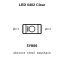
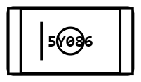
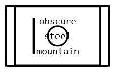
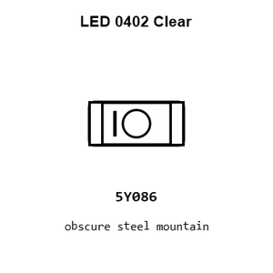
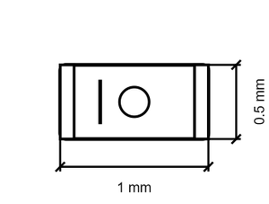
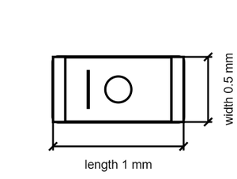

# LED 0402 Clear

`electronic_led_0402_clear`

LED 0402 Clear is an OOMP electronic led definition. It uses the 0402 package or form factor. Its nominal drawing size is 1.0 × 0.5 mm.

## At a glance

| Detail | Value |
| --- | --- |
| OOMP ID | `electronic_led_0402_clear` |
| Type | Led |
| Package / style | 0402 |
| Nominal size | 1.0 × 0.5 mm |

## Classification

| Level | Value |
| --- | --- |
| 1 | `electronic` |
| 2 | `led` |
| 3 | `0402` |
| 5 | `clear` |

## Nominal dimensions

| Measurement | Value |
| --- | ---: |
| Length | 1.0 mm |
| Width | 0.5 mm |

## Files

[View this part on GitHub](https://github.com/oomlout/oomp_electronic_version_5/tree/main/parts/electronic_led_0402_clear)

---

This page is generated from the OOMP part definition by a Roboclick Jinja template. Edit the source taxonomy or template rather than this generated file.
