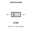
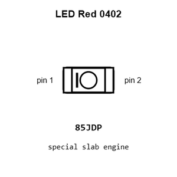
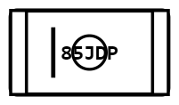
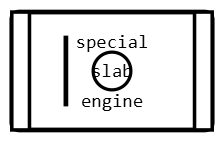
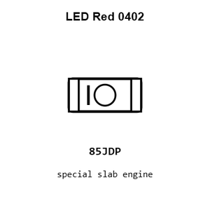
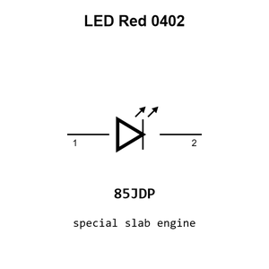
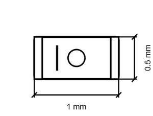

# LED Red 0402

`electronic_led_0402_red`

LED Red 0402 is an OOMP electronic led definition. It uses the 0402 package or form factor. Its nominal drawing size is 1.0 &#x00D7; 0.5 mm.

## At a glance

| Detail | Value |
| --- | --- |
| OOMP ID | `electronic_led_0402_red` |
| Type | Led |
| Package / style | 0402 |
| Nominal size | 1.0 &#x00D7; 0.5 mm |

## Classification

| Level | Value |
| --- | --- |
| 1 | `electronic` |
| 2 | `led` |
| 3 | `0402` |
| 4 | `red` |

## Nominal dimensions

| Measurement | Value |
| --- | ---: |
| Length | 1.0 mm |
| Width | 0.5 mm |

## Used in projects

| Project | Quantity | References | Explore |
| --- | ---: | --- | --- |
| [Project sparkfun/SparkFun_6DoF_LSM6DSV16X Spark Fun Micro 6 Do F LSM6 DSV16 X current](https://github.com/sparkfun/SparkFun_6DoF_LSM6DSV16X/blob/main/Hardware/Qwiic%20Micro/SparkFun_Micro_6DoF_LSM6DSV16X.brd) | 1 | D1 | [Board explorer](https://oomlout.github.io/oomp_electronic_version_5/parts/oomp_project_github_sparkfun_spark_fun_6_do_f_lsm6_dsv16_x_spark_fun_micro_6_do_f_lsm6_dsv16_x_current/board_explorer.html) · [OOMP project](https://github.com/oomlout/oomp_electronic_version_5/tree/main/parts/oomp_project_github_sparkfun_spark_fun_6_do_f_lsm6_dsv16_x_spark_fun_micro_6_do_f_lsm6_dsv16_x_current) |
| [Project sparkfun/SparkFun_NanoBeacon_Board_-_IN100 Spark Fun Nano Beacon Lite Board IN100 current](https://github.com/sparkfun/SparkFun_NanoBeacon_Board_-_IN100/blob/main/Hardware/NanoBeacon%20Lite/SparkFun%20NanoBeacon%20Lite%20Board%20-%20IN100.brd) | 1 | D1 | [Board explorer](https://oomlout.github.io/oomp_electronic_version_5/parts/oomp_project_github_sparkfun_spark_fun_nano_beacon_board_in100_spark_fun_nano_beacon_lite_board_in100_current/board_explorer.html) · [OOMP project](https://github.com/oomlout/oomp_electronic_version_5/tree/main/parts/oomp_project_github_sparkfun_spark_fun_nano_beacon_board_in100_spark_fun_nano_beacon_lite_board_in100_current) |
| [Project sparkfun/SparkFun_Qwiic_6DoF_BMI270 Spark Fun Qwiic 6 Do F BMI270 current](https://github.com/sparkfun/SparkFun_Qwiic_6DoF_BMI270/blob/main/Hardware/Qwiic%20Micro/SparkFun_Qwiic_6DoF_BMI270.brd) | 1 | D1 | [Board explorer](https://oomlout.github.io/oomp_electronic_version_5/parts/oomp_project_github_sparkfun_spark_fun_qwiic_6_do_f_bmi270_qwiic_micro_spark_fun_qwiic_6_do_f_bmi270_current/board_explorer.html) · [OOMP project](https://github.com/oomlout/oomp_electronic_version_5/tree/main/parts/oomp_project_github_sparkfun_spark_fun_qwiic_6_do_f_bmi270_qwiic_micro_spark_fun_qwiic_6_do_f_bmi270_current) |
| [Project sparkfun/SparkFun_Qwiic_6DoF_ISM330DHCX Spark Fun 6 Do F ISM330 DHCX Qwiic Micro current](https://github.com/sparkfun/SparkFun_Qwiic_6DoF_ISM330DHCX/blob/main/Hardware/Qwiic%20Micro/SparkFun_6DoF_ISM330DHCX_Qwiic_Micro.brd) | 1 | D1 | [Board explorer](https://oomlout.github.io/oomp_electronic_version_5/parts/oomp_project_github_sparkfun_spark_fun_qwiic_6_do_f_ism330_dhcx_spark_fun_6_do_f_ism330_dhcx_qwiic_micro_current/board_explorer.html) · [OOMP project](https://github.com/oomlout/oomp_electronic_version_5/tree/main/parts/oomp_project_github_sparkfun_spark_fun_qwiic_6_do_f_ism330_dhcx_spark_fun_6_do_f_ism330_dhcx_qwiic_micro_current) |
| [Project sparkfun/SparkFun_Temperature_Sensor-STTS22H Spark Fun Micro Temperature Sensor STTS22 H current](https://github.com/sparkfun/SparkFun_Temperature_Sensor-STTS22H/blob/main/Hardware/Qwiic%20Micro/SparkFun_Micro_Temperature_Sensor-STTS22H.brd) | 1 | D1 | [Board explorer](https://oomlout.github.io/oomp_electronic_version_5/parts/oomp_project_github_sparkfun_spark_fun_temperature_sensor_stts22_h_spark_fun_micro_temperature_sensor_stts22_h_current/board_explorer.html) · [OOMP project](https://github.com/oomlout/oomp_electronic_version_5/tree/main/parts/oomp_project_github_sparkfun_spark_fun_temperature_sensor_stts22_h_spark_fun_micro_temperature_sensor_stts22_h_current) |
| [Project sparkfun/SparkFun_Triple_Axis_Acclerometer-LIS3DH LIS3DH Qwiic Micro current](https://github.com/sparkfun/SparkFun_Triple_Axis_Acclerometer-LIS3DH/tree/main/Hardware/Micro) | 1 | D1 | [Board explorer](https://oomlout.github.io/oomp_electronic_version_5/parts/oomp_project_github_sparkfun_spark_fun_triple_axis_acclerometer_lis3_dh_lis3dh_qwiic_micro_current/board_explorer.html) · [OOMP project](https://github.com/oomlout/oomp_electronic_version_5/tree/main/parts/oomp_project_github_sparkfun_spark_fun_triple_axis_acclerometer_lis3_dh_lis3dh_qwiic_micro_current) |

## Files

[KiCad symbol, machine-solder and hand-solder footprints](data/kicad/README.md) · [Availability and source masters](data/kicad/manifest.yaml)

[View this part on GitHub](https://github.com/oomlout/oomp_electronic_version_5/tree/main/parts/electronic_led_0402_red)

[Browse this category](../../navigation/electronic/led/0402/README.md)

---

This page is generated from the OOMP part definition by a Roboclick Jinja template. Edit the source taxonomy or template rather than this generated file.