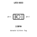
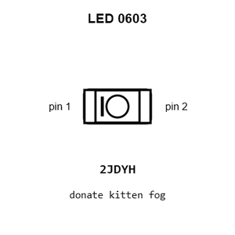
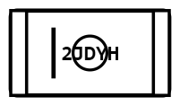
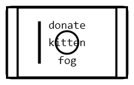
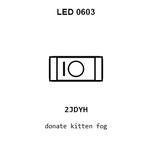
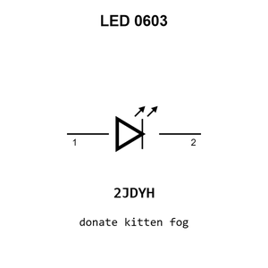
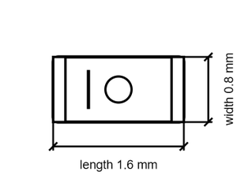

# LED  0603

`electronic_led_0603`

LED  0603 is an OOMP electronic led definition. It uses the 0603 package or form factor. Its nominal drawing size is 1.6 &#x00D7; 0.8 mm.

## At a glance

| Detail | Value |
| --- | --- |
| OOMP ID | `electronic_led_0603` |
| Type | Led |
| Package / style | 0603 |
| Nominal size | 1.6 &#x00D7; 0.8 mm |

## Classification

| Level | Value |
| --- | --- |
| 1 | `electronic` |
| 2 | `led` |
| 3 | `0603` |

## Nominal dimensions

| Measurement | Value |
| --- | ---: |
| Length | 1.6 mm |
| Width | 0.8 mm |

## Used in projects

| Project | Quantity | References | Explore |
| --- | ---: | --- | --- |
| [Project adafruit/Adafruit-bq25185-with-3.3V-Buck-PCB Adafruit bq25185 with 3.3 V Output current](https://github.com/adafruit/Adafruit-bq25185-with-3.3V-Buck-PCB/blob/main/Adafruit%20bq25185%20with%203.3V%20Output.brd) | 1 | CHG0 | [Board explorer](https://oomlout.github.io/oomp_electronic_version_5/parts/oomp_project_github_adafruit_adafruit_bq25185_with_3_3_v_buck_pcb_adafruit_bq25185_with_3_3_v_output_current/board_explorer.html) · [OOMP project](https://github.com/oomlout/oomp_electronic_version_5/tree/main/parts/oomp_project_github_adafruit_adafruit_bq25185_with_3_3_v_buck_pcb_adafruit_bq25185_with_3_3_v_output_current) |
| [Project adafruit/Adafruit-bq25185-with-5V-Boost-PCB Adafruit bq25185 with 5 V Boost Breakout current](https://github.com/adafruit/Adafruit-bq25185-with-5V-Boost-PCB/blob/main/Adafruit%20bq25185%20with%205V%20Boost%20Breakout.brd) | 1 | CHG0 | [Board explorer](https://oomlout.github.io/oomp_electronic_version_5/parts/oomp_project_github_adafruit_adafruit_bq25185_with_5_v_boost_pcb_adafruit_bq25185_with_5_v_boost_breakout_current/board_explorer.html) · [OOMP project](https://github.com/oomlout/oomp_electronic_version_5/tree/main/parts/oomp_project_github_adafruit_adafruit_bq25185_with_5_v_boost_pcb_adafruit_bq25185_with_5_v_boost_breakout_current) |
| [Project adafruit/Adafruit-Charger-BFF-PCB Adafruit LIPoly Charger BFF current](https://github.com/adafruit/Adafruit-Charger-BFF-PCB/blob/main/Adafruit%20LIPoly%20Charger%20BFF.brd) | 1 | CHG0 | [Board explorer](https://oomlout.github.io/oomp_electronic_version_5/parts/oomp_project_github_adafruit_adafruit_charger_bff_pcb_adafruit_lipoly_charger_bff_current/board_explorer.html) · [OOMP project](https://github.com/oomlout/oomp_electronic_version_5/tree/main/parts/oomp_project_github_adafruit_adafruit_charger_bff_pcb_adafruit_lipoly_charger_bff_current) |
| [Project adafruit/Adafruit-CharliePlex-Bonnet-PCBs Adafruit Charlie Plex Bonnet current](https://github.com/adafruit/Adafruit-CharliePlex-Bonnet-PCBs/blob/master/Adafruit%20CharliePlex%20Bonnet.brd) | 128 | C2-1, C2-2, C2-3, C2-4, C2-5, C2-6, C2-7, C2-8, C2-9, C2-10, C2-11, C2-12, C2-13, C2-14, C2-15, C2-16, C3-1, C3-2, C3-3, C3-4, C3-5, C3-6, C3-7, C3-8, C3-9, C3-10, C3-11, C3-12, C3-13, C3-14, C3-15, C3-16, C4-1, C4-2, C4-3, C4-4, C4-5, C4-6, C4-7, C4-8, C4-9, C4-10, C4-11, C4-12, C4-13, C4-14, C4-15, C4-16, C5-1, C5-2, C5-3, C5-4, C5-5, C5-6, C5-7, C5-8, C5-9, C5-10, C5-11, C5-12, C5-13, C5-14, C5-15, C5-16, C6-1, C6-2, C6-3, C6-4, C6-5, C6-6, C6-7, C6-8, C6-9, C6-10, C6-11, C6-12, C6-13, C6-14, C6-15, C6-16, C7-1, C7-2, C7-3, C7-4, C7-5, C7-6, C7-7, C7-8, C7-9, C7-10, C7-11, C7-12, C7-13, C7-14, C7-15, C7-16, C8-1, C8-2, C8-3, C8-4, C8-5, C8-6, C8-7, C8-8, C8-9, C8-10, C8-11, C8-12, C8-13, C8-14, C8-15, C8-16, C9-1, C9-2, C9-3, C9-4, C9-5, C9-6, C9-7, C9-8, C9-9, C9-10, C9-11, C9-12, C9-13, C9-14, C9-15, C9-16 | [Board explorer](https://oomlout.github.io/oomp_electronic_version_5/parts/oomp_project_github_adafruit_adafruit_charlie_plex_bonnet_pcbs_adafruit_charlie_plex_bonnet_current/board_explorer.html) · [OOMP project](https://github.com/oomlout/oomp_electronic_version_5/tree/main/parts/oomp_project_github_adafruit_adafruit_charlie_plex_bonnet_pcbs_adafruit_charlie_plex_bonnet_current) |
| [Project adafruit/Adafruit-ESP32-C6-Feather-PCB Adafruit Feather ESP32 C6 current](https://github.com/adafruit/Adafruit-ESP32-C6-Feather-PCB/blob/main/Adafruit%20Feather%20ESP32-C6.brd) | 1 | CHG0 | [Board explorer](https://oomlout.github.io/oomp_electronic_version_5/parts/oomp_project_github_adafruit_adafruit_esp32_c6_feather_pcb_adafruit_feather_esp32_c6_current/board_explorer.html) · [OOMP project](https://github.com/oomlout/oomp_electronic_version_5/tree/main/parts/oomp_project_github_adafruit_adafruit_esp32_c6_feather_pcb_adafruit_feather_esp32_c6_current) |
| [Project adafruit/Adafruit-ESP32-Feather-V2-PCB Adafruit ESP32 Feather current](https://github.com/adafruit/Adafruit-ESP32-Feather-V2-PCB/blob/main/Adafruit%20ESP32%20Feather%20V2.brd) | 1 | CHG0 | [Board explorer](https://oomlout.github.io/oomp_electronic_version_5/parts/oomp_project_github_adafruit_adafruit_esp32_feather_v2_pcb_adafruit_esp32_feather_current/board_explorer.html) · [OOMP project](https://github.com/oomlout/oomp_electronic_version_5/tree/main/parts/oomp_project_github_adafruit_adafruit_esp32_feather_v2_pcb_adafruit_esp32_feather_current) |
| [Project adafruit/Adafruit-ESP32-S2-Reverse-TFT-Feather-PCB Adafruit Feather ESP32 S2rse TFT current](https://github.com/adafruit/Adafruit-ESP32-S2-Reverse-TFT-Feather-PCB/blob/main/Adafruit%20Feather%20ESP32-S2%20Reverse%20TFT.brd) | 1 | CHG0 | [Board explorer](https://oomlout.github.io/oomp_electronic_version_5/parts/oomp_project_github_adafruit_adafruit_esp32_s2_reverse_tft_feather_pcb_adafruit_feather_esp32_s2rse_tft_current/board_explorer.html) · [OOMP project](https://github.com/oomlout/oomp_electronic_version_5/tree/main/parts/oomp_project_github_adafruit_adafruit_esp32_s2_reverse_tft_feather_pcb_adafruit_feather_esp32_s2rse_tft_current) |
| [Project adafruit/Adafruit-ESP32-S2-TFT-Feather-PCB Adafruit ESP32 S2 TFT Feather current](https://github.com/adafruit/Adafruit-ESP32-S2-TFT-Feather-PCB/blob/main/Adafruit%20ESP32-S2%20TFT%20Feather.brd) | 1 | CHG0 | [Board explorer](https://oomlout.github.io/oomp_electronic_version_5/parts/oomp_project_github_adafruit_adafruit_esp32_s2_tft_feather_pcb_adafruit_esp32_s2_tft_feather_current/board_explorer.html) · [OOMP project](https://github.com/oomlout/oomp_electronic_version_5/tree/main/parts/oomp_project_github_adafruit_adafruit_esp32_s2_tft_feather_pcb_adafruit_esp32_s2_tft_feather_current) |
| [Project adafruit/Adafruit-ESP32-S3-Reverse-TFT-Feather-PCB Adafruit ESP32 S3rse TFT Feather current](https://github.com/adafruit/Adafruit-ESP32-S3-Reverse-TFT-Feather-PCB/blob/main/Adafruit%20ESP32-S3%20Reverse%20TFT%20Feather.brd) | 1 | CHG0 | [Board explorer](https://oomlout.github.io/oomp_electronic_version_5/parts/oomp_project_github_adafruit_adafruit_esp32_s3_reverse_tft_feather_pcb_adafruit_esp32_s3rse_tft_feather_current/board_explorer.html) · [OOMP project](https://github.com/oomlout/oomp_electronic_version_5/tree/main/parts/oomp_project_github_adafruit_adafruit_esp32_s3_reverse_tft_feather_pcb_adafruit_esp32_s3rse_tft_feather_current) |
| [Project adafruit/Adafruit-ESP32-S3-TFT-Feather-PCB Adafruit ESP32 S3 TFT Feather current](https://github.com/adafruit/Adafruit-ESP32-S3-TFT-Feather-PCB/blob/main/Adafruit%20ESP32-S3%20TFT%20Feather.brd) | 1 | CHG0 | [Board explorer](https://oomlout.github.io/oomp_electronic_version_5/parts/oomp_project_github_adafruit_adafruit_esp32_s3_tft_feather_pcb_adafruit_esp32_s3_tft_feather_current/board_explorer.html) · [OOMP project](https://github.com/oomlout/oomp_electronic_version_5/tree/main/parts/oomp_project_github_adafruit_adafruit_esp32_s3_tft_feather_pcb_adafruit_esp32_s3_tft_feather_current) |
| [Project adafruit/Adafruit-Feather-ESP32-S2-PCB Adafruit Feather ESP32 S2 current](https://github.com/adafruit/Adafruit-Feather-ESP32-S2-PCB/blob/main/Adafruit%20Feather%20ESP32-S2.brd) | 1 | CHG0 | [Board explorer](https://oomlout.github.io/oomp_electronic_version_5/parts/oomp_project_github_adafruit_adafruit_feather_esp32_s2_pcb_adafruit_feather_esp32_s2_current/board_explorer.html) · [OOMP project](https://github.com/oomlout/oomp_electronic_version_5/tree/main/parts/oomp_project_github_adafruit_adafruit_feather_esp32_s2_pcb_adafruit_feather_esp32_s2_current) |
| [Project adafruit/Adafruit-Feather-ESP32-S3-PCB Adafruit ESP32 S3 8 MB No PSRAM current](https://github.com/adafruit/Adafruit-Feather-ESP32-S3-PCB/blob/main/Adafruit%20ESP32-S3%208MB%20No%20PSRAM.brd) | 1 | CHG0 | [Board explorer](https://oomlout.github.io/oomp_electronic_version_5/parts/oomp_project_github_adafruit_adafruit_feather_esp32_s3_pcb_adafruit_esp32_s3_8_mb_no_psram_current/board_explorer.html) · [OOMP project](https://github.com/oomlout/oomp_electronic_version_5/tree/main/parts/oomp_project_github_adafruit_adafruit_feather_esp32_s3_pcb_adafruit_esp32_s3_8_mb_no_psram_current) |
| [Project adafruit/Adafruit-Feather-M4-CAN-PCB Adafruit Feather M4 Express CAN current](https://github.com/adafruit/Adafruit-Feather-M4-CAN-PCB/blob/main/Adafruit%20Feather%20M4%20Express%20CAN.brd) | 1 | CHG0 | [Board explorer](https://oomlout.github.io/oomp_electronic_version_5/parts/oomp_project_github_adafruit_adafruit_feather_m4_can_pcb_adafruit_feather_m4_express_can_current/board_explorer.html) · [OOMP project](https://github.com/oomlout/oomp_electronic_version_5/tree/main/parts/oomp_project_github_adafruit_adafruit_feather_m4_can_pcb_adafruit_feather_m4_express_can_current) |
| [Project adafruit/Adafruit-Feather-RP2040-Adalogger-PCB Adafruit Feather RP2040 Adalogger current](https://github.com/adafruit/Adafruit-Feather-RP2040-Adalogger-PCB/blob/main/Adafruit%20Feather%20RP2040%20Adalogger.brd) | 1 | CHG0 | [Board explorer](https://oomlout.github.io/oomp_electronic_version_5/parts/oomp_project_github_adafruit_adafruit_feather_rp2040_adalogger_pcb_adafruit_feather_rp2040_adalogger_current/board_explorer.html) · [OOMP project](https://github.com/oomlout/oomp_electronic_version_5/tree/main/parts/oomp_project_github_adafruit_adafruit_feather_rp2040_adalogger_pcb_adafruit_feather_rp2040_adalogger_current) |
| [Project adafruit/Adafruit-Feather-RP2040-DVI-PCB Adafruit Feather RP2040 DVI current](https://github.com/adafruit/Adafruit-Feather-RP2040-DVI-PCB/blob/main/Adafruit%20Feather%20RP2040%20DVI.brd) | 1 | CHG0 | [Board explorer](https://oomlout.github.io/oomp_electronic_version_5/parts/oomp_project_github_adafruit_adafruit_feather_rp2040_dvi_pcb_adafruit_feather_rp2040_dvi_current/board_explorer.html) · [OOMP project](https://github.com/oomlout/oomp_electronic_version_5/tree/main/parts/oomp_project_github_adafruit_adafruit_feather_rp2040_dvi_pcb_adafruit_feather_rp2040_dvi_current) |
| [Project adafruit/Adafruit-Feather-RP2040-PCB Adafruit Feather RP2040 current](https://github.com/adafruit/Adafruit-Feather-RP2040-PCB/blob/main/Adafruit%20Feather%20RP2040.brd) | 1 | CHG0 | [Board explorer](https://oomlout.github.io/oomp_electronic_version_5/parts/oomp_project_github_adafruit_adafruit_feather_rp2040_pcb_adafruit_feather_rp2040_current/board_explorer.html) · [OOMP project](https://github.com/oomlout/oomp_electronic_version_5/tree/main/parts/oomp_project_github_adafruit_adafruit_feather_rp2040_pcb_adafruit_feather_rp2040_current) |
| [Project adafruit/Adafruit-Feather-RP2040-PCB Adafruit Feather RP2040 Original current](https://github.com/adafruit/Adafruit-Feather-RP2040-PCB/blob/main/Adafruit%20Feather%20RP2040%20Original.brd) | 1 | CHG0 | [Board explorer](https://oomlout.github.io/oomp_electronic_version_5/parts/oomp_project_github_adafruit_adafruit_feather_rp2040_pcb_adafruit_feather_rp2040_original_current/board_explorer.html) · [OOMP project](https://github.com/oomlout/oomp_electronic_version_5/tree/main/parts/oomp_project_github_adafruit_adafruit_feather_rp2040_pcb_adafruit_feather_rp2040_original_current) |
| [Project adafruit/Adafruit-Feather-RP2040-RFM-PCB Adafruit Feather RP2040 RFM current](https://github.com/adafruit/Adafruit-Feather-RP2040-RFM-PCB/blob/main/Adafruit%20Feather%20RP2040%20RFM.brd) | 1 | CHG0 | [Board explorer](https://oomlout.github.io/oomp_electronic_version_5/parts/oomp_project_github_adafruit_adafruit_feather_rp2040_rfm_pcb_adafruit_feather_rp2040_rfm_current/board_explorer.html) · [OOMP project](https://github.com/oomlout/oomp_electronic_version_5/tree/main/parts/oomp_project_github_adafruit_adafruit_feather_rp2040_rfm_pcb_adafruit_feather_rp2040_rfm_current) |
| [Project adafruit/Adafruit-Feather-RP2040-ThinkInk Adafruit Feather RP2040 Think Ink current](https://github.com/adafruit/Adafruit-Feather-RP2040-ThinkInk/blob/main/Adafruit%20Feather%20RP2040%20ThinkInk.brd) | 1 | CHG0 | [Board explorer](https://oomlout.github.io/oomp_electronic_version_5/parts/oomp_project_github_adafruit_adafruit_feather_rp2040_think_ink_adafruit_feather_rp2040_think_ink_current/board_explorer.html) · [OOMP project](https://github.com/oomlout/oomp_electronic_version_5/tree/main/parts/oomp_project_github_adafruit_adafruit_feather_rp2040_think_ink_adafruit_feather_rp2040_think_ink_current) |
| [Project adafruit/Adafruit-Feather-RP2040-USB-Host-PCB Adafruit Feather RP2040 USB Host current](https://github.com/adafruit/Adafruit-Feather-RP2040-USB-Host-PCB/blob/main/Adafruit%20Feather%20RP2040%20USB%20Host.brd) | 1 | CHG0 | [Board explorer](https://oomlout.github.io/oomp_electronic_version_5/parts/oomp_project_github_adafruit_adafruit_feather_rp2040_usb_host_pcb_adafruit_feather_rp2040_usb_host_current/board_explorer.html) · [OOMP project](https://github.com/oomlout/oomp_electronic_version_5/tree/main/parts/oomp_project_github_adafruit_adafruit_feather_rp2040_usb_host_pcb_adafruit_feather_rp2040_usb_host_current) |
| [Project adafruit/Adafruit-Feather-RP2350-PCB Adafruit Feather RP2350 current](https://github.com/adafruit/Adafruit-Feather-RP2350-PCB/blob/main/Adafruit%20Feather%20RP2350.brd) | 1 | CHG0 | [Board explorer](https://oomlout.github.io/oomp_electronic_version_5/parts/oomp_project_github_adafruit_adafruit_feather_rp2350_pcb_adafruit_feather_rp2350_current/board_explorer.html) · [OOMP project](https://github.com/oomlout/oomp_electronic_version_5/tree/main/parts/oomp_project_github_adafruit_adafruit_feather_rp2350_pcb_adafruit_feather_rp2350_current) |
| [Project adafruit/Adafruit-IS31FL3731-CharliePlex-LED-Breakout-PCB Adafruit IS31 FL3731 Charlie Plex Grid current](https://github.com/adafruit/Adafruit-IS31FL3731-CharliePlex-LED-Breakout-PCB/blob/master/Adafruit%20IS31FL3731%20CharliePlex%20Grid.brd) | 144 | C1-1, C1-2, C1-3, C1-4, C1-5, C1-6, C1-7, C1-8, C1-9, C1-10, C1-11, C1-12, C1-13, C1-14, C1-15, C1-16, C2-1, C2-2, C2-3, C2-4, C2-5, C2-6, C2-7, C2-8, C2-9, C2-10, C2-11, C2-12, C2-13, C2-14, C2-15, C2-16, C3-1, C3-2, C3-3, C3-4, C3-5, C3-6, C3-7, C3-8, C3-9, C3-10, C3-11, C3-12, C3-13, C3-14, C3-15, C3-16, C4-1, C4-2, C4-3, C4-4, C4-5, C4-6, C4-7, C4-8, C4-9, C4-10, C4-11, C4-12, C4-13, C4-14, C4-15, C4-16, C5-1, C5-2, C5-3, C5-4, C5-5, C5-6, C5-7, C5-8, C5-9, C5-10, C5-11, C5-12, C5-13, C5-14, C5-15, C5-16, C6-1, C6-2, C6-3, C6-4, C6-5, C6-6, C6-7, C6-8, C6-9, C6-10, C6-11, C6-12, C6-13, C6-14, C6-15, C6-16, C7-1, C7-2, C7-3, C7-4, C7-5, C7-6, C7-7, C7-8, C7-9, C7-10, C7-11, C7-12, C7-13, C7-14, C7-15, C7-16, C8-1, C8-2, C8-3, C8-4, C8-5, C8-6, C8-7, C8-8, C8-9, C8-10, C8-11, C8-12, C8-13, C8-14, C8-15, C8-16, C9-1, C9-2, C9-3, C9-4, C9-5, C9-6, C9-7, C9-8, C9-9, C9-10, C9-11, C9-12, C9-13, C9-14, C9-15, C9-16 | [Board explorer](https://oomlout.github.io/oomp_electronic_version_5/parts/oomp_project_github_adafruit_adafruit_is31_fl3731_charlie_plex_led_breakout_pcb_adafruit_is31_fl3731_charlie_plex_grid_current/board_explorer.html) · [OOMP project](https://github.com/oomlout/oomp_electronic_version_5/tree/main/parts/oomp_project_github_adafruit_adafruit_is31_fl3731_charlie_plex_led_breakout_pcb_adafruit_is31_fl3731_charlie_plex_grid_current) |
| [Project adafruit/Adafruit_MagTag_PCBs Adafruit Mag Tag 2.9in current](https://github.com/adafruit/Adafruit_MagTag_PCBs/blob/main/Adafruit%20MagTag%202.9in.brd) | 1 | CHG1 | [Board explorer](https://oomlout.github.io/oomp_electronic_version_5/parts/oomp_project_github_adafruit_adafruit_mag_tag_pcbs_adafruit_mag_tag_2_9in_current/board_explorer.html) · [OOMP project](https://github.com/oomlout/oomp_electronic_version_5/tree/main/parts/oomp_project_github_adafruit_adafruit_mag_tag_pcbs_adafruit_mag_tag_2_9in_current) |
| [Project adafruit/Adafruit-MEMENTO-PCB Adafruit MEMENTO Camera Board current](https://github.com/adafruit/Adafruit-MEMENTO-PCB/blob/main/Adafruit%20MEMENTO%20Camera%20Board.brd) | 1 | CHG1 | [Board explorer](https://oomlout.github.io/oomp_electronic_version_5/parts/oomp_project_github_adafruit_adafruit_memento_pcb_adafruit_memento_camera_board_current/board_explorer.html) · [OOMP project](https://github.com/oomlout/oomp_electronic_version_5/tree/main/parts/oomp_project_github_adafruit_adafruit_memento_pcb_adafruit_memento_camera_board_current) |
| [Project adafruit/Adafruit-Metro-ESP32-S2-PCB Adafruit Metro ESP32 S2 current](https://github.com/adafruit/Adafruit-Metro-ESP32-S2-PCB/blob/master/Adafruit%20Metro%20ESP32-S2.brd) | 1 | CHG1 | [Board explorer](https://oomlout.github.io/oomp_electronic_version_5/parts/oomp_project_github_adafruit_adafruit_metro_esp32_s2_pcb_adafruit_metro_esp32_s2_current/board_explorer.html) · [OOMP project](https://github.com/oomlout/oomp_electronic_version_5/tree/main/parts/oomp_project_github_adafruit_adafruit_metro_esp32_s2_pcb_adafruit_metro_esp32_s2_current) |
| [Project adafruit/Adafruit-Metro-ESP32-S3-PCB Adafruit Metro ESP32 S3 current](https://github.com/adafruit/Adafruit-Metro-ESP32-S3-PCB/blob/main/Adafruit%20Metro%20ESP32-S3%20Rev%20B.brd) | 1 | CHG1 | [Board explorer](https://oomlout.github.io/oomp_electronic_version_5/parts/oomp_project_github_adafruit_adafruit_metro_esp32_s3_pcb_adafruit_metro_esp32_s3_current/board_explorer.html) · [OOMP project](https://github.com/oomlout/oomp_electronic_version_5/tree/main/parts/oomp_project_github_adafruit_adafruit_metro_esp32_s3_pcb_adafruit_metro_esp32_s3_current) |
| [Project adafruit/Adafruit-nRF52-Bluefruit-Feather-PCB Adafruit n RF52840 Bluefruit Feather Express current](https://github.com/adafruit/Adafruit-nRF52-Bluefruit-Feather-PCB/blob/master/Adafruit%20nRF52840%20Bluefruit%20Feather%20Express%20Rev%20E.brd) | 1 | D3 | [Board explorer](https://oomlout.github.io/oomp_electronic_version_5/parts/oomp_project_github_adafruit_adafruit_n_rf52_bluefruit_feather_pcb_adafruit_n_rf52840_bluefruit_feather_express_current/board_explorer.html) · [OOMP project](https://github.com/oomlout/oomp_electronic_version_5/tree/main/parts/oomp_project_github_adafruit_adafruit_n_rf52_bluefruit_feather_pcb_adafruit_n_rf52840_bluefruit_feather_express_current) |
| [Project hanqaqa/easyduino ATmega328P Arduino Uno current](https://github.com/Hanqaqa/Easyduino/tree/master/Atmega328p%20Arduino%20Uno) | 2 | D4, D5 | [Board explorer](https://oomlout.github.io/oomp_electronic_version_5/parts/oomp_project_github_hanqaqa_easyduino_atmega328p_arduino_uno_current/board_explorer.html) · [OOMP project](https://github.com/oomlout/oomp_electronic_version_5/tree/main/parts/oomp_project_github_hanqaqa_easyduino_atmega328p_arduino_uno_current) |
| [Project jedp/LIS3DH-breakout LIS3DH Breakout current](https://github.com/jedp/LIS3DH-breakout) | 1 | D1 | [Board explorer](https://oomlout.github.io/oomp_electronic_version_5/parts/oomp_project_github_jedp_lis3_dh_breakout_lis3dh_breakout_current/board_explorer.html) · [OOMP project](https://github.com/oomlout/oomp_electronic_version_5/tree/main/parts/oomp_project_github_jedp_lis3_dh_breakout_lis3dh_breakout_current) |

## Files

[KiCad symbol, machine-solder and hand-solder footprints](data/kicad/README.md) · [Availability and source masters](data/kicad/manifest.yaml)

[View this part on GitHub](https://github.com/oomlout/oomp_electronic_version_5/tree/main/parts/electronic_led_0603)

[Browse this category](../../navigation/electronic/led/README.md)

---

This page is generated from the OOMP part definition by a Roboclick Jinja template. Edit the source taxonomy or template rather than this generated file.