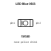
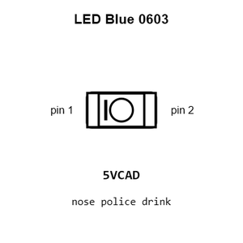
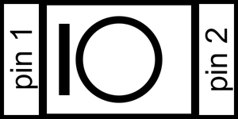
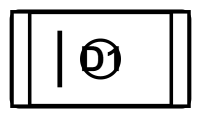
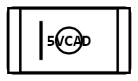
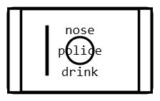
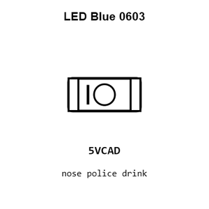
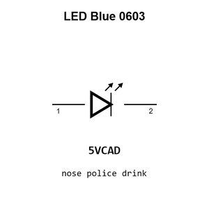

# LED Blue 0603

`electronic_led_0603_blue`

LED Blue 0603 is an OOMP electronic led definition. It uses the 0603 package or form factor. Its nominal drawing size is 1.6 &#x00D7; 0.8 mm.

## At a glance

| Detail | Value |
| --- | --- |
| OOMP ID | `electronic_led_0603_blue` |
| Type | Led |
| Package / style | 0603 |
| Nominal size | 1.6 &#x00D7; 0.8 mm |

## Classification

| Level | Value |
| --- | --- |
| 1 | `electronic` |
| 2 | `led` |
| 3 | `0603` |
| 4 | `blue` |

## Nominal dimensions

| Measurement | Value |
| --- | ---: |
| Length | 1.6 mm |
| Width | 0.8 mm |

## Used in projects

| Project | Quantity | References | Explore |
| --- | ---: | --- | --- |
| [Project adafruit/Adafruit-Feather-nRF52840-Sense-PCB Adafruit Feather n RF52840 Sense current](https://github.com/adafruit/Adafruit-Feather-nRF52840-Sense-PCB/blob/master/Adafruit%20Feather%20nRF52840%20Sense.brd) | 1 | D4 | [Board explorer](https://oomlout.github.io/oomp_electronic_version_5/parts/oomp_project_github_adafruit_adafruit_feather_n_rf52840_sense_pcb_adafruit_feather_n_rf52840_sense_current/board_explorer.html) · [OOMP project](https://github.com/oomlout/oomp_electronic_version_5/tree/main/parts/oomp_project_github_adafruit_adafruit_feather_n_rf52840_sense_pcb_adafruit_feather_n_rf52840_sense_current) |
| [Project adafruit/Adafruit-nRF52-Bluefruit-Feather-PCB Adafruit n RF52840 Bluefruit Feather Express current](https://github.com/adafruit/Adafruit-nRF52-Bluefruit-Feather-PCB/blob/master/Adafruit%20nRF52840%20Bluefruit%20Feather%20Express%20Rev%20E.brd) | 1 | D4 | [Board explorer](https://oomlout.github.io/oomp_electronic_version_5/parts/oomp_project_github_adafruit_adafruit_n_rf52_bluefruit_feather_pcb_adafruit_n_rf52840_bluefruit_feather_express_current/board_explorer.html) · [OOMP project](https://github.com/oomlout/oomp_electronic_version_5/tree/main/parts/oomp_project_github_adafruit_adafruit_n_rf52_bluefruit_feather_pcb_adafruit_n_rf52840_bluefruit_feather_express_current) |
| [Project sparkfun/SparkFun_Capacitive_Soil_Moisture_Sensor_CY8CMBR3102 Capacitive Soil Moisture Sensor CY8CMBR3102 current](https://github.com/sparkfun/SparkFun_Capacitive_Soil_Moisture_Sensor_CY8CMBR3102) | 1 | D2 | [Board explorer](https://oomlout.github.io/oomp_electronic_version_5/parts/oomp_project_github_sparkfun_spark_fun_capacitive_soil_moisture_sensor_cy8_cmbr3102_capacitive_soil_moisture_cy8cmbr3102_current/board_explorer.html) · [OOMP project](https://github.com/oomlout/oomp_electronic_version_5/tree/main/parts/oomp_project_github_sparkfun_spark_fun_capacitive_soil_moisture_sensor_cy8_cmbr3102_capacitive_soil_moisture_cy8cmbr3102_current) |
| [Project sparkfun/SparkFun_GNSS_Flex_Breakout GNSS Flex Breakout current](https://github.com/sparkfun/SparkFun_GNSS_Flex_Breakout) | 1 | D3 | [Board explorer](https://oomlout.github.io/oomp_electronic_version_5/parts/oomp_project_github_sparkfun_spark_fun_gnss_flex_breakout_gnss_flex_breakout_current/board_explorer.html) · [OOMP project](https://github.com/oomlout/oomp_electronic_version_5/tree/main/parts/oomp_project_github_sparkfun_spark_fun_gnss_flex_breakout_gnss_flex_breakout_current) |

## Files

[KiCad symbol, machine-solder and hand-solder footprints](data/kicad/README.md) · [Availability and source masters](data/kicad/manifest.yaml)

[View this part on GitHub](https://github.com/oomlout/oomp_electronic_version_5/tree/main/parts/electronic_led_0603_blue)

[Browse this category](../../navigation/electronic/led/0603/README.md)

---

This page is generated from the OOMP part definition by a Roboclick Jinja template. Edit the source taxonomy or template rather than this generated file.