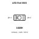
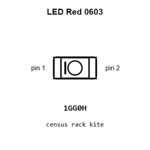
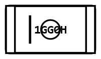
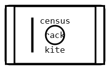
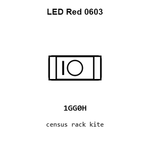
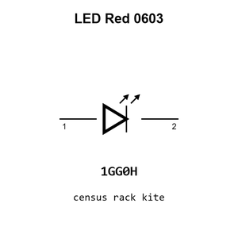

# LED Red 0603

`electronic_led_0603_red`

LED Red 0603 is an OOMP electronic led definition. It uses the 0603 package or form factor. Its nominal drawing size is 1.6 &#x00D7; 0.8 mm.

## At a glance

| Detail | Value |
| --- | --- |
| OOMP ID | `electronic_led_0603_red` |
| Type | Led |
| Package / style | 0603 |
| Nominal size | 1.6 &#x00D7; 0.8 mm |

## Classification

| Level | Value |
| --- | --- |
| 1 | `electronic` |
| 2 | `led` |
| 3 | `0603` |
| 4 | `red` |

## Nominal dimensions

| Measurement | Value |
| --- | ---: |
| Length | 1.6 mm |
| Width | 0.8 mm |

## Used in projects

| Project | Quantity | References | Explore |
| --- | ---: | --- | --- |
| [Project adafruit/Adafruit-A4988-Breakout-PCB Adafruit A4988 Breakout current](https://github.com/adafruit/Adafruit-A4988-Breakout-PCB/blob/main/Adafruit%20A4988%20Breakout.brd) | 1 | D1 | [Board explorer](https://oomlout.github.io/oomp_electronic_version_5/parts/oomp_project_github_adafruit_adafruit_a4988_breakout_pcb_adafruit_a4988_breakout_current/board_explorer.html) · [OOMP project](https://github.com/oomlout/oomp_electronic_version_5/tree/main/parts/oomp_project_github_adafruit_adafruit_a4988_breakout_pcb_adafruit_a4988_breakout_current) |
| [Project adafruit/Adafruit-ANO-Rotary-Navigation-Encoder-to-I2C Adafruit ANO Rotary Encoder to I2 C current](https://github.com/adafruit/Adafruit-ANO-Rotary-Navigation-Encoder-to-I2C/blob/main/Adafruit%20ANO%20Rotary%20Encoder%20to%20I2C.brd) | 1 | D2 | [Board explorer](https://oomlout.github.io/oomp_electronic_version_5/parts/oomp_project_github_adafruit_adafruit_ano_rotary_navigation_encoder_to_i2_c_adafruit_ano_rotary_encoder_to_i2_c_current/board_explorer.html) · [OOMP project](https://github.com/oomlout/oomp_electronic_version_5/tree/main/parts/oomp_project_github_adafruit_adafruit_ano_rotary_navigation_encoder_to_i2_c_adafruit_ano_rotary_encoder_to_i2_c_current) |
| [Project adafruit/Adafruit-BQ24074-PCB Adafruit BQ24074 current](https://github.com/adafruit/Adafruit-BQ24074-PCB/blob/master/Adafruit_BQ24074.brd) | 1 | D3 | [Board explorer](https://oomlout.github.io/oomp_electronic_version_5/parts/oomp_project_github_adafruit_adafruit_bq24074_pcb_adafruit_bq24074_current/board_explorer.html) · [OOMP project](https://github.com/oomlout/oomp_electronic_version_5/tree/main/parts/oomp_project_github_adafruit_adafruit_bq24074_pcb_adafruit_bq24074_current) |
| [Project adafruit/Adafruit-bq25185-with-3.3V-Buck-PCB Adafruit bq25185 with 3.3 V Output current](https://github.com/adafruit/Adafruit-bq25185-with-3.3V-Buck-PCB/blob/main/Adafruit%20bq25185%20with%203.3V%20Output.brd) | 1 | FAULT0 | [Board explorer](https://oomlout.github.io/oomp_electronic_version_5/parts/oomp_project_github_adafruit_adafruit_bq25185_with_3_3_v_buck_pcb_adafruit_bq25185_with_3_3_v_output_current/board_explorer.html) · [OOMP project](https://github.com/oomlout/oomp_electronic_version_5/tree/main/parts/oomp_project_github_adafruit_adafruit_bq25185_with_3_3_v_buck_pcb_adafruit_bq25185_with_3_3_v_output_current) |
| [Project adafruit/Adafruit-bq25185-with-5V-Boost-PCB Adafruit bq25185 with 5 V Boost Breakout current](https://github.com/adafruit/Adafruit-bq25185-with-5V-Boost-PCB/blob/main/Adafruit%20bq25185%20with%205V%20Boost%20Breakout.brd) | 1 | FAULT0 | [Board explorer](https://oomlout.github.io/oomp_electronic_version_5/parts/oomp_project_github_adafruit_adafruit_bq25185_with_5_v_boost_pcb_adafruit_bq25185_with_5_v_boost_breakout_current/board_explorer.html) · [OOMP project](https://github.com/oomlout/oomp_electronic_version_5/tree/main/parts/oomp_project_github_adafruit_adafruit_bq25185_with_5_v_boost_pcb_adafruit_bq25185_with_5_v_boost_breakout_current) |
| [Project adafruit/Adafruit-CP2102N-Friend-PCB Adafruit CP2102 N Friend current](https://github.com/adafruit/Adafruit-CP2102N-Friend-PCB/blob/main/Adafruit%20CP2102N%20Friend.brd) | 1 | D1 | [Board explorer](https://oomlout.github.io/oomp_electronic_version_5/parts/oomp_project_github_adafruit_adafruit_cp2102_n_friend_pcb_adafruit_cp2102_n_friend_current/board_explorer.html) · [OOMP project](https://github.com/oomlout/oomp_electronic_version_5/tree/main/parts/oomp_project_github_adafruit_adafruit_cp2102_n_friend_pcb_adafruit_cp2102_n_friend_current) |
| [Project adafruit/Adafruit-ESP32-C6-Feather-PCB Adafruit Feather ESP32 C6 current](https://github.com/adafruit/Adafruit-ESP32-C6-Feather-PCB/blob/main/Adafruit%20Feather%20ESP32-C6.brd) | 1 | D3 | [Board explorer](https://oomlout.github.io/oomp_electronic_version_5/parts/oomp_project_github_adafruit_adafruit_esp32_c6_feather_pcb_adafruit_feather_esp32_c6_current/board_explorer.html) · [OOMP project](https://github.com/oomlout/oomp_electronic_version_5/tree/main/parts/oomp_project_github_adafruit_adafruit_esp32_c6_feather_pcb_adafruit_feather_esp32_c6_current) |
| [Project adafruit/Adafruit-ESP32-Feather-V2-PCB Adafruit ESP32 Feather current](https://github.com/adafruit/Adafruit-ESP32-Feather-V2-PCB/blob/main/Adafruit%20ESP32%20Feather%20V2.brd) | 1 | D3 | [Board explorer](https://oomlout.github.io/oomp_electronic_version_5/parts/oomp_project_github_adafruit_adafruit_esp32_feather_v2_pcb_adafruit_esp32_feather_current/board_explorer.html) · [OOMP project](https://github.com/oomlout/oomp_electronic_version_5/tree/main/parts/oomp_project_github_adafruit_adafruit_esp32_feather_v2_pcb_adafruit_esp32_feather_current) |
| [Project adafruit/Adafruit-ESP32-S2-Reverse-TFT-Feather-PCB Adafruit Feather ESP32 S2rse TFT current](https://github.com/adafruit/Adafruit-ESP32-S2-Reverse-TFT-Feather-PCB/blob/main/Adafruit%20Feather%20ESP32-S2%20Reverse%20TFT.brd) | 1 | D3 | [Board explorer](https://oomlout.github.io/oomp_electronic_version_5/parts/oomp_project_github_adafruit_adafruit_esp32_s2_reverse_tft_feather_pcb_adafruit_feather_esp32_s2rse_tft_current/board_explorer.html) · [OOMP project](https://github.com/oomlout/oomp_electronic_version_5/tree/main/parts/oomp_project_github_adafruit_adafruit_esp32_s2_reverse_tft_feather_pcb_adafruit_feather_esp32_s2rse_tft_current) |
| [Project adafruit/Adafruit-ESP32-S2-TFT-Feather-PCB Adafruit ESP32 S2 TFT Feather current](https://github.com/adafruit/Adafruit-ESP32-S2-TFT-Feather-PCB/blob/main/Adafruit%20ESP32-S2%20TFT%20Feather.brd) | 1 | D3 | [Board explorer](https://oomlout.github.io/oomp_electronic_version_5/parts/oomp_project_github_adafruit_adafruit_esp32_s2_tft_feather_pcb_adafruit_esp32_s2_tft_feather_current/board_explorer.html) · [OOMP project](https://github.com/oomlout/oomp_electronic_version_5/tree/main/parts/oomp_project_github_adafruit_adafruit_esp32_s2_tft_feather_pcb_adafruit_esp32_s2_tft_feather_current) |
| [Project adafruit/Adafruit-ESP32-S3-Reverse-TFT-Feather-PCB Adafruit ESP32 S3rse TFT Feather current](https://github.com/adafruit/Adafruit-ESP32-S3-Reverse-TFT-Feather-PCB/blob/main/Adafruit%20ESP32-S3%20Reverse%20TFT%20Feather.brd) | 1 | D3 | [Board explorer](https://oomlout.github.io/oomp_electronic_version_5/parts/oomp_project_github_adafruit_adafruit_esp32_s3_reverse_tft_feather_pcb_adafruit_esp32_s3rse_tft_feather_current/board_explorer.html) · [OOMP project](https://github.com/oomlout/oomp_electronic_version_5/tree/main/parts/oomp_project_github_adafruit_adafruit_esp32_s3_reverse_tft_feather_pcb_adafruit_esp32_s3rse_tft_feather_current) |
| [Project adafruit/Adafruit-ESP32-S3-TFT-Feather-PCB Adafruit ESP32 S3 TFT Feather current](https://github.com/adafruit/Adafruit-ESP32-S3-TFT-Feather-PCB/blob/main/Adafruit%20ESP32-S3%20TFT%20Feather.brd) | 1 | D3 | [Board explorer](https://oomlout.github.io/oomp_electronic_version_5/parts/oomp_project_github_adafruit_adafruit_esp32_s3_tft_feather_pcb_adafruit_esp32_s3_tft_feather_current/board_explorer.html) · [OOMP project](https://github.com/oomlout/oomp_electronic_version_5/tree/main/parts/oomp_project_github_adafruit_adafruit_esp32_s3_tft_feather_pcb_adafruit_esp32_s3_tft_feather_current) |
| [Project adafruit/Adafruit-Feather-ESP32-S2-PCB Adafruit Feather ESP32 S2 current](https://github.com/adafruit/Adafruit-Feather-ESP32-S2-PCB/blob/main/Adafruit%20Feather%20ESP32-S2.brd) | 1 | D3 | [Board explorer](https://oomlout.github.io/oomp_electronic_version_5/parts/oomp_project_github_adafruit_adafruit_feather_esp32_s2_pcb_adafruit_feather_esp32_s2_current/board_explorer.html) · [OOMP project](https://github.com/oomlout/oomp_electronic_version_5/tree/main/parts/oomp_project_github_adafruit_adafruit_feather_esp32_s2_pcb_adafruit_feather_esp32_s2_current) |
| [Project adafruit/Adafruit-Feather-ESP32-S3-PCB Adafruit ESP32 S3 8 MB No PSRAM current](https://github.com/adafruit/Adafruit-Feather-ESP32-S3-PCB/blob/main/Adafruit%20ESP32-S3%208MB%20No%20PSRAM.brd) | 1 | D3 | [Board explorer](https://oomlout.github.io/oomp_electronic_version_5/parts/oomp_project_github_adafruit_adafruit_feather_esp32_s3_pcb_adafruit_esp32_s3_8_mb_no_psram_current/board_explorer.html) · [OOMP project](https://github.com/oomlout/oomp_electronic_version_5/tree/main/parts/oomp_project_github_adafruit_adafruit_feather_esp32_s3_pcb_adafruit_esp32_s3_8_mb_no_psram_current) |
| [Project adafruit/Adafruit-Feather-M4-CAN-PCB Adafruit Feather M4 Express CAN current](https://github.com/adafruit/Adafruit-Feather-M4-CAN-PCB/blob/main/Adafruit%20Feather%20M4%20Express%20CAN.brd) | 1 | L0 | [Board explorer](https://oomlout.github.io/oomp_electronic_version_5/parts/oomp_project_github_adafruit_adafruit_feather_m4_can_pcb_adafruit_feather_m4_express_can_current/board_explorer.html) · [OOMP project](https://github.com/oomlout/oomp_electronic_version_5/tree/main/parts/oomp_project_github_adafruit_adafruit_feather_m4_can_pcb_adafruit_feather_m4_express_can_current) |
| [Project adafruit/Adafruit-Feather-RP2040-Adalogger-PCB Adafruit Feather RP2040 Adalogger current](https://github.com/adafruit/Adafruit-Feather-RP2040-Adalogger-PCB/blob/main/Adafruit%20Feather%20RP2040%20Adalogger.brd) | 1 | L0 | [Board explorer](https://oomlout.github.io/oomp_electronic_version_5/parts/oomp_project_github_adafruit_adafruit_feather_rp2040_adalogger_pcb_adafruit_feather_rp2040_adalogger_current/board_explorer.html) · [OOMP project](https://github.com/oomlout/oomp_electronic_version_5/tree/main/parts/oomp_project_github_adafruit_adafruit_feather_rp2040_adalogger_pcb_adafruit_feather_rp2040_adalogger_current) |
| [Project adafruit/Adafruit-Feather-RP2040-DVI-PCB Adafruit Feather RP2040 DVI current](https://github.com/adafruit/Adafruit-Feather-RP2040-DVI-PCB/blob/main/Adafruit%20Feather%20RP2040%20DVI.brd) | 1 | L0 | [Board explorer](https://oomlout.github.io/oomp_electronic_version_5/parts/oomp_project_github_adafruit_adafruit_feather_rp2040_dvi_pcb_adafruit_feather_rp2040_dvi_current/board_explorer.html) · [OOMP project](https://github.com/oomlout/oomp_electronic_version_5/tree/main/parts/oomp_project_github_adafruit_adafruit_feather_rp2040_dvi_pcb_adafruit_feather_rp2040_dvi_current) |
| [Project adafruit/Adafruit-Feather-RP2040-PCB Adafruit Feather RP2040 current](https://github.com/adafruit/Adafruit-Feather-RP2040-PCB/blob/main/Adafruit%20Feather%20RP2040.brd) | 1 | L0 | [Board explorer](https://oomlout.github.io/oomp_electronic_version_5/parts/oomp_project_github_adafruit_adafruit_feather_rp2040_pcb_adafruit_feather_rp2040_current/board_explorer.html) · [OOMP project](https://github.com/oomlout/oomp_electronic_version_5/tree/main/parts/oomp_project_github_adafruit_adafruit_feather_rp2040_pcb_adafruit_feather_rp2040_current) |
| [Project adafruit/Adafruit-Feather-RP2040-PCB Adafruit Feather RP2040 Original current](https://github.com/adafruit/Adafruit-Feather-RP2040-PCB/blob/main/Adafruit%20Feather%20RP2040%20Original.brd) | 1 | L0 | [Board explorer](https://oomlout.github.io/oomp_electronic_version_5/parts/oomp_project_github_adafruit_adafruit_feather_rp2040_pcb_adafruit_feather_rp2040_original_current/board_explorer.html) · [OOMP project](https://github.com/oomlout/oomp_electronic_version_5/tree/main/parts/oomp_project_github_adafruit_adafruit_feather_rp2040_pcb_adafruit_feather_rp2040_original_current) |
| [Project adafruit/Adafruit-Feather-RP2040-RFM-PCB Adafruit Feather RP2040 RFM current](https://github.com/adafruit/Adafruit-Feather-RP2040-RFM-PCB/blob/main/Adafruit%20Feather%20RP2040%20RFM.brd) | 1 | L0 | [Board explorer](https://oomlout.github.io/oomp_electronic_version_5/parts/oomp_project_github_adafruit_adafruit_feather_rp2040_rfm_pcb_adafruit_feather_rp2040_rfm_current/board_explorer.html) · [OOMP project](https://github.com/oomlout/oomp_electronic_version_5/tree/main/parts/oomp_project_github_adafruit_adafruit_feather_rp2040_rfm_pcb_adafruit_feather_rp2040_rfm_current) |
| [Project adafruit/Adafruit-Feather-RP2040-ThinkInk Adafruit Feather RP2040 Think Ink current](https://github.com/adafruit/Adafruit-Feather-RP2040-ThinkInk/blob/main/Adafruit%20Feather%20RP2040%20ThinkInk.brd) | 1 | L0 | [Board explorer](https://oomlout.github.io/oomp_electronic_version_5/parts/oomp_project_github_adafruit_adafruit_feather_rp2040_think_ink_adafruit_feather_rp2040_think_ink_current/board_explorer.html) · [OOMP project](https://github.com/oomlout/oomp_electronic_version_5/tree/main/parts/oomp_project_github_adafruit_adafruit_feather_rp2040_think_ink_adafruit_feather_rp2040_think_ink_current) |
| [Project adafruit/Adafruit-Feather-RP2040-USB-Host-PCB Adafruit Feather RP2040 USB Host current](https://github.com/adafruit/Adafruit-Feather-RP2040-USB-Host-PCB/blob/main/Adafruit%20Feather%20RP2040%20USB%20Host.brd) | 1 | L0 | [Board explorer](https://oomlout.github.io/oomp_electronic_version_5/parts/oomp_project_github_adafruit_adafruit_feather_rp2040_usb_host_pcb_adafruit_feather_rp2040_usb_host_current/board_explorer.html) · [OOMP project](https://github.com/oomlout/oomp_electronic_version_5/tree/main/parts/oomp_project_github_adafruit_adafruit_feather_rp2040_usb_host_pcb_adafruit_feather_rp2040_usb_host_current) |
| [Project adafruit/Adafruit-Feather-RP2350-PCB Adafruit Feather RP2350 current](https://github.com/adafruit/Adafruit-Feather-RP2350-PCB/blob/main/Adafruit%20Feather%20RP2350.brd) | 1 | L0 | [Board explorer](https://oomlout.github.io/oomp_electronic_version_5/parts/oomp_project_github_adafruit_adafruit_feather_rp2350_pcb_adafruit_feather_rp2350_current/board_explorer.html) · [OOMP project](https://github.com/oomlout/oomp_electronic_version_5/tree/main/parts/oomp_project_github_adafruit_adafruit_feather_rp2350_pcb_adafruit_feather_rp2350_current) |
| [Project adafruit/Adafruit-Fruit-Jam-PCB Adafruit Fruit Jam current](https://github.com/adafruit/Adafruit-Fruit-Jam-PCB/blob/main/Adafruit%20Fruit%20Jam.brd) | 1 | L0 | [Board explorer](https://oomlout.github.io/oomp_electronic_version_5/parts/oomp_project_github_adafruit_adafruit_fruit_jam_pcb_adafruit_fruit_jam_current/board_explorer.html) · [OOMP project](https://github.com/oomlout/oomp_electronic_version_5/tree/main/parts/oomp_project_github_adafruit_adafruit_fruit_jam_pcb_adafruit_fruit_jam_current) |
| [Project adafruit/Adafruit_FTDI-Friend-PCB FTDI Friend Rev B current](https://github.com/adafruit/Adafruit_FTDI-Friend-PCB/blob/master/Adafruit%20FTDI%20Friend%20Rev%20B.brd) | 1 | TX0 | [Board explorer](https://oomlout.github.io/oomp_electronic_version_5/parts/oomp_project_github_adafruit_adafruit_ftdi_friend_pcb_ftdi_friend_rev_b_current/board_explorer.html) · [OOMP project](https://github.com/oomlout/oomp_electronic_version_5/tree/main/parts/oomp_project_github_adafruit_adafruit_ftdi_friend_pcb_ftdi_friend_rev_b_current) |
| [Project adafruit/Adafruit-Gemma-M0-PCB Adafruit Gemma M0 current](https://github.com/adafruit/Adafruit-Gemma-M0-PCB/blob/master/Adafruit%20Gemma%20M0.brd) | 1 | PWR0 | [Board explorer](https://oomlout.github.io/oomp_electronic_version_5/parts/oomp_project_github_adafruit_adafruit_gemma_m0_pcb_adafruit_gemma_m0_current/board_explorer.html) · [OOMP project](https://github.com/oomlout/oomp_electronic_version_5/tree/main/parts/oomp_project_github_adafruit_adafruit_gemma_m0_pcb_adafruit_gemma_m0_current) |
| [Project adafruit/Adafruit-High-Power-Infrared-LED-Emitter-PCB IR STEMMA LED Emitter current](https://github.com/adafruit/Adafruit-High-Power-Infrared-LED-Emitter-PCB/blob/main/IR%20STEMMA%20LED%20Emitter.brd) | 1 | D1 | [Board explorer](https://oomlout.github.io/oomp_electronic_version_5/parts/oomp_project_github_adafruit_adafruit_high_power_infrared_led_emitter_pcb_ir_stemma_led_emitter_current/board_explorer.html) · [OOMP project](https://github.com/oomlout/oomp_electronic_version_5/tree/main/parts/oomp_project_github_adafruit_adafruit_high_power_infrared_led_emitter_pcb_ir_stemma_led_emitter_current) |
| [Project adafruit/Adafruit-High-Voltage-UPDI-Friend-PCB Adafruit High Voltage UPDI Friend current](https://github.com/adafruit/Adafruit-High-Voltage-UPDI-Friend-PCB/blob/main/Adafruit%20High%20Voltage%20UPDI%20Friend.brd) | 1 | D1 | [Board explorer](https://oomlout.github.io/oomp_electronic_version_5/parts/oomp_project_github_adafruit_adafruit_high_voltage_updi_friend_pcb_adafruit_high_voltage_updi_friend_current/board_explorer.html) · [OOMP project](https://github.com/oomlout/oomp_electronic_version_5/tree/main/parts/oomp_project_github_adafruit_adafruit_high_voltage_updi_friend_pcb_adafruit_high_voltage_updi_friend_current) |
| [Project adafruit/Adafruit-I2C-QT-Rotary-Encoder-PCB Adafruit I2 C QT Rotary Encoder current](https://github.com/adafruit/Adafruit-I2C-QT-Rotary-Encoder-PCB/blob/main/Adafruit%20I2C%20QT%20Rotary%20Encoder.brd) | 1 | D2 | [Board explorer](https://oomlout.github.io/oomp_electronic_version_5/parts/oomp_project_github_adafruit_adafruit_i2_c_qt_rotary_encoder_pcb_adafruit_i2_c_qt_rotary_encoder_current/board_explorer.html) · [OOMP project](https://github.com/oomlout/oomp_electronic_version_5/tree/main/parts/oomp_project_github_adafruit_adafruit_i2_c_qt_rotary_encoder_pcb_adafruit_i2_c_qt_rotary_encoder_current) |
| [Project adafruit/Adafruit-I2C-Quad-Rotary-Encoder-Breakout-PCB Adafruit I2 C Quad Rotary Encoder Breakout current](https://github.com/adafruit/Adafruit-I2C-Quad-Rotary-Encoder-Breakout-PCB/blob/main/Adafruit%20I2C%20Quad%20Rotary%20Encoder%20Breakout.brd) | 1 | D1 | [Board explorer](https://oomlout.github.io/oomp_electronic_version_5/parts/oomp_project_github_adafruit_adafruit_i2_c_quad_rotary_encoder_breakout_pcb_adafruit_i2_c_quad_rotary_encoder_breakout_current/board_explorer.html) · [OOMP project](https://github.com/oomlout/oomp_electronic_version_5/tree/main/parts/oomp_project_github_adafruit_adafruit_i2_c_quad_rotary_encoder_breakout_pcb_adafruit_i2_c_quad_rotary_encoder_breakout_current) |
| [Project adafruit/Adafruit-I2C-to-8-Channel-Solenoid-Driver-PCB Adafruit I2 C to 8 Channel Solenoid Driver current](https://github.com/adafruit/Adafruit-I2C-to-8-Channel-Solenoid-Driver-PCB/blob/main/Adafruit%20I2C%20to%208%20Channel%20Solenoid%20Driver.brd) | 8 | D10, D11, D12, D13, D14, D15, D16, D17 | [Board explorer](https://oomlout.github.io/oomp_electronic_version_5/parts/oomp_project_github_adafruit_adafruit_i2_c_to_8_channel_solenoid_driver_pcb_adafruit_i2_c_to_8_channel_solenoid_driver_current/board_explorer.html) · [OOMP project](https://github.com/oomlout/oomp_electronic_version_5/tree/main/parts/oomp_project_github_adafruit_adafruit_i2_c_to_8_channel_solenoid_driver_pcb_adafruit_i2_c_to_8_channel_solenoid_driver_current) |
| [Project adafruit/Adafruit-ICM20948-PCB Adafruit ICM20948 current](https://github.com/adafruit/Adafruit-ICM20948-PCB/blob/master/Adafruit%20ICM20948.brd) | 1 | D1 | [Board explorer](https://oomlout.github.io/oomp_electronic_version_5/parts/oomp_project_github_adafruit_adafruit_icm20948_pcb_adafruit_icm20948_current/board_explorer.html) · [OOMP project](https://github.com/oomlout/oomp_electronic_version_5/tree/main/parts/oomp_project_github_adafruit_adafruit_icm20948_pcb_adafruit_icm20948_current) |
| [Project adafruit/Adafruit-ItsyBitsy-ESP32-PCB Adafruit Itsy Bitsy ESP32 current](https://github.com/adafruit/Adafruit-ItsyBitsy-ESP32-PCB/blob/main/Adafruit%20ItsyBitsy%20ESP32.brd) | 1 | D2 | [Board explorer](https://oomlout.github.io/oomp_electronic_version_5/parts/oomp_project_github_adafruit_adafruit_itsy_bitsy_esp32_pcb_adafruit_itsy_bitsy_esp32_current/board_explorer.html) · [OOMP project](https://github.com/oomlout/oomp_electronic_version_5/tree/main/parts/oomp_project_github_adafruit_adafruit_itsy_bitsy_esp32_pcb_adafruit_itsy_bitsy_esp32_current) |
| [Project adafruit/Adafruit-ItsyBitsy-M4-Express-PCB Adafruit Itsy Bitsy M4 current](https://github.com/adafruit/Adafruit-ItsyBitsy-M4-Express-PCB/blob/master/Adafruit%20ItsyBitsy%20M4.brd) | 1 | L0 | [Board explorer](https://oomlout.github.io/oomp_electronic_version_5/parts/oomp_project_github_adafruit_adafruit_itsy_bitsy_m4_express_pcb_adafruit_itsy_bitsy_m4_current/board_explorer.html) · [OOMP project](https://github.com/oomlout/oomp_electronic_version_5/tree/main/parts/oomp_project_github_adafruit_adafruit_itsy_bitsy_m4_express_pcb_adafruit_itsy_bitsy_m4_current) |
| [Project adafruit/Adafruit-ItsyBitsy-RP2040-PCB Adafruit Itsy Bitsy RP2040 current](https://github.com/adafruit/Adafruit-ItsyBitsy-RP2040-PCB/blob/main/Adafruit%20ItsyBitsy%20RP2040.brd) | 1 | L0 | [Board explorer](https://oomlout.github.io/oomp_electronic_version_5/parts/oomp_project_github_adafruit_adafruit_itsy_bitsy_rp2040_pcb_adafruit_itsy_bitsy_rp2040_current/board_explorer.html) · [OOMP project](https://github.com/oomlout/oomp_electronic_version_5/tree/main/parts/oomp_project_github_adafruit_adafruit_itsy_bitsy_rp2040_pcb_adafruit_itsy_bitsy_rp2040_current) |
| [Project adafruit/Adafruit-MacroPad-RP2040-PCB Adafruit Macro Pad 2040 current](https://github.com/adafruit/Adafruit-MacroPad-RP2040-PCB/blob/main/Adafruit%20MacroPad%202040.brd) | 1 | L0 | [Board explorer](https://oomlout.github.io/oomp_electronic_version_5/parts/oomp_project_github_adafruit_adafruit_macro_pad_rp2040_pcb_adafruit_macro_pad_2040_current/board_explorer.html) · [OOMP project](https://github.com/oomlout/oomp_electronic_version_5/tree/main/parts/oomp_project_github_adafruit_adafruit_macro_pad_rp2040_pcb_adafruit_macro_pad_2040_current) |
| [Project adafruit/Adafruit_MagTag_PCBs Adafruit Mag Tag 2.9in current](https://github.com/adafruit/Adafruit_MagTag_PCBs/blob/main/Adafruit%20MagTag%202.9in.brd) | 1 | L0 | [Board explorer](https://oomlout.github.io/oomp_electronic_version_5/parts/oomp_project_github_adafruit_adafruit_mag_tag_pcbs_adafruit_mag_tag_2_9in_current/board_explorer.html) · [OOMP project](https://github.com/oomlout/oomp_electronic_version_5/tree/main/parts/oomp_project_github_adafruit_adafruit_mag_tag_pcbs_adafruit_mag_tag_2_9in_current) |
| [Project adafruit/Adafruit-MatrixPortal-M4-PCB Adafruit Matrix Portal M4 current](https://github.com/adafruit/Adafruit-MatrixPortal-M4-PCB/blob/main/Adafruit%20MatrixPortal%20M4.brd) | 1 | L0 | [Board explorer](https://oomlout.github.io/oomp_electronic_version_5/parts/oomp_project_github_adafruit_adafruit_matrix_portal_m4_pcb_adafruit_matrix_portal_m4_current/board_explorer.html) · [OOMP project](https://github.com/oomlout/oomp_electronic_version_5/tree/main/parts/oomp_project_github_adafruit_adafruit_matrix_portal_m4_pcb_adafruit_matrix_portal_m4_current) |
| [Project adafruit/Adafruit-MatrixPortal-S3-PCB Adafruit Matrix Portal S3 current](https://github.com/adafruit/Adafruit-MatrixPortal-S3-PCB/blob/main/Adafruit%20MatrixPortal%20S3.brd) | 1 | L0 | [Board explorer](https://oomlout.github.io/oomp_electronic_version_5/parts/oomp_project_github_adafruit_adafruit_matrix_portal_s3_pcb_adafruit_matrix_portal_s3_current/board_explorer.html) · [OOMP project](https://github.com/oomlout/oomp_electronic_version_5/tree/main/parts/oomp_project_github_adafruit_adafruit_matrix_portal_s3_pcb_adafruit_matrix_portal_s3_current) |
| [Project adafruit/Adafruit-METRO-328-PCB Metro Mini 328 STEMMA QT current](https://github.com/adafruit/Adafruit-METRO-328-PCB/blob/master/Metro%20Mini%20328%20V2%20-%20STEMMA%20QT.brd) | 1 | L0 | [Board explorer](https://oomlout.github.io/oomp_electronic_version_5/parts/oomp_project_github_adafruit_adafruit_metro_328_pcb_metro_mini_328_stemma_qt_current/board_explorer.html) · [OOMP project](https://github.com/oomlout/oomp_electronic_version_5/tree/main/parts/oomp_project_github_adafruit_adafruit_metro_328_pcb_metro_mini_328_stemma_qt_current) |
| [Project adafruit/Adafruit-Metro-ESP32-S2-PCB Adafruit Metro ESP32 S2 current](https://github.com/adafruit/Adafruit-Metro-ESP32-S2-PCB/blob/master/Adafruit%20Metro%20ESP32-S2.brd) | 1 | L0 | [Board explorer](https://oomlout.github.io/oomp_electronic_version_5/parts/oomp_project_github_adafruit_adafruit_metro_esp32_s2_pcb_adafruit_metro_esp32_s2_current/board_explorer.html) · [OOMP project](https://github.com/oomlout/oomp_electronic_version_5/tree/main/parts/oomp_project_github_adafruit_adafruit_metro_esp32_s2_pcb_adafruit_metro_esp32_s2_current) |
| [Project adafruit/Adafruit-Metro-ESP32-S3-PCB Adafruit Metro ESP32 S3 current](https://github.com/adafruit/Adafruit-Metro-ESP32-S3-PCB/blob/main/Adafruit%20Metro%20ESP32-S3%20Rev%20B.brd) | 1 | L0 | [Board explorer](https://oomlout.github.io/oomp_electronic_version_5/parts/oomp_project_github_adafruit_adafruit_metro_esp32_s3_pcb_adafruit_metro_esp32_s3_current/board_explorer.html) · [OOMP project](https://github.com/oomlout/oomp_electronic_version_5/tree/main/parts/oomp_project_github_adafruit_adafruit_metro_esp32_s3_pcb_adafruit_metro_esp32_s3_current) |
| [Project adafruit/Adafruit-Metro-M7-with-AirLift-PCB Adafruit Metro M7 i MX RT1011 with Air Lift current](https://github.com/adafruit/Adafruit-Metro-M7-with-AirLift-PCB/blob/main/Adafruit%20Metro%20M7%20iMX%20RT1011%20with%20AirLift.brd) | 1 | L0 | [Board explorer](https://oomlout.github.io/oomp_electronic_version_5/parts/oomp_project_github_adafruit_adafruit_metro_m7_with_air_lift_pcb_adafruit_metro_m7_i_mx_rt1011_with_air_lift_current/board_explorer.html) · [OOMP project](https://github.com/oomlout/oomp_electronic_version_5/tree/main/parts/oomp_project_github_adafruit_adafruit_metro_m7_with_air_lift_pcb_adafruit_metro_m7_i_mx_rt1011_with_air_lift_current) |
| [Project adafruit/Adafruit-Metro-M7-with-microSD-PCB Adafruit Metro M7 with micro SD current](https://github.com/adafruit/Adafruit-Metro-M7-with-microSD-PCB/blob/main/Adafruit%20Metro%20M7%20with%20microSD.brd) | 1 | L0 | [Board explorer](https://oomlout.github.io/oomp_electronic_version_5/parts/oomp_project_github_adafruit_adafruit_metro_m7_with_micro_sd_pcb_adafruit_metro_m7_with_micro_sd_current/board_explorer.html) · [OOMP project](https://github.com/oomlout/oomp_electronic_version_5/tree/main/parts/oomp_project_github_adafruit_adafruit_metro_m7_with_micro_sd_pcb_adafruit_metro_m7_with_micro_sd_current) |
| [Project adafruit/Adafruit-Metro-RP2040-PCB Adafruit Metro RP2040 current](https://github.com/adafruit/Adafruit-Metro-RP2040-PCB/blob/main/Adafruit%20Metro%20RP2040.brd) | 1 | L0 | [Board explorer](https://oomlout.github.io/oomp_electronic_version_5/parts/oomp_project_github_adafruit_adafruit_metro_rp2040_pcb_adafruit_metro_rp2040_current/board_explorer.html) · [OOMP project](https://github.com/oomlout/oomp_electronic_version_5/tree/main/parts/oomp_project_github_adafruit_adafruit_metro_rp2040_pcb_adafruit_metro_rp2040_current) |
| [Project adafruit/Adafruit-Metro-RP2350-PCB Adafruit Metro RP2350 current](https://github.com/adafruit/Adafruit-Metro-RP2350-PCB/blob/main/Adafruit%20Metro%20RP2350.brd) | 1 | L0 | [Board explorer](https://oomlout.github.io/oomp_electronic_version_5/parts/oomp_project_github_adafruit_adafruit_metro_rp2350_pcb_adafruit_metro_rp2350_current/board_explorer.html) · [OOMP project](https://github.com/oomlout/oomp_electronic_version_5/tree/main/parts/oomp_project_github_adafruit_adafruit_metro_rp2350_pcb_adafruit_metro_rp2350_current) |
| [Project adafruit/Adafruit-MicroLipo-PCB Adafruit Micro Lipo Charger current](https://github.com/adafruit/Adafruit-MicroLipo-PCB/blob/master/Adafruit%20MicroLipo%20Charger%20v2.brd) | 1 | LED1 | [Board explorer](https://oomlout.github.io/oomp_electronic_version_5/parts/oomp_project_github_adafruit_adafruit_micro_lipo_pcb_adafruit_micro_lipo_charger_current/board_explorer.html) · [OOMP project](https://github.com/oomlout/oomp_electronic_version_5/tree/main/parts/oomp_project_github_adafruit_adafruit_micro_lipo_pcb_adafruit_micro_lipo_charger_current) |
| [Project adafruit/Adafruit-Mini-I2C-Gamepad-PCB Gamepad Seesaw QT current](https://github.com/adafruit/Adafruit-Mini-I2C-Gamepad-PCB/blob/main/Gamepad%20Seesaw%20QT%20rev%20A.brd) | 1 | D4 | [Board explorer](https://oomlout.github.io/oomp_electronic_version_5/parts/oomp_project_github_adafruit_adafruit_mini_i2_c_gamepad_pcb_gamepad_seesaw_qt_current/board_explorer.html) · [OOMP project](https://github.com/oomlout/oomp_electronic_version_5/tree/main/parts/oomp_project_github_adafruit_adafruit_mini_i2_c_gamepad_pcb_gamepad_seesaw_qt_current) |
| [Project adafruit/Adafruit-Mini-Sparkle-Motion-PCB Adafruit Mini Sparkle Motion current](https://github.com/adafruit/Adafruit-Mini-Sparkle-Motion-PCB/blob/main/Adafruit%20Mini%20Sparkle%20Motion.brd) | 1 | D3 | [Board explorer](https://oomlout.github.io/oomp_electronic_version_5/parts/oomp_project_github_adafruit_adafruit_mini_sparkle_motion_pcb_adafruit_mini_sparkle_motion_current/board_explorer.html) · [OOMP project](https://github.com/oomlout/oomp_electronic_version_5/tree/main/parts/oomp_project_github_adafruit_adafruit_mini_sparkle_motion_pcb_adafruit_mini_sparkle_motion_current) |
| [Project adafruit/Adafruit-MOSFET-Driver-STEMMA-PCB Adafruit MOSFET Driver STEMMA Breakout current](https://github.com/adafruit/Adafruit-MOSFET-Driver-STEMMA-PCB/blob/main/Adafruit%20MOSFET%20Driver%20STEMMA%20Breakout.brd) | 1 | D1 | [Board explorer](https://oomlout.github.io/oomp_electronic_version_5/parts/oomp_project_github_adafruit_adafruit_mosfet_driver_stemma_pcb_adafruit_mosfet_driver_stemma_breakout_current/board_explorer.html) · [OOMP project](https://github.com/oomlout/oomp_electronic_version_5/tree/main/parts/oomp_project_github_adafruit_adafruit_mosfet_driver_stemma_pcb_adafruit_mosfet_driver_stemma_breakout_current) |
| [Project adafruit/Adafruit-MPR121-PCB Adafruit MPR121 Q QT current](https://github.com/adafruit/Adafruit-MPR121-PCB/blob/master/Adafruit%20MPR121Q%20QT.brd) | 1 | D1 | [Board explorer](https://oomlout.github.io/oomp_electronic_version_5/parts/oomp_project_github_adafruit_adafruit_mpr121_pcb_adafruit_mpr121_q_qt_current/board_explorer.html) · [OOMP project](https://github.com/oomlout/oomp_electronic_version_5/tree/main/parts/oomp_project_github_adafruit_adafruit_mpr121_pcb_adafruit_mpr121_q_qt_current) |
| [Project adafruit/Adafruit-MPR121-PCB Adafruit MPR121 Q QT Gator Breakout current](https://github.com/adafruit/Adafruit-MPR121-PCB/blob/master/Adafruit%20MPR121Q%20QT%20Gator%20Breakout.brd) | 1 | D1 | [Board explorer](https://oomlout.github.io/oomp_electronic_version_5/parts/oomp_project_github_adafruit_adafruit_mpr121_pcb_adafruit_mpr121_q_qt_gator_breakout_current/board_explorer.html) · [OOMP project](https://github.com/oomlout/oomp_electronic_version_5/tree/main/parts/oomp_project_github_adafruit_adafruit_mpr121_pcb_adafruit_mpr121_q_qt_gator_breakout_current) |
| [Project adafruit/Adafruit-nRF52-Bluefruit-Feather-PCB Adafruit n RF52840 Bluefruit Feather Express current](https://github.com/adafruit/Adafruit-nRF52-Bluefruit-Feather-PCB/blob/master/Adafruit%20nRF52840%20Bluefruit%20Feather%20Express%20Rev%20E.brd) | 1 | D2 | [Board explorer](https://oomlout.github.io/oomp_electronic_version_5/parts/oomp_project_github_adafruit_adafruit_n_rf52_bluefruit_feather_pcb_adafruit_n_rf52840_bluefruit_feather_express_current/board_explorer.html) · [OOMP project](https://github.com/oomlout/oomp_electronic_version_5/tree/main/parts/oomp_project_github_adafruit_adafruit_n_rf52_bluefruit_feather_pcb_adafruit_n_rf52840_bluefruit_feather_express_current) |
| [Project electrolama/TinyReflowController Tiny Reflow Controller current](https://github.com/electrolama/TinyReflowController/tree/master/hardware/Revision%20A1) | 1 | D1 | [Board explorer](https://oomlout.github.io/oomp_electronic_version_5/parts/oomp_project_github_electrolama_tiny_reflow_controller_tiny_reflow_controller_current/board_explorer.html) · [OOMP project](https://github.com/oomlout/oomp_electronic_version_5/tree/main/parts/oomp_project_github_electrolama_tiny_reflow_controller_tiny_reflow_controller_current) |
| [Project sparkfun/SparkFun_Audio_Player_Breakout_MY1690X-16S Audio Player Breakout MY1690X-16S current](https://github.com/sparkfun/SparkFun_Audio_Player_Breakout_MY1690X-16S) | 1 | D4 | [Board explorer](https://oomlout.github.io/oomp_electronic_version_5/parts/oomp_project_github_sparkfun_spark_fun_audio_player_breakout_my1690_x_16_s_audio_player_breakout_my1690x_16s_current/board_explorer.html) · [OOMP project](https://github.com/oomlout/oomp_electronic_version_5/tree/main/parts/oomp_project_github_sparkfun_spark_fun_audio_player_breakout_my1690_x_16_s_audio_player_breakout_my1690x_16s_current) |
| [Project sparkfun/SparkFun_Capacitive_Soil_Moisture_Sensor_CY8CMBR3102 Capacitive Soil Moisture Sensor CY8CMBR3102 current](https://github.com/sparkfun/SparkFun_Capacitive_Soil_Moisture_Sensor_CY8CMBR3102) | 1 | D1 | [Board explorer](https://oomlout.github.io/oomp_electronic_version_5/parts/oomp_project_github_sparkfun_spark_fun_capacitive_soil_moisture_sensor_cy8_cmbr3102_capacitive_soil_moisture_cy8cmbr3102_current/board_explorer.html) · [OOMP project](https://github.com/oomlout/oomp_electronic_version_5/tree/main/parts/oomp_project_github_sparkfun_spark_fun_capacitive_soil_moisture_sensor_cy8_cmbr3102_capacitive_soil_moisture_cy8cmbr3102_current) |
| [Project sparkfun/SparkFun_GNSS_DAN-F10N GNSS DAN-F10N current](https://github.com/sparkfun/SparkFun_GNSS_DAN-F10N) | 1 | D1 | [Board explorer](https://oomlout.github.io/oomp_electronic_version_5/parts/oomp_project_github_sparkfun_spark_fun_gnss_dan_f10_n_gnss_dan_f10n_current/board_explorer.html) · [OOMP project](https://github.com/oomlout/oomp_electronic_version_5/tree/main/parts/oomp_project_github_sparkfun_spark_fun_gnss_dan_f10_n_gnss_dan_f10n_current) |
| [Project sparkfun/SparkFun_GNSS_Flex_Breakout GNSS Flex Breakout current](https://github.com/sparkfun/SparkFun_GNSS_Flex_Breakout) | 1 | D2 | [Board explorer](https://oomlout.github.io/oomp_electronic_version_5/parts/oomp_project_github_sparkfun_spark_fun_gnss_flex_breakout_gnss_flex_breakout_current/board_explorer.html) · [OOMP project](https://github.com/oomlout/oomp_electronic_version_5/tree/main/parts/oomp_project_github_sparkfun_spark_fun_gnss_flex_breakout_gnss_flex_breakout_current) |
| [Project sparkfun/SparkFun_Qwiic_ADC_ADS1219 Qwiic ADC ADS1219 current](https://github.com/sparkfun/SparkFun_Qwiic_ADC_ADS1219) | 1 | D1 | [Board explorer](https://oomlout.github.io/oomp_electronic_version_5/parts/oomp_project_github_sparkfun_spark_fun_qwiic_adc_ads1219_qwiic_adc_ads1219_current/board_explorer.html) · [OOMP project](https://github.com/oomlout/oomp_electronic_version_5/tree/main/parts/oomp_project_github_sparkfun_spark_fun_qwiic_adc_ads1219_qwiic_adc_ads1219_current) |
| [Project sparkfun/SparkFun_Qwiic_Current_Sensor_ADE7953 Qwiic Current Sensor ADE7953 current](https://github.com/sparkfun/SparkFun_Qwiic_Current_Sensor_ADE7953) | 1 | D1 | [Board explorer](https://oomlout.github.io/oomp_electronic_version_5/parts/oomp_project_github_sparkfun_spark_fun_qwiic_current_sensor_ade7953_qwiic_current_sensor_ade7953_current/board_explorer.html) · [OOMP project](https://github.com/oomlout/oomp_electronic_version_5/tree/main/parts/oomp_project_github_sparkfun_spark_fun_qwiic_current_sensor_ade7953_qwiic_current_sensor_ade7953_current) |
| [Project sparkfun/SparkFun_Qwiic_Current_Sensor_INA2XX Qwiic Current Sensor INA2XX current](https://github.com/sparkfun/SparkFun_Qwiic_Current_Sensor_INA2XX) | 1 | D1 | [Board explorer](https://oomlout.github.io/oomp_electronic_version_5/parts/oomp_project_github_sparkfun_spark_fun_qwiic_current_sensor_ina2_xx_qwiic_current_sensor_ina2xx_current/board_explorer.html) · [OOMP project](https://github.com/oomlout/oomp_electronic_version_5/tree/main/parts/oomp_project_github_sparkfun_spark_fun_qwiic_current_sensor_ina2_xx_qwiic_current_sensor_ina2xx_current) |
| [Project sparkfun/SparkFun_Qwiic_Directional_Pad Qwiic Directional Pad current](https://github.com/sparkfun/SparkFun_Qwiic_Directional_Pad) | 1 | D1 | [Board explorer](https://oomlout.github.io/oomp_electronic_version_5/parts/oomp_project_github_sparkfun_spark_fun_qwiic_directional_pad_qwiic_directional_pad_current/board_explorer.html) · [OOMP project](https://github.com/oomlout/oomp_electronic_version_5/tree/main/parts/oomp_project_github_sparkfun_spark_fun_qwiic_directional_pad_qwiic_directional_pad_current) |
| [Project sparkfun/SparkFun_Qwiic_GNSS_SAM-M8Q Qwiic GNSS SAM-M8Q current](https://github.com/sparkfun/SparkFun_Qwiic_GNSS_SAM-M8Q) | 1 | D1 | [Board explorer](https://oomlout.github.io/oomp_electronic_version_5/parts/oomp_project_github_sparkfun_spark_fun_qwiic_gnss_sam_m8_q_qwiic_gnss_sam_m8q_current/board_explorer.html) · [OOMP project](https://github.com/oomlout/oomp_electronic_version_5/tree/main/parts/oomp_project_github_sparkfun_spark_fun_qwiic_gnss_sam_m8_q_qwiic_gnss_sam_m8q_current) |
| [Project sparkfun/SparkFun_Qwiic_GNSS_SAM-M8Q Qwiic GNSS SAM-M8Q v0.1](https://github.com/sparkfun/SparkFun_Qwiic_GNSS_SAM-M8Q) | 1 | D1 | [Board explorer](https://oomlout.github.io/oomp_electronic_version_5/parts/oomp_project_github_sparkfun_spark_fun_qwiic_gnss_sam_m8_q_qwiic_gnss_sam_m8q_v0_1/board_explorer.html) · [OOMP project](https://github.com/oomlout/oomp_electronic_version_5/tree/main/parts/oomp_project_github_sparkfun_spark_fun_qwiic_gnss_sam_m8_q_qwiic_gnss_sam_m8q_v0_1) |
| [Project sparkfun/SparkFun_Qwiic_Navigation_Switch Qwiic Navigation Switch current](https://github.com/sparkfun/SparkFun_Qwiic_Navigation_Switch) | 1 | D1 | [Board explorer](https://oomlout.github.io/oomp_electronic_version_5/parts/oomp_project_github_sparkfun_spark_fun_qwiic_navigation_switch_qwiic_navigation_switch_current/board_explorer.html) · [OOMP project](https://github.com/oomlout/oomp_electronic_version_5/tree/main/parts/oomp_project_github_sparkfun_spark_fun_qwiic_navigation_switch_qwiic_navigation_switch_current) |
| [Project sparkfun/SparkFun_Triple_Axis_Acclerometer-LIS3DH LIS3DH Qwiic 1x1 current](https://github.com/sparkfun/SparkFun_Triple_Axis_Acclerometer-LIS3DH/tree/main/Hardware/Qwiic%201x1) | 1 | D1 | [Board explorer](https://oomlout.github.io/oomp_electronic_version_5/parts/oomp_project_github_sparkfun_spark_fun_triple_axis_acclerometer_lis3_dh_lis3dh_qwiic_1x1_current/board_explorer.html) · [OOMP project](https://github.com/oomlout/oomp_electronic_version_5/tree/main/parts/oomp_project_github_sparkfun_spark_fun_triple_axis_acclerometer_lis3_dh_lis3dh_qwiic_1x1_current) |
| [Project sparkfun/SparkFun_u-blox_NEO-F10N u-blox NEO-F10N current](https://github.com/sparkfun/SparkFun_u-blox_NEO-F10N) | 1 | D1 | [Board explorer](https://oomlout.github.io/oomp_electronic_version_5/parts/oomp_project_github_sparkfun_spark_fun_u_blox_neo_f10_n_ublox_neo_f10n_current/board_explorer.html) · [OOMP project](https://github.com/oomlout/oomp_electronic_version_5/tree/main/parts/oomp_project_github_sparkfun_spark_fun_u_blox_neo_f10_n_ublox_neo_f10n_current) |

## Files

[KiCad symbol, machine-solder and hand-solder footprints](data/kicad/README.md) · [Availability and source masters](data/kicad/manifest.yaml)

[View this part on GitHub](https://github.com/oomlout/oomp_electronic_version_5/tree/main/parts/electronic_led_0603_red)

[Browse this category](../../navigation/electronic/led/0603/README.md)

---

This page is generated from the OOMP part definition by a Roboclick Jinja template. Edit the source taxonomy or template rather than this generated file.