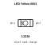
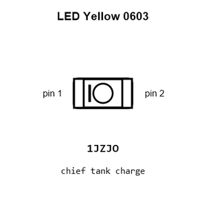
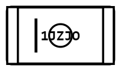
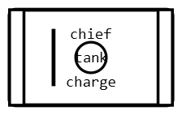
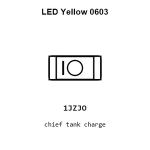
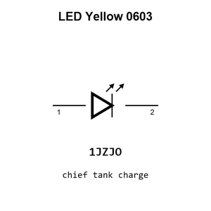

# LED Yellow 0603

`electronic_led_0603_yellow`

LED Yellow 0603 is an OOMP electronic led definition. It uses the 0603 package or form factor. Its nominal drawing size is 1.6 &#x00D7; 0.8 mm.

## At a glance

| Detail | Value |
| --- | --- |
| OOMP ID | `electronic_led_0603_yellow` |
| Type | Led |
| Package / style | 0603 |
| Nominal size | 1.6 &#x00D7; 0.8 mm |

## Classification

| Level | Value |
| --- | --- |
| 1 | `electronic` |
| 2 | `led` |
| 3 | `0603` |
| 4 | `yellow` |

## Nominal dimensions

| Measurement | Value |
| --- | ---: |
| Length | 1.6 mm |
| Width | 0.8 mm |

## Used in projects

| Project | Quantity | References | Explore |
| --- | ---: | --- | --- |
| [Project adafruit/Adafruit-A4988-Breakout-PCB Adafruit A4988 Breakout current](https://github.com/adafruit/Adafruit-A4988-Breakout-PCB/blob/main/Adafruit%20A4988%20Breakout.brd) | 1 | D2 | [Board explorer](https://oomlout.github.io/oomp_electronic_version_5/parts/oomp_project_github_adafruit_adafruit_a4988_breakout_pcb_adafruit_a4988_breakout_current/board_explorer.html) · [OOMP project](https://github.com/oomlout/oomp_electronic_version_5/tree/main/parts/oomp_project_github_adafruit_adafruit_a4988_breakout_pcb_adafruit_a4988_breakout_current) |
| [Project adafruit/Adafruit-Infrared-IR-Remote-Transceiver Adafruit Infrared IR Remote Transceiver current](https://github.com/adafruit/Adafruit-Infrared-IR-Remote-Transceiver/blob/main/Adafruit%20Infrared%20IR%20Remote%20Transceiver.brd) | 2 | D1, D3 | [Board explorer](https://oomlout.github.io/oomp_electronic_version_5/parts/oomp_project_github_adafruit_adafruit_infrared_ir_remote_transceiver_adafruit_infrared_ir_remote_transceiver_current/board_explorer.html) · [OOMP project](https://github.com/oomlout/oomp_electronic_version_5/tree/main/parts/oomp_project_github_adafruit_adafruit_infrared_ir_remote_transceiver_adafruit_infrared_ir_remote_transceiver_current) |
| [Project adafruit/Adafruit-METRO-328-PCB Metro Mini 328 STEMMA QT current](https://github.com/adafruit/Adafruit-METRO-328-PCB/blob/master/Metro%20Mini%20328%20V2%20-%20STEMMA%20QT.brd) | 2 | D4, D5 | [Board explorer](https://oomlout.github.io/oomp_electronic_version_5/parts/oomp_project_github_adafruit_adafruit_metro_328_pcb_metro_mini_328_stemma_qt_current/board_explorer.html) · [OOMP project](https://github.com/oomlout/oomp_electronic_version_5/tree/main/parts/oomp_project_github_adafruit_adafruit_metro_328_pcb_metro_mini_328_stemma_qt_current) |
| [Project adafruit/Adafruit-PyRuler-PCB Adafruit Py Ruler current](https://github.com/adafruit/Adafruit-PyRuler-PCB/blob/master/Adafruit_PyRuler.brd) | 1 | L1 | [Board explorer](https://oomlout.github.io/oomp_electronic_version_5/parts/oomp_project_github_adafruit_adafruit_py_ruler_pcb_adafruit_py_ruler_current/board_explorer.html) · [OOMP project](https://github.com/oomlout/oomp_electronic_version_5/tree/main/parts/oomp_project_github_adafruit_adafruit_py_ruler_pcb_adafruit_py_ruler_current) |
| [Project adafruit/Adafruit-TMC2209-Breakout-PCB Adafruit TMC2209 Stepper Motor Driver current](https://github.com/adafruit/Adafruit-TMC2209-Breakout-PCB/blob/main/Adafruit%20TMC2209%20Stepper%20Motor%20Driver.brd) | 1 | D2 | [Board explorer](https://oomlout.github.io/oomp_electronic_version_5/parts/oomp_project_github_adafruit_adafruit_tmc2209_breakout_pcb_adafruit_tmc2209_stepper_motor_driver_current/board_explorer.html) · [OOMP project](https://github.com/oomlout/oomp_electronic_version_5/tree/main/parts/oomp_project_github_adafruit_adafruit_tmc2209_breakout_pcb_adafruit_tmc2209_stepper_motor_driver_current) |
| [Project sparkfun/9DOF_Razor_IMU sparkfun 9dof razor imu current](https://github.com/sparkfun/9DOF_Razor_IMU/blob/master/Hardware/sparkfun-9dof-razor-imu.brd) | 1 | D2 | [Board explorer](https://oomlout.github.io/oomp_electronic_version_5/parts/oomp_project_github_sparkfun_9_dof_razor_imu_sparkfun_9dof_razor_imu_current/board_explorer.html) · [OOMP project](https://github.com/oomlout/oomp_electronic_version_5/tree/main/parts/oomp_project_github_sparkfun_9_dof_razor_imu_sparkfun_9dof_razor_imu_current) |
| [Project sparkfun/Blynk_Board_ESP8266 Spark Fun Blynk Board ESP8266 current](https://github.com/sparkfun/Blynk_Board_ESP8266/blob/master/Hardware/SparkFun-Blynk-Board-ESP8266.brd) | 1 | D1 | [Board explorer](https://oomlout.github.io/oomp_electronic_version_5/parts/oomp_project_github_sparkfun_blynk_board_esp8266_spark_fun_blynk_board_esp8266_current/board_explorer.html) · [OOMP project](https://github.com/oomlout/oomp_electronic_version_5/tree/main/parts/oomp_project_github_sparkfun_blynk_board_esp8266_spark_fun_blynk_board_esp8266_current) |
| [Project sparkfun/Digital_Sandbox Digital Sandbox current](https://github.com/sparkfun/Digital_Sandbox/blob/master/Hardware/DigitalSandbox.brd) | 1 | D1 | [Board explorer](https://oomlout.github.io/oomp_electronic_version_5/parts/oomp_project_github_sparkfun_digital_sandbox_digital_sandbox_current/board_explorer.html) · [OOMP project](https://github.com/oomlout/oomp_electronic_version_5/tree/main/parts/oomp_project_github_sparkfun_digital_sandbox_digital_sandbox_current) |
| [Project sparkfun/Easy_Driver Easy Driver current](https://github.com/sparkfun/Easy_Driver/blob/master/Hardware/EasyDriver_v45.brd) | 1 | PWR_LED0 | [Board explorer](https://oomlout.github.io/oomp_electronic_version_5/parts/oomp_project_github_sparkfun_easy_driver_easy_driver_current/board_explorer.html) · [OOMP project](https://github.com/oomlout/oomp_electronic_version_5/tree/main/parts/oomp_project_github_sparkfun_easy_driver_easy_driver_current) |
| [Project sparkfun/Electric_Imp_Shield electric imp shield current](https://github.com/sparkfun/Electric_Imp_Shield/blob/master/Hardware/electric-imp-shield.brd) | 1 | LED2 | [Board explorer](https://oomlout.github.io/oomp_electronic_version_5/parts/oomp_project_github_sparkfun_electric_imp_shield_electric_imp_shield_current/board_explorer.html) · [OOMP project](https://github.com/oomlout/oomp_electronic_version_5/tree/main/parts/oomp_project_github_sparkfun_electric_imp_shield_electric_imp_shield_current) |
| [Project sparkfun/ESP32_Thing esp32 thing current](https://github.com/sparkfun/ESP32_Thing/blob/master/Hardware/esp32-thing.brd) | 1 | D1 | [Board explorer](https://oomlout.github.io/oomp_electronic_version_5/parts/oomp_project_github_sparkfun_esp32_thing_esp32_thing_current/board_explorer.html) · [OOMP project](https://github.com/oomlout/oomp_electronic_version_5/tree/main/parts/oomp_project_github_sparkfun_esp32_thing_esp32_thing_current) |
| [Project sparkfun/ESP32_Thing_Plus ESP32 Thing Plus current](https://github.com/sparkfun/ESP32_Thing_Plus/blob/master/Hardware/ESP32_Thing_Plus.brd) | 1 | D1 | [Board explorer](https://oomlout.github.io/oomp_electronic_version_5/parts/oomp_project_github_sparkfun_esp32_thing_plus_esp32_thing_plus_current/board_explorer.html) · [OOMP project](https://github.com/oomlout/oomp_electronic_version_5/tree/main/parts/oomp_project_github_sparkfun_esp32_thing_plus_esp32_thing_plus_current) |
| [Project sparkfun/ESP8266_Thing_Dev ESP8266 Thing Dev current](https://github.com/sparkfun/ESP8266_Thing_Dev/blob/master/Hardware/ESP8266-Thing-Dev.brd) | 1 | D4 | [Board explorer](https://oomlout.github.io/oomp_electronic_version_5/parts/oomp_project_github_sparkfun_esp8266_thing_dev_esp8266_thing_dev_current/board_explorer.html) · [OOMP project](https://github.com/oomlout/oomp_electronic_version_5/tree/main/parts/oomp_project_github_sparkfun_esp8266_thing_dev_esp8266_thing_dev_current) |
| [Project sparkfun/ESP8266_Thing Spark Fun ESP8266 Thinga current](https://github.com/sparkfun/ESP8266_Thing/blob/master/Hardware/SparkFun_ESP8266_Thing_V10a.brd) | 1 | D1 | [Board explorer](https://oomlout.github.io/oomp_electronic_version_5/parts/oomp_project_github_sparkfun_esp8266_thing_spark_fun_esp8266_thinga_current/board_explorer.html) · [OOMP project](https://github.com/oomlout/oomp_electronic_version_5/tree/main/parts/oomp_project_github_sparkfun_esp8266_thing_spark_fun_esp8266_thinga_current) |
| [Project sparkfun/IOIO-OTG IOIO OTG current](https://github.com/sparkfun/IOIO-OTG/blob/master/Hardware/IOIO-OTG.brd) | 1 | D3 | [Board explorer](https://oomlout.github.io/oomp_electronic_version_5/parts/oomp_project_github_sparkfun_ioio_otg_ioio_otg_current/board_explorer.html) · [OOMP project](https://github.com/oomlout/oomp_electronic_version_5/tree/main/parts/oomp_project_github_sparkfun_ioio_otg_ioio_otg_current) |
| [Project sparkfun/LilyPad_MP3_Player Lily Pad MP3a current](https://github.com/sparkfun/LilyPad_MP3_Player/blob/master/hardware/LilyPad-MP3-v15a.brd) | 1 | LED2 | [Board explorer](https://oomlout.github.io/oomp_electronic_version_5/parts/oomp_project_github_sparkfun_lily_pad_mp3_player_lily_pad_mp3a_current/board_explorer.html) · [OOMP project](https://github.com/oomlout/oomp_electronic_version_5/tree/main/parts/oomp_project_github_sparkfun_lily_pad_mp3_player_lily_pad_mp3a_current) |
| [Project sparkfun/LTE_Cat_M1_Shield lte cat m1 shield sara r4 current](https://github.com/sparkfun/LTE_Cat_M1_Shield/blob/main/Hardware/lte_cat_m1_shield_sara-r4.brd) | 1 | D2 | [Board explorer](https://oomlout.github.io/oomp_electronic_version_5/parts/oomp_project_github_sparkfun_lte_cat_m1_shield_lte_cat_m1_shield_sara_r4_current/board_explorer.html) · [OOMP project](https://github.com/oomlout/oomp_electronic_version_5/tree/main/parts/oomp_project_github_sparkfun_lte_cat_m1_shield_lte_cat_m1_shield_sara_r4_current) |
| [Project sparkfun/LumiDrive Lumi Drive current](https://github.com/sparkfun/LumiDrive/blob/master/HARDWARE/LumiDrive.brd) | 1 | D2 | [Board explorer](https://oomlout.github.io/oomp_electronic_version_5/parts/oomp_project_github_sparkfun_lumi_drive_lumi_drive_current/board_explorer.html) · [OOMP project](https://github.com/oomlout/oomp_electronic_version_5/tree/main/parts/oomp_project_github_sparkfun_lumi_drive_lumi_drive_current) |
| [Project sparkfun/MicroMod_Data_Logging_Carrier Micro Mod Datalogging Carrier Board current](https://github.com/sparkfun/MicroMod_Data_Logging_Carrier/blob/master/Hardware/MicroMod-Datalogging-CarrierBoard.brd) | 2 | D2, D7 | [Board explorer](https://oomlout.github.io/oomp_electronic_version_5/parts/oomp_project_github_sparkfun_micro_mod_data_logging_carrier_micro_mod_datalogging_carrier_board_current/board_explorer.html) · [OOMP project](https://github.com/oomlout/oomp_electronic_version_5/tree/main/parts/oomp_project_github_sparkfun_micro_mod_data_logging_carrier_micro_mod_datalogging_carrier_board_current) |
| [Project sparkfun/MicroMod_Function_Ethernet-W5500 Micro Mod Ethernet Function Board W5500 current](https://github.com/sparkfun/MicroMod_Function_Ethernet-W5500/blob/main/Hardware/MicroMod-Ethernet-Function-Board-W5500.brd) | 1 | D5 | [Board explorer](https://oomlout.github.io/oomp_electronic_version_5/parts/oomp_project_github_sparkfun_micro_mod_function_ethernet_w5500_micro_mod_ethernet_function_board_w5500_current/board_explorer.html) · [OOMP project](https://github.com/oomlout/oomp_electronic_version_5/tree/main/parts/oomp_project_github_sparkfun_micro_mod_function_ethernet_w5500_micro_mod_ethernet_function_board_w5500_current) |
| [Project sparkfun/MicroMod_Machine_Learning_Carrier Machine Learning MM Carrier current](https://github.com/sparkfun/MicroMod_Machine_Learning_Carrier/blob/master/Hardware/MachineLearning-MM-Carrier.brd) | 1 | D4 | [Board explorer](https://oomlout.github.io/oomp_electronic_version_5/parts/oomp_project_github_sparkfun_micro_mod_machine_learning_carrier_machine_learning_mm_carrier_current/board_explorer.html) · [OOMP project](https://github.com/oomlout/oomp_electronic_version_5/tree/main/parts/oomp_project_github_sparkfun_micro_mod_machine_learning_carrier_machine_learning_mm_carrier_current) |
| [Project sparkfun/MicroMod_Teensy_Processor Micro Mod Teensy current](https://github.com/sparkfun/MicroMod_Teensy_Processor/blob/main/Hardware/MicroMod-Teensy.brd) | 1 | D5 | [Board explorer](https://oomlout.github.io/oomp_electronic_version_5/parts/oomp_project_github_sparkfun_micro_mod_teensy_processor_micro_mod_teensy_current/board_explorer.html) · [OOMP project](https://github.com/oomlout/oomp_electronic_version_5/tree/main/parts/oomp_project_github_sparkfun_micro_mod_teensy_processor_micro_mod_teensy_current) |
| [Project sparkfun/MicroMod_Teensy_Processor Micro Mod Teensy Lockable current](https://github.com/sparkfun/MicroMod_Teensy_Processor/blob/main/Hardware/Lockable/MicroMod-Teensy-Lockable.brd) | 1 | D5 | [Board explorer](https://oomlout.github.io/oomp_electronic_version_5/parts/oomp_project_github_sparkfun_micro_mod_teensy_processor_micro_mod_teensy_lockable_current/board_explorer.html) · [OOMP project](https://github.com/oomlout/oomp_electronic_version_5/tree/main/parts/oomp_project_github_sparkfun_micro_mod_teensy_processor_micro_mod_teensy_lockable_current) |
| [Project sparkfun/nRF52840_Breakout_MDBT50Q nrf52840 breakout mdbt50q current](https://github.com/sparkfun/nRF52840_Breakout_MDBT50Q/blob/master/Hardware/nrf52840-breakout-mdbt50q.brd) | 1 | D2 | [Board explorer](https://oomlout.github.io/oomp_electronic_version_5/parts/oomp_project_github_sparkfun_n_rf52840_breakout_mdbt50_q_nrf52840_breakout_mdbt50q_current/board_explorer.html) · [OOMP project](https://github.com/oomlout/oomp_electronic_version_5/tree/main/parts/oomp_project_github_sparkfun_n_rf52840_breakout_mdbt50_q_nrf52840_breakout_mdbt50q_current) |
| [Project sparkfun/OBD-II_UART OBD II UART current](https://github.com/sparkfun/OBD-II_UART/blob/master/Hardware/OBD-II-UART.brd) | 2 | LED1, LED3 | [Board explorer](https://oomlout.github.io/oomp_electronic_version_5/parts/oomp_project_github_sparkfun_obd_ii_uart_obd_ii_uart_current/board_explorer.html) · [OOMP project](https://github.com/oomlout/oomp_electronic_version_5/tree/main/parts/oomp_project_github_sparkfun_obd_ii_uart_obd_ii_uart_current) |
| [Project sparkfun/OpenLog_Artemis Spark Fun Artemis Open Log current](https://github.com/sparkfun/OpenLog_Artemis/blob/main/Hardware/SparkFun_Artemis_OpenLog.brd) | 2 | D2, D11 | [Board explorer](https://oomlout.github.io/oomp_electronic_version_5/parts/oomp_project_github_sparkfun_open_log_artemis_spark_fun_artemis_open_log_current/board_explorer.html) · [OOMP project](https://github.com/oomlout/oomp_electronic_version_5/tree/main/parts/oomp_project_github_sparkfun_open_log_artemis_spark_fun_artemis_open_log_current) |
| [Project sparkfun/P8X32A_Breakout P8 X32 A Breakout current](https://github.com/sparkfun/P8X32A_Breakout/blob/master/hardware/P8X32A_Breakout.brd) | 1 | LED2 | [Board explorer](https://oomlout.github.io/oomp_electronic_version_5/parts/oomp_project_github_sparkfun_p8_x32_a_breakout_p8_x32_a_breakout_current/board_explorer.html) · [OOMP project](https://github.com/oomlout/oomp_electronic_version_5/tree/main/parts/oomp_project_github_sparkfun_p8_x32_a_breakout_p8_x32_a_breakout_current) |
| [Project sparkfun/Pi_Servo_Hat Pi Servo p HAT current](https://github.com/sparkfun/Pi_Servo_Hat/blob/master/Hardware/Pi_Servo_pHAT.brd) | 1 | D2 | [Board explorer](https://oomlout.github.io/oomp_electronic_version_5/parts/oomp_project_github_sparkfun_pi_servo_hat_pi_servo_p_hat_current/board_explorer.html) · [OOMP project](https://github.com/oomlout/oomp_electronic_version_5/tree/main/parts/oomp_project_github_sparkfun_pi_servo_hat_pi_servo_p_hat_current) |
| [Project sparkfun/Power_Delivery_Board-USB-C Spark Fun STUSB4500 USB PD current](https://github.com/sparkfun/Power_Delivery_Board-USB-C/blob/master/Hardware/SparkFun_STUSB4500_USB-PD.brd) | 1 | D2 | [Board explorer](https://oomlout.github.io/oomp_electronic_version_5/parts/oomp_project_github_sparkfun_power_delivery_board_usb_c_spark_fun_stusb4500_usb_pd_current/board_explorer.html) · [OOMP project](https://github.com/oomlout/oomp_electronic_version_5/tree/main/parts/oomp_project_github_sparkfun_power_delivery_board_usb_c_spark_fun_stusb4500_usb_pd_current) |
| [Project sparkfun/Pro_Micro Spark Fun Pro Micro current](https://github.com/sparkfun/Pro_Micro/blob/main/Hardware/v13/SparkFun_Pro_Micro.brd) | 1 | D1 | [Board explorer](https://oomlout.github.io/oomp_electronic_version_5/parts/oomp_project_github_sparkfun_pro_micro_spark_fun_pro_micro_current/board_explorer.html) · [OOMP project](https://github.com/oomlout/oomp_electronic_version_5/tree/main/parts/oomp_project_github_sparkfun_pro_micro_spark_fun_pro_micro_current) |
| [Project sparkfun/Pro_Micro Spark Fun Pro Micro current](https://github.com/sparkfun/Pro_Micro/blob/main/Hardware/v20/SparkFun_Pro_Micro.brd) | 1 | D1 | [Board explorer](https://oomlout.github.io/oomp_electronic_version_5/parts/oomp_project_github_sparkfun_pro_micro_v20_spark_fun_pro_micro_current/board_explorer.html) · [OOMP project](https://github.com/oomlout/oomp_electronic_version_5/tree/main/parts/oomp_project_github_sparkfun_pro_micro_v20_spark_fun_pro_micro_current) |
| [Project sparkfun/ProtoSnap-LilyPad_Development_Board Lily Pad Dev current](https://github.com/sparkfun/ProtoSnap-LilyPad_Development_Board/blob/master/Hardware/LilyPad-Dev-v34.brd) | 1 | D4 | [Board explorer](https://oomlout.github.io/oomp_electronic_version_5/parts/oomp_project_github_sparkfun_proto_snap_lily_pad_development_board_lily_pad_dev_current/board_explorer.html) · [OOMP project](https://github.com/oomlout/oomp_electronic_version_5/tree/main/parts/oomp_project_github_sparkfun_proto_snap_lily_pad_development_board_lily_pad_dev_current) |
| [Project sparkfun/Qwiic_GPS-RTK2 Qwiic GPS RTK2 ublox ZED-F9P current](https://github.com/sparkfun/Qwiic_GPS-RTK2/blob/master/Hardware/Qwiic%20GPS-RTK2%20-%20ublox%20ZED-F9P.brd) | 1 | D1 | [Board explorer](https://oomlout.github.io/oomp_electronic_version_5/parts/oomp_project_github_sparkfun_qwiic_gps_rtk2_qwiic_gps_rtk2_ublox_zed_f9_p_current/board_explorer.html) · [OOMP project](https://github.com/oomlout/oomp_electronic_version_5/tree/main/parts/oomp_project_github_sparkfun_qwiic_gps_rtk2_qwiic_gps_rtk2_ublox_zed_f9_p_current) |
| [Project sparkfun/RedBoard_Artemis_Nano Red Board Artemis Nano current](https://github.com/sparkfun/RedBoard_Artemis_Nano/blob/master/Hardware/RedBoard-Artemis-Nano.brd) | 2 | D2, D5 | [Board explorer](https://oomlout.github.io/oomp_electronic_version_5/parts/oomp_project_github_sparkfun_red_board_artemis_nano_red_board_artemis_nano_current/board_explorer.html) · [OOMP project](https://github.com/oomlout/oomp_electronic_version_5/tree/main/parts/oomp_project_github_sparkfun_red_board_artemis_nano_red_board_artemis_nano_current) |
| [Project sparkfun/RP2040_mikroBUS_Dev_Board RP2040 Mikro BUS current](https://github.com/sparkfun/RP2040_mikroBUS_Dev_Board/blob/main/Hardware/RP2040_MikroBUS.brd) | 1 | D1 | [Board explorer](https://oomlout.github.io/oomp_electronic_version_5/parts/oomp_project_github_sparkfun_rp2040_mikro_bus_dev_board_rp2040_mikro_bus_current/board_explorer.html) · [OOMP project](https://github.com/oomlout/oomp_electronic_version_5/tree/main/parts/oomp_project_github_sparkfun_rp2040_mikro_bus_dev_board_rp2040_mikro_bus_current) |
| [Project sparkfun/SAMD21_Dev_Breakout sparkfun samd21 pro breakout current](https://github.com/sparkfun/SAMD21_Dev_Breakout/blob/master/Hardware/sparkfun-samd21-pro-breakout.brd) | 1 | D6 | [Board explorer](https://oomlout.github.io/oomp_electronic_version_5/parts/oomp_project_github_sparkfun_samd21_dev_breakout_sparkfun_samd21_pro_breakout_current/board_explorer.html) · [OOMP project](https://github.com/oomlout/oomp_electronic_version_5/tree/main/parts/oomp_project_github_sparkfun_samd21_dev_breakout_sparkfun_samd21_pro_breakout_current) |
| [Project sparkfun/SAMD21_Mini_Breakout sparkfun samd21 mini breakout current](https://github.com/sparkfun/SAMD21_Mini_Breakout/blob/master/Hardware/sparkfun-samd21-mini-breakout.brd) | 1 | D4 | [Board explorer](https://oomlout.github.io/oomp_electronic_version_5/parts/oomp_project_github_sparkfun_samd21_mini_breakout_sparkfun_samd21_mini_breakout_current/board_explorer.html) · [OOMP project](https://github.com/oomlout/oomp_electronic_version_5/tree/main/parts/oomp_project_github_sparkfun_samd21_mini_breakout_sparkfun_samd21_mini_breakout_current) |
| [Project sparkfun/SAMD51_Thing_Plus SAMD51 Thing Plus current](https://github.com/sparkfun/SAMD51_Thing_Plus/blob/master/Hardware/SAMD51_Thing_Plus.brd) | 1 | D1 | [Board explorer](https://oomlout.github.io/oomp_electronic_version_5/parts/oomp_project_github_sparkfun_samd51_thing_plus_samd51_thing_plus_current/board_explorer.html) · [OOMP project](https://github.com/oomlout/oomp_electronic_version_5/tree/main/parts/oomp_project_github_sparkfun_samd51_thing_plus_samd51_thing_plus_current) |
| [Project sparkfun/Serial_Basic_Breakout-CH340C Serial Basic CH340 C current](https://github.com/sparkfun/Serial_Basic_Breakout-CH340C/blob/master/Hardware/Serial-Basic-CH340C.brd) | 1 | LED2 | [Board explorer](https://oomlout.github.io/oomp_electronic_version_5/parts/oomp_project_github_sparkfun_serial_basic_breakout_ch340_c_serial_basic_ch340_c_current/board_explorer.html) · [OOMP project](https://github.com/oomlout/oomp_electronic_version_5/tree/main/parts/oomp_project_github_sparkfun_serial_basic_breakout_ch340_c_serial_basic_ch340_c_current) |
| [Project sparkfun/SparkFun_Artemis_Global_Tracker Spark Fun Artemis Global Tracker current](https://github.com/sparkfun/SparkFun_Artemis_Global_Tracker/blob/main/Hardware/SparkFun_Artemis_Global_Tracker.brd) | 3 | D2, D9, D13 | [Board explorer](https://oomlout.github.io/oomp_electronic_version_5/parts/oomp_project_github_sparkfun_spark_fun_artemis_global_tracker_spark_fun_artemis_global_tracker_current/board_explorer.html) · [OOMP project](https://github.com/oomlout/oomp_electronic_version_5/tree/main/parts/oomp_project_github_sparkfun_spark_fun_artemis_global_tracker_spark_fun_artemis_global_tracker_current) |
| [Project sparkfun/SparkFun_DataLogger_IoT_9DoF Spark Fun Data Logger Io T 9 DOF current](https://github.com/sparkfun/SparkFun_DataLogger_IoT_9DoF/blob/main/Hardware/SparkFun_DataLogger_IoT_9DOF.brd) | 1 | D3 | [Board explorer](https://oomlout.github.io/oomp_electronic_version_5/parts/oomp_project_github_sparkfun_spark_fun_data_logger_io_t_9_do_f_spark_fun_data_logger_io_t_9_dof_current/board_explorer.html) · [OOMP project](https://github.com/oomlout/oomp_electronic_version_5/tree/main/parts/oomp_project_github_sparkfun_spark_fun_data_logger_io_t_9_do_f_spark_fun_data_logger_io_t_9_dof_current) |
| [Project sparkfun/SparkFun_Digi_XBee_Arduino_Shield-USB-C Spark Fun Digi XBee Arduino Shield Qwiic current](https://github.com/sparkfun/SparkFun_Digi_XBee_Arduino_Shield-USB-C/blob/main/Hardware/SparkFun_Digi_XBee_Arduino_Shield_Qwiic.brd) | 1 | D4 | [Board explorer](https://oomlout.github.io/oomp_electronic_version_5/parts/oomp_project_github_sparkfun_spark_fun_digi_xbee_arduino_shield_usb_c_spark_fun_digi_xbee_arduino_shield_qwiic_current/board_explorer.html) · [OOMP project](https://github.com/oomlout/oomp_electronic_version_5/tree/main/parts/oomp_project_github_sparkfun_spark_fun_digi_xbee_arduino_shield_usb_c_spark_fun_digi_xbee_arduino_shield_qwiic_current) |
| [Project sparkfun/SparkFun_Digi_XBee_Development_Board Spark Fun Digi XBee Development Board current](https://github.com/sparkfun/SparkFun_Digi_XBee_Development_Board/blob/main/Hardware/SparkFun_Digi_XBee_Development_Board.brd) | 2 | D4, D7 | [Board explorer](https://oomlout.github.io/oomp_electronic_version_5/parts/oomp_project_github_sparkfun_spark_fun_digi_xbee_development_board_spark_fun_digi_xbee_development_board_current/board_explorer.html) · [OOMP project](https://github.com/oomlout/oomp_electronic_version_5/tree/main/parts/oomp_project_github_sparkfun_spark_fun_digi_xbee_development_board_spark_fun_digi_xbee_development_board_current) |
| [Project sparkfun/SparkFun_Digi_XBee_Explorer_USB-C Spark Fun Digi XBee Explorer USB C current](https://github.com/sparkfun/SparkFun_Digi_XBee_Explorer_USB-C/blob/main/Hardware/SparkFun_Digi_XBee_Explorer_USB-C.brd) | 1 | D4 | [Board explorer](https://oomlout.github.io/oomp_electronic_version_5/parts/oomp_project_github_sparkfun_spark_fun_digi_xbee_explorer_usb_c_spark_fun_digi_xbee_explorer_usb_c_current/board_explorer.html) · [OOMP project](https://github.com/oomlout/oomp_electronic_version_5/tree/main/parts/oomp_project_github_sparkfun_spark_fun_digi_xbee_explorer_usb_c_spark_fun_digi_xbee_explorer_usb_c_current) |
| [Project sparkfun/SparkFun_Digi_XBee_Regulated_Qwiic Spark Fun Digi XBee Regulated Qwiic current](https://github.com/sparkfun/SparkFun_Digi_XBee_Regulated_Qwiic/blob/main/Hardware/SparkFun_Digi_XBee_Regulated_Qwiic.brd) | 1 | D4 | [Board explorer](https://oomlout.github.io/oomp_electronic_version_5/parts/oomp_project_github_sparkfun_spark_fun_digi_xbee_regulated_qwiic_spark_fun_digi_xbee_regulated_qwiic_current/board_explorer.html) · [OOMP project](https://github.com/oomlout/oomp_electronic_version_5/tree/main/parts/oomp_project_github_sparkfun_spark_fun_digi_xbee_regulated_qwiic_spark_fun_digi_xbee_regulated_qwiic_current) |
| [Project sparkfun/SparkFun_GNSS_Flex_Breakout GNSS Flex Breakout current](https://github.com/sparkfun/SparkFun_GNSS_Flex_Breakout) | 1 | D6 | [Board explorer](https://oomlout.github.io/oomp_electronic_version_5/parts/oomp_project_github_sparkfun_spark_fun_gnss_flex_breakout_gnss_flex_breakout_current/board_explorer.html) · [OOMP project](https://github.com/oomlout/oomp_electronic_version_5/tree/main/parts/oomp_project_github_sparkfun_spark_fun_gnss_flex_breakout_gnss_flex_breakout_current) |
| [Project sparkfun/SparkFun_GNSS_Timing-ZED-F9T Spark Fun GNSS Timing ZED F9 T current](https://github.com/sparkfun/SparkFun_GNSS_Timing-ZED-F9T/blob/main/Hardware/SparkFun_GNSS_Timing-ZED-F9T.brd) | 1 | D4 | [Board explorer](https://oomlout.github.io/oomp_electronic_version_5/parts/oomp_project_github_sparkfun_spark_fun_gnss_timing_zed_f9_t_spark_fun_gnss_timing_zed_f9_t_current/board_explorer.html) · [OOMP project](https://github.com/oomlout/oomp_electronic_version_5/tree/main/parts/oomp_project_github_sparkfun_spark_fun_gnss_timing_zed_f9_t_spark_fun_gnss_timing_zed_f9_t_current) |
| [Project sparkfun/SparkFun_LoRaSerial Spark Fun Lo Ra Serial 433 MHz 1 W current](https://github.com/sparkfun/SparkFun_LoRaSerial/blob/main/Hardware/433MHz/SparkFun%20LoRaSerial%20433MHz%20-%201W.brd) | 1 | D3 | [Board explorer](https://oomlout.github.io/oomp_electronic_version_5/parts/oomp_project_github_sparkfun_spark_fun_lo_ra_serial_spark_fun_lo_ra_serial_433_mhz_1_w_current/board_explorer.html) · [OOMP project](https://github.com/oomlout/oomp_electronic_version_5/tree/main/parts/oomp_project_github_sparkfun_spark_fun_lo_ra_serial_spark_fun_lo_ra_serial_433_mhz_1_w_current) |
| [Project sparkfun/SparkFun_LoRaSerial Spark Fun Lo Ra Serial 868 MHz 1 W current](https://github.com/sparkfun/SparkFun_LoRaSerial/blob/main/Hardware/868MHz/SparkFun%20LoRaSerial%20868MHz%20-%201W.brd) | 1 | D3 | [Board explorer](https://oomlout.github.io/oomp_electronic_version_5/parts/oomp_project_github_sparkfun_spark_fun_lo_ra_serial_spark_fun_lo_ra_serial_868_mhz_1_w_current/board_explorer.html) · [OOMP project](https://github.com/oomlout/oomp_electronic_version_5/tree/main/parts/oomp_project_github_sparkfun_spark_fun_lo_ra_serial_spark_fun_lo_ra_serial_868_mhz_1_w_current) |
| [Project sparkfun/SparkFun_LoRaSerial Spark Fun Lo Ra Serial 915 MHz 1 W current](https://github.com/sparkfun/SparkFun_LoRaSerial/blob/main/Hardware/915MHz/SparkFun%20LoRaSerial%20915MHz%20-%201W.brd) | 1 | D3 | [Board explorer](https://oomlout.github.io/oomp_electronic_version_5/parts/oomp_project_github_sparkfun_spark_fun_lo_ra_serial_spark_fun_lo_ra_serial_915_mhz_1_w_current/board_explorer.html) · [OOMP project](https://github.com/oomlout/oomp_electronic_version_5/tree/main/parts/oomp_project_github_sparkfun_spark_fun_lo_ra_serial_spark_fun_lo_ra_serial_915_mhz_1_w_current) |
| [Project sparkfun/SparkFun_LTE_GNSS_Breakout_SARA-R510M8S Spark Fun LTE GNSS Breakout SARA R510 M8 S current](https://github.com/sparkfun/SparkFun_LTE_GNSS_Breakout_SARA-R510M8S/blob/main/Hardware/SparkFun_LTE_GNSS_Breakout_SARA-R510M8S.brd) | 2 | D4, D9 | [Board explorer](https://oomlout.github.io/oomp_electronic_version_5/parts/oomp_project_github_sparkfun_spark_fun_lte_gnss_breakout_sara_r510_m8_s_spark_fun_lte_gnss_breakout_sara_r510_m8_s_current/board_explorer.html) · [OOMP project](https://github.com/oomlout/oomp_electronic_version_5/tree/main/parts/oomp_project_github_sparkfun_spark_fun_lte_gnss_breakout_sara_r510_m8_s_spark_fun_lte_gnss_breakout_sara_r510_m8_s_current) |
| [Project sparkfun/SparkFun_MicroMod_Main_Board_Double Spark Fun Main Board Double current](https://github.com/sparkfun/SparkFun_MicroMod_Main_Board_Double/blob/main/Hardware/SparkFun_Main_Board_Double_v22.brd) | 1 | D4 | [Board explorer](https://oomlout.github.io/oomp_electronic_version_5/parts/oomp_project_github_sparkfun_spark_fun_micro_mod_main_board_double_spark_fun_main_board_double_current/board_explorer.html) · [OOMP project](https://github.com/oomlout/oomp_electronic_version_5/tree/main/parts/oomp_project_github_sparkfun_spark_fun_micro_mod_main_board_double_spark_fun_main_board_double_current) |
| [Project sparkfun/SparkFun_MicroMod_Main_Board_Single Spark Fun Main Board Single current](https://github.com/sparkfun/SparkFun_MicroMod_Main_Board_Single/blob/main/Hardware/SparkFun_Main_Board_Single_v21.brd) | 1 | D4 | [Board explorer](https://oomlout.github.io/oomp_electronic_version_5/parts/oomp_project_github_sparkfun_spark_fun_micro_mod_main_board_single_spark_fun_main_board_single_current/board_explorer.html) · [OOMP project](https://github.com/oomlout/oomp_electronic_version_5/tree/main/parts/oomp_project_github_sparkfun_spark_fun_micro_mod_main_board_single_spark_fun_main_board_single_current) |
| [Project sparkfun/SparkFun_MicroMod_Single_Pair_Ethernet_Function_Board_ADIN1110 Spark Fun Micro Mod Function ADIN1110 current](https://github.com/sparkfun/SparkFun_MicroMod_Single_Pair_Ethernet_Function_Board_ADIN1110/blob/main/Hardware/SparkFun_MicroMod_Function_ADIN1110.brd) | 1 | LED_1 | [Board explorer](https://oomlout.github.io/oomp_electronic_version_5/parts/oomp_project_github_sparkfun_spark_fun_micro_mod_single_pair_ethernet_function_board_adin1110_spark_fun_micro_mod_function_adin1110_current/board_explorer.html) · [OOMP project](https://github.com/oomlout/oomp_electronic_version_5/tree/main/parts/oomp_project_github_sparkfun_spark_fun_micro_mod_single_pair_ethernet_function_board_adin1110_spark_fun_micro_mod_function_adin1110_current) |
| [Project sparkfun/SparkFun_Qwiic_Pocket_Dev_Board_ESP32_C6 Qwiic Pocket Dev ESP32 C6 current](https://github.com/sparkfun/SparkFun_Qwiic_Pocket_Dev_Board_ESP32_C6/blob/main/Hardware/Qwiic_Pocket_Dev_ESP32_C6.brd) | 1 | D4 | [Board explorer](https://oomlout.github.io/oomp_electronic_version_5/parts/oomp_project_github_sparkfun_spark_fun_qwiic_pocket_dev_board_esp32_c6_qwiic_pocket_dev_esp32_c6_current/board_explorer.html) · [OOMP project](https://github.com/oomlout/oomp_electronic_version_5/tree/main/parts/oomp_project_github_sparkfun_spark_fun_qwiic_pocket_dev_board_esp32_c6_qwiic_pocket_dev_esp32_c6_current) |
| [Project sparkfun/SparkFun_Red-V_Thing_Plus Red VThing Plus current](https://github.com/sparkfun/SparkFun_Red-V_Thing_Plus/blob/master/Hardware/RedVThingPlus.brd) | 1 | D3 | [Board explorer](https://oomlout.github.io/oomp_electronic_version_5/parts/oomp_project_github_sparkfun_spark_fun_red_v_thing_plus_red_vthing_plus_current/board_explorer.html) · [OOMP project](https://github.com/oomlout/oomp_electronic_version_5/tree/main/parts/oomp_project_github_sparkfun_spark_fun_red_v_thing_plus_red_vthing_plus_current) |
| [Project sparkfun/SparkFun_RTK_Facet Spark Fun RTK Facet L Band Main current](https://github.com/sparkfun/SparkFun_RTK_Facet/blob/main/Hardware/Main-LBand/SparkFun%20RTK%20Facet%20L-Band%20-%20Main.brd) | 1 | D1 | [Board explorer](https://oomlout.github.io/oomp_electronic_version_5/parts/oomp_project_github_sparkfun_spark_fun_rtk_facet_spark_fun_rtk_facet_l_band_main_current/board_explorer.html) · [OOMP project](https://github.com/oomlout/oomp_electronic_version_5/tree/main/parts/oomp_project_github_sparkfun_spark_fun_rtk_facet_spark_fun_rtk_facet_l_band_main_current) |
| [Project sparkfun/SparkFun_RTK_Facet Spark Fun RTK Facet Main current](https://github.com/sparkfun/SparkFun_RTK_Facet/blob/main/Hardware/Main/SparkFun%20RTK%20Facet%20-%20Main.brd) | 1 | D1 | [Board explorer](https://oomlout.github.io/oomp_electronic_version_5/parts/oomp_project_github_sparkfun_spark_fun_rtk_facet_spark_fun_rtk_facet_main_current/board_explorer.html) · [OOMP project](https://github.com/oomlout/oomp_electronic_version_5/tree/main/parts/oomp_project_github_sparkfun_spark_fun_rtk_facet_spark_fun_rtk_facet_main_current) |
| [Project sparkfun/SparkFun_RTK_Surveyor Spark Fun GPS RTK Surveyor current](https://github.com/sparkfun/SparkFun_RTK_Surveyor/blob/main/Hardware/SparkFun%20GPS%20RTK%20Surveyor.brd) | 1 | D1 | [Board explorer](https://oomlout.github.io/oomp_electronic_version_5/parts/oomp_project_github_sparkfun_spark_fun_rtk_surveyor_spark_fun_gps_rtk_surveyor_current/board_explorer.html) · [OOMP project](https://github.com/oomlout/oomp_electronic_version_5/tree/main/parts/oomp_project_github_sparkfun_spark_fun_rtk_surveyor_spark_fun_gps_rtk_surveyor_current) |
| [Project sparkfun/SparkFun_Satellite_Transceiver-Swarm_M138 Satellite Transceiver Breakout Swarm M138 current](https://github.com/sparkfun/SparkFun_Satellite_Transceiver-Swarm_M138/blob/main/Hardware/Satellite_Transceiver_Breakout__Swarm_M138.brd) | 1 | D3 | [Board explorer](https://oomlout.github.io/oomp_electronic_version_5/parts/oomp_project_github_sparkfun_spark_fun_satellite_transceiver_swarm_m138_satellite_transceiver_breakout_swarm_m138_current/board_explorer.html) · [OOMP project](https://github.com/oomlout/oomp_electronic_version_5/tree/main/parts/oomp_project_github_sparkfun_spark_fun_satellite_transceiver_swarm_m138_satellite_transceiver_breakout_swarm_m138_current) |
| [Project sparkfun/SparkFun_Thing_Plus_AW-CU488 Spark Fun Azure Wave Module Thing Plus AW CU488 current](https://github.com/sparkfun/SparkFun_Thing_Plus_AW-CU488/blob/main/Hardware/SparkFun_AzureWave_Module_Thing_Plus_AW-CU488.brd) | 1 | D1 | [Board explorer](https://oomlout.github.io/oomp_electronic_version_5/parts/oomp_project_github_sparkfun_spark_fun_thing_plus_aw_cu488_spark_fun_azure_wave_module_thing_plus_aw_cu488_current/board_explorer.html) · [OOMP project](https://github.com/oomlout/oomp_electronic_version_5/tree/main/parts/oomp_project_github_sparkfun_spark_fun_thing_plus_aw_cu488_spark_fun_azure_wave_module_thing_plus_aw_cu488_current) |
| [Project sparkfun/SparkFun_Thing_Plus_ESP32_C6 Thing Plus ESP32 C6 current](https://github.com/sparkfun/SparkFun_Thing_Plus_ESP32_C6/blob/main/Hardware/Thing_Plus_ESP32_C6.brd) | 1 | D4 | [Board explorer](https://oomlout.github.io/oomp_electronic_version_5/parts/oomp_project_github_sparkfun_spark_fun_thing_plus_esp32_c6_thing_plus_esp32_c6_current/board_explorer.html) · [OOMP project](https://github.com/oomlout/oomp_electronic_version_5/tree/main/parts/oomp_project_github_sparkfun_spark_fun_thing_plus_esp32_c6_thing_plus_esp32_c6_current) |
| [Project sparkfun/SparkFun_Thing_Plus_ESP32_WROOM_C Spark Fun Thing Plus ESP32 WROOM C current](https://github.com/sparkfun/SparkFun_Thing_Plus_ESP32_WROOM_C/blob/main/Hardware/SparkFun_Thing_Plus_ESP32_WROOM_C.brd) | 1 | D1 | [Board explorer](https://oomlout.github.io/oomp_electronic_version_5/parts/oomp_project_github_sparkfun_spark_fun_thing_plus_esp32_wroom_c_spark_fun_thing_plus_esp32_wroom_c_current/board_explorer.html) · [OOMP project](https://github.com/oomlout/oomp_electronic_version_5/tree/main/parts/oomp_project_github_sparkfun_spark_fun_thing_plus_esp32_wroom_c_spark_fun_thing_plus_esp32_wroom_c_current) |
| [Project sparkfun/SparkFun_Thing_Plus_MGM240P Thing Plus MGM240 P current](https://github.com/sparkfun/SparkFun_Thing_Plus_MGM240P/blob/main/Hardware/Thing_Plus_MGM240P.brd) | 1 | D2 | [Board explorer](https://oomlout.github.io/oomp_electronic_version_5/parts/oomp_project_github_sparkfun_spark_fun_thing_plus_mgm240_p_thing_plus_mgm240_p_current/board_explorer.html) · [OOMP project](https://github.com/oomlout/oomp_electronic_version_5/tree/main/parts/oomp_project_github_sparkfun_spark_fun_thing_plus_mgm240_p_thing_plus_mgm240_p_current) |
| [Project sparkfun/SparkFun_Thing_Plus_NORA-W306 Spark Fun Thing Plus NORA W306 current](https://github.com/sparkfun/SparkFun_Thing_Plus_NORA-W306/blob/main/Hardware/SparkFun_Thing_Plus_NORA_W306.brd) | 1 | D1 | [Board explorer](https://oomlout.github.io/oomp_electronic_version_5/parts/oomp_project_github_sparkfun_spark_fun_thing_plus_nora_w306_spark_fun_thing_plus_nora_w306_current/board_explorer.html) · [OOMP project](https://github.com/oomlout/oomp_electronic_version_5/tree/main/parts/oomp_project_github_sparkfun_spark_fun_thing_plus_nora_w306_spark_fun_thing_plus_nora_w306_current) |
| [Project sparkfun/SparkFun_Thing_Plus-RP2040 RP2040 Thing Plus current](https://github.com/sparkfun/SparkFun_Thing_Plus-RP2040/blob/main/Hardware/RP2040_Thing_Plus.brd) | 1 | D1 | [Board explorer](https://oomlout.github.io/oomp_electronic_version_5/parts/oomp_project_github_sparkfun_spark_fun_thing_plus_rp2040_rp2040_thing_plus_current/board_explorer.html) · [OOMP project](https://github.com/oomlout/oomp_electronic_version_5/tree/main/parts/oomp_project_github_sparkfun_spark_fun_thing_plus_rp2040_rp2040_thing_plus_current) |
| [Project sparkfun/SparkFun_u-blox_MAX-M10S Spark Fun u blox GNSS MAX M10 S current](https://github.com/sparkfun/SparkFun_u-blox_MAX-M10S/blob/main/Hardware/SparkFun%20u-blox%20GNSS%20MAX-M10S.brd) | 1 | D1 | [Board explorer](https://oomlout.github.io/oomp_electronic_version_5/parts/oomp_project_github_sparkfun_spark_fun_u_blox_max_m10_s_spark_fun_u_blox_gnss_max_m10_s_current/board_explorer.html) · [OOMP project](https://github.com/oomlout/oomp_electronic_version_5/tree/main/parts/oomp_project_github_sparkfun_spark_fun_u_blox_max_m10_s_spark_fun_u_blox_gnss_max_m10_s_current) |
| [Project sparkfun/SparkFun_u-blox_NEO-F10N u-blox NEO-F10N current](https://github.com/sparkfun/SparkFun_u-blox_NEO-F10N) | 1 | D4 | [Board explorer](https://oomlout.github.io/oomp_electronic_version_5/parts/oomp_project_github_sparkfun_spark_fun_u_blox_neo_f10_n_ublox_neo_f10n_current/board_explorer.html) · [OOMP project](https://github.com/oomlout/oomp_electronic_version_5/tree/main/parts/oomp_project_github_sparkfun_spark_fun_u_blox_neo_f10_n_ublox_neo_f10n_current) |
| [Project sparkfun/SparkFun_u-blox_SAM-M10Q Spark Fun u blox SAM M10 Q current](https://github.com/sparkfun/SparkFun_u-blox_SAM-M10Q/blob/main/Hardware/SparkFun_u-blox_SAM-M10Q.brd) | 1 | D1 | [Board explorer](https://oomlout.github.io/oomp_electronic_version_5/parts/oomp_project_github_sparkfun_spark_fun_u_blox_sam_m10_q_spark_fun_u_blox_sam_m10_q_current/board_explorer.html) · [OOMP project](https://github.com/oomlout/oomp_electronic_version_5/tree/main/parts/oomp_project_github_sparkfun_spark_fun_u_blox_sam_m10_q_spark_fun_u_blox_sam_m10_q_current) |
| [Project sparkfun/Tiny-AVR-Programmer Tiny Programmer current](https://github.com/sparkfun/Tiny-AVR-Programmer/blob/master/Hardware/Tiny_Programmer.brd) | 1 | LED1 | [Board explorer](https://oomlout.github.io/oomp_electronic_version_5/parts/oomp_project_github_sparkfun_tiny_avr_programmer_tiny_programmer_current/board_explorer.html) · [OOMP project](https://github.com/oomlout/oomp_electronic_version_5/tree/main/parts/oomp_project_github_sparkfun_tiny_avr_programmer_tiny_programmer_current) |
| [Project sparkfun/UBW32 UBW32 MX460 current](https://github.com/sparkfun/UBW32/blob/master/Hardware/UBW32_MX460_v262.brd) | 1 | LED3 | [Board explorer](https://oomlout.github.io/oomp_electronic_version_5/parts/oomp_project_github_sparkfun_ubw32_hardware_ubw32_mx460_current/board_explorer.html) · [OOMP project](https://github.com/oomlout/oomp_electronic_version_5/tree/main/parts/oomp_project_github_sparkfun_ubw32_hardware_ubw32_mx460_current) |
| [Project sparkfun/WiFly-Shield WiFly Shield current](https://github.com/sparkfun/WiFly-Shield/blob/master/Hardware/SparkFun_WiFly_Shield.brd) | 1 | LED2 | [Board explorer](https://oomlout.github.io/oomp_electronic_version_5/parts/oomp_project_github_sparkfun_wi_fly_shield_wifly_shield_current/board_explorer.html) · [OOMP project](https://github.com/oomlout/oomp_electronic_version_5/tree/main/parts/oomp_project_github_sparkfun_wi_fly_shield_wifly_shield_current) |

## Files

[KiCad symbol, machine-solder and hand-solder footprints](data/kicad/README.md) · [Availability and source masters](data/kicad/manifest.yaml)

[View this part on GitHub](https://github.com/oomlout/oomp_electronic_version_5/tree/main/parts/electronic_led_0603_yellow)

[Browse this category](../../navigation/electronic/led/0603/README.md)

---

This page is generated from the OOMP part definition by a Roboclick Jinja template. Edit the source taxonomy or template rather than this generated file.