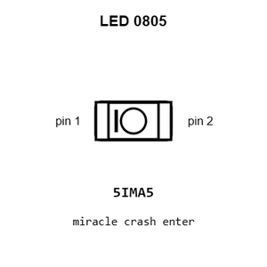
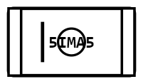
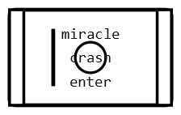
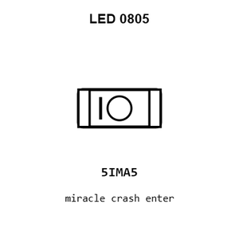
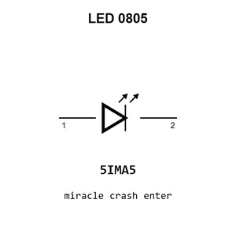

# LED  0805

`electronic_led_0805`

LED  0805 is an OOMP electronic led definition. It uses the 0805 package or form factor. Its nominal drawing size is 2.0 &#x00D7; 1.25 mm.

## At a glance

| Detail | Value |
| --- | --- |
| OOMP ID | `electronic_led_0805` |
| Type | Led |
| Package / style | 0805 |
| Nominal size | 2.0 &#x00D7; 1.25 mm |

## Classification

| Level | Value |
| --- | --- |
| 1 | `electronic` |
| 2 | `led` |
| 3 | `0805` |

## Nominal dimensions

| Measurement | Value |
| --- | ---: |
| Length | 2.0 mm |
| Width | 1.25 mm |

## Used in projects

| Project | Quantity | References | Explore |
| --- | ---: | --- | --- |
| [Project adafruit/Adafruit-16-Channel-PWM-Servo-Driver-PCB Adafruit PCA9685 current](https://github.com/adafruit/Adafruit-16-Channel-PWM-Servo-Driver-PCB/blob/master/Adafruit%20PCA9685.brd) | 1 | LED1 | [Board explorer](https://oomlout.github.io/oomp_electronic_version_5/parts/oomp_project_github_adafruit_adafruit_16_channel_pwm_servo_driver_pcb_adafruit_pca9685_current/board_explorer.html) · [OOMP project](https://github.com/oomlout/oomp_electronic_version_5/tree/main/parts/oomp_project_github_adafruit_adafruit_16_channel_pwm_servo_driver_pcb_adafruit_pca9685_current) |
| [Project adafruit/Adafruit-bq25185-Charger-Breakout-PCB Adafruit bq25185 Breakout1 current](https://github.com/adafruit/Adafruit-bq25185-Charger-Breakout-PCB/blob/main/Adafruit%20bq25185%20Breakout%20rev%20B1.brd) | 1 | CHG0 | [Board explorer](https://oomlout.github.io/oomp_electronic_version_5/parts/oomp_project_github_adafruit_adafruit_bq25185_charger_breakout_pcb_adafruit_bq25185_breakout1_current/board_explorer.html) · [OOMP project](https://github.com/oomlout/oomp_electronic_version_5/tree/main/parts/oomp_project_github_adafruit_adafruit_bq25185_charger_breakout_pcb_adafruit_bq25185_breakout1_current) |
| [Project adafruit/Adafruit-bq25185-Charger-Breakout-PCB Adafruit bq25185 Breakout current](https://github.com/adafruit/Adafruit-bq25185-Charger-Breakout-PCB/blob/main/Adafruit%20bq25185%20Breakout.brd) | 1 | CHG0 | [Board explorer](https://oomlout.github.io/oomp_electronic_version_5/parts/oomp_project_github_adafruit_adafruit_bq25185_charger_breakout_pcb_adafruit_bq25185_breakout_current/board_explorer.html) · [OOMP project](https://github.com/oomlout/oomp_electronic_version_5/tree/main/parts/oomp_project_github_adafruit_adafruit_bq25185_charger_breakout_pcb_adafruit_bq25185_breakout_current) |
| [Project adafruit/Adafruit-Feather-32u4-Basic-Proto-PCB Adafruit Feather 32u4 Basic current](https://github.com/adafruit/Adafruit-Feather-32u4-Basic-Proto-PCB/blob/master/Adafruit%20Feather%2032u4%20Basic%20rev%20B.brd) | 1 | CHG0 | [Board explorer](https://oomlout.github.io/oomp_electronic_version_5/parts/oomp_project_github_adafruit_adafruit_feather_32u4_basic_proto_pcb_adafruit_feather_32u4_basic_current/board_explorer.html) · [OOMP project](https://github.com/oomlout/oomp_electronic_version_5/tree/main/parts/oomp_project_github_adafruit_adafruit_feather_32u4_basic_proto_pcb_adafruit_feather_32u4_basic_current) |
| [Project adafruit/Adafruit-Feather-32u4-RFM-LoRa-PCB Adafruit Feather 32u4 RFMxx current](https://github.com/adafruit/Adafruit-Feather-32u4-RFM-LoRa-PCB/blob/master/Adafruit%20Feather%2032u4%20RFMxx.brd) | 1 | CHG0 | [Board explorer](https://oomlout.github.io/oomp_electronic_version_5/parts/oomp_project_github_adafruit_adafruit_feather_32u4_rfm_lo_ra_pcb_adafruit_feather_32u4_rfmxx_current/board_explorer.html) · [OOMP project](https://github.com/oomlout/oomp_electronic_version_5/tree/main/parts/oomp_project_github_adafruit_adafruit_feather_32u4_rfm_lo_ra_pcb_adafruit_feather_32u4_rfmxx_current) |
| [Project adafruit/Adafruit-Feather-ESP8266-HUZZAH-PCB Adafruit ESP8266 Feather current](https://github.com/adafruit/Adafruit-Feather-ESP8266-HUZZAH-PCB/blob/master/Adafruit%20ESP8266%20Feather.brd) | 1 | CHG0 | [Board explorer](https://oomlout.github.io/oomp_electronic_version_5/parts/oomp_project_github_adafruit_adafruit_feather_esp8266_huzzah_pcb_adafruit_esp8266_feather_current/board_explorer.html) · [OOMP project](https://github.com/oomlout/oomp_electronic_version_5/tree/main/parts/oomp_project_github_adafruit_adafruit_feather_esp8266_huzzah_pcb_adafruit_esp8266_feather_current) |
| [Project adafruit/Adafruit-Feather-M0-Express-PCB Adafruit Feather M0 Express current](https://github.com/adafruit/Adafruit-Feather-M0-Express-PCB/blob/master/Adafruit%20Feather%20M0%20Express.brd) | 1 | CHG0 | [Board explorer](https://oomlout.github.io/oomp_electronic_version_5/parts/oomp_project_github_adafruit_adafruit_feather_m0_express_pcb_adafruit_feather_m0_express_current/board_explorer.html) · [OOMP project](https://github.com/oomlout/oomp_electronic_version_5/tree/main/parts/oomp_project_github_adafruit_adafruit_feather_m0_express_pcb_adafruit_feather_m0_express_current) |
| [Project adafruit/Adafruit-Feather-M0-RFM-LoRa-PCB Adafruit Feather M0 RFMxx current](https://github.com/adafruit/Adafruit-Feather-M0-RFM-LoRa-PCB/blob/master/Adafruit%20Feather%20M0%20RFMxx.brd) | 1 | CHG0 | [Board explorer](https://oomlout.github.io/oomp_electronic_version_5/parts/oomp_project_github_adafruit_adafruit_feather_m0_rfm_lo_ra_pcb_adafruit_feather_m0_rfmxx_current/board_explorer.html) · [OOMP project](https://github.com/oomlout/oomp_electronic_version_5/tree/main/parts/oomp_project_github_adafruit_adafruit_feather_m0_rfm_lo_ra_pcb_adafruit_feather_m0_rfmxx_current) |
| [Project adafruit/Adafruit-Feather-M4-Express-PCB Adafruit Feather M4 Express current](https://github.com/adafruit/Adafruit-Feather-M4-Express-PCB/blob/master/Adafruit%20Feather%20M4%20Express.brd) | 1 | CHG0 | [Board explorer](https://oomlout.github.io/oomp_electronic_version_5/parts/oomp_project_github_adafruit_adafruit_feather_m4_express_pcb_adafruit_feather_m4_express_current/board_explorer.html) · [OOMP project](https://github.com/oomlout/oomp_electronic_version_5/tree/main/parts/oomp_project_github_adafruit_adafruit_feather_m4_express_pcb_adafruit_feather_m4_express_current) |
| [Project adafruit/Adafruit-Feather-nRF52840-Sense-PCB Adafruit Feather n RF52840 Sense current](https://github.com/adafruit/Adafruit-Feather-nRF52840-Sense-PCB/blob/master/Adafruit%20Feather%20nRF52840%20Sense.brd) | 1 | D3 | [Board explorer](https://oomlout.github.io/oomp_electronic_version_5/parts/oomp_project_github_adafruit_adafruit_feather_n_rf52840_sense_pcb_adafruit_feather_n_rf52840_sense_current/board_explorer.html) · [OOMP project](https://github.com/oomlout/oomp_electronic_version_5/tree/main/parts/oomp_project_github_adafruit_adafruit_feather_n_rf52840_sense_pcb_adafruit_feather_n_rf52840_sense_current) |
| [Project adafruit/Adafruit-Feather-STM32F405-Express-PCB Adafruit Feather STM32 F405 Express current](https://github.com/adafruit/Adafruit-Feather-STM32F405-Express-PCB/blob/master/Adafruit%20Feather%20STM32F405%20Express.brd) | 1 | CHG0 | [Board explorer](https://oomlout.github.io/oomp_electronic_version_5/parts/oomp_project_github_adafruit_adafruit_feather_stm32_f405_express_pcb_adafruit_feather_stm32_f405_express_current/board_explorer.html) · [OOMP project](https://github.com/oomlout/oomp_electronic_version_5/tree/main/parts/oomp_project_github_adafruit_adafruit_feather_stm32_f405_express_pcb_adafruit_feather_stm32_f405_express_current) |
| [Project adafruit/Adafruit-FONA-800-GSM-Breakout-PCB Adafruit FONA 800 GSM Breakout current](https://github.com/adafruit/Adafruit-FONA-800-GSM-Breakout-PCB/blob/master/Adafruit-FONA-800-GSM-Breakout.brd) | 1 | CHRG0 | [Board explorer](https://oomlout.github.io/oomp_electronic_version_5/parts/oomp_project_github_adafruit_adafruit_fona_800_gsm_breakout_pcb_adafruit_fona_800_gsm_breakout_current/board_explorer.html) · [OOMP project](https://github.com/oomlout/oomp_electronic_version_5/tree/main/parts/oomp_project_github_adafruit_adafruit_fona_800_gsm_breakout_pcb_adafruit_fona_800_gsm_breakout_current) |
| [Project adafruit/Adafruit-HUZZAH32-ESP32-Feather-PCB Adafruit HUZZAH32 ESP32 Feather current](https://github.com/adafruit/Adafruit-HUZZAH32-ESP32-Feather-PCB/blob/master/Adafruit%20HUZZAH32%20ESP32%20Feather.brd) | 1 | CHG0 | [Board explorer](https://oomlout.github.io/oomp_electronic_version_5/parts/oomp_project_github_adafruit_adafruit_huzzah32_esp32_feather_pcb_adafruit_huzzah32_esp32_feather_current/board_explorer.html) · [OOMP project](https://github.com/oomlout/oomp_electronic_version_5/tree/main/parts/oomp_project_github_adafruit_adafruit_huzzah32_esp32_feather_pcb_adafruit_huzzah32_esp32_feather_current) |
| [Project adafruit/Adafruit_MCP73833_PCB MCP73833 QFN current](https://github.com/adafruit/Adafruit_MCP73833_PCB/blob/master/MCP73833_QFN_v1.0.brd) | 1 | LED1 | [Board explorer](https://oomlout.github.io/oomp_electronic_version_5/parts/oomp_project_github_adafruit_adafruit_mcp73833_pcb_mcp73833_qfn_current/board_explorer.html) · [OOMP project](https://github.com/oomlout/oomp_electronic_version_5/tree/main/parts/oomp_project_github_adafruit_adafruit_mcp73833_pcb_mcp73833_qfn_current) |
| [Project adafruit/Adafruit-nRF52-Bluefruit-Feather-PCB Adafruit n RF52 Bluefruit Feather current](https://github.com/adafruit/Adafruit-nRF52-Bluefruit-Feather-PCB/blob/master/Adafruit%20nRF52%20Bluefruit%20Feather.brd) | 1 | CHG0 | [Board explorer](https://oomlout.github.io/oomp_electronic_version_5/parts/oomp_project_github_adafruit_adafruit_n_rf52_bluefruit_feather_pcb_adafruit_n_rf52_bluefruit_feather_current/board_explorer.html) · [OOMP project](https://github.com/oomlout/oomp_electronic_version_5/tree/main/parts/oomp_project_github_adafruit_adafruit_n_rf52_bluefruit_feather_pcb_adafruit_n_rf52_bluefruit_feather_current) |
| [Project adafruit/Adafruit-PowerBoost-1000C Adafruit Power Boost 1000 C current](https://github.com/adafruit/Adafruit-PowerBoost-1000C/blob/master/Adafruit%20PowerBoost%201000C%20Rev%20B.brd) | 1 | CHRG/LBO0 | [Board explorer](https://oomlout.github.io/oomp_electronic_version_5/parts/oomp_project_github_adafruit_adafruit_power_boost_1000_c_adafruit_power_boost_1000_c_current/board_explorer.html) · [OOMP project](https://github.com/oomlout/oomp_electronic_version_5/tree/main/parts/oomp_project_github_adafruit_adafruit_power_boost_1000_c_adafruit_power_boost_1000_c_current) |
| [Project adafruit/Adafruit-PowerBoost-500-Charger-PCB Adafruit Power Boost 500 C current](https://github.com/adafruit/Adafruit-PowerBoost-500-Charger-PCB/blob/master/Adafruit%20PowerBoost%20500C.brd) | 1 | LED3 | [Board explorer](https://oomlout.github.io/oomp_electronic_version_5/parts/oomp_project_github_adafruit_adafruit_power_boost_500_charger_pcb_adafruit_power_boost_500_c_current/board_explorer.html) · [OOMP project](https://github.com/oomlout/oomp_electronic_version_5/tree/main/parts/oomp_project_github_adafruit_adafruit_power_boost_500_charger_pcb_adafruit_power_boost_500_c_current) |
| [Project adafruit/Adafruit-PyBadge-PCB Adafruit Py Badge current](https://github.com/adafruit/Adafruit-PyBadge-PCB/blob/master/Adafruit%20PyBadge.brd) | 1 | CHG0 | [Board explorer](https://oomlout.github.io/oomp_electronic_version_5/parts/oomp_project_github_adafruit_adafruit_py_badge_pcb_adafruit_py_badge_current/board_explorer.html) · [OOMP project](https://github.com/oomlout/oomp_electronic_version_5/tree/main/parts/oomp_project_github_adafruit_adafruit_py_badge_pcb_adafruit_py_badge_current) |
| [Project adafruit/Adafruit-PyGamer-PCB Adafruit Py Gamer current](https://github.com/adafruit/Adafruit-PyGamer-PCB/blob/master/Adafruit%20PyGamer.brd) | 1 | CHG0 | [Board explorer](https://oomlout.github.io/oomp_electronic_version_5/parts/oomp_project_github_adafruit_adafruit_py_gamer_pcb_adafruit_py_gamer_current/board_explorer.html) · [OOMP project](https://github.com/oomlout/oomp_electronic_version_5/tree/main/parts/oomp_project_github_adafruit_adafruit_py_gamer_pcb_adafruit_py_gamer_current) |
| [Project adafruit/Adafruit-Standalone-Capacitive-Sensor-PCB Adafruit AT42 QT1070 Breakout current](https://github.com/adafruit/Adafruit-Standalone-Capacitive-Sensor-PCB/blob/master/Adafruit%20AT42QT1070%20Breakout.brd) | 5 | LED1, LED2, LED3, LED4, LED5 | [Board explorer](https://oomlout.github.io/oomp_electronic_version_5/parts/oomp_project_github_adafruit_adafruit_standalone_capacitive_sensor_pcb_adafruit_at42_qt1070_breakout_current/board_explorer.html) · [OOMP project](https://github.com/oomlout/oomp_electronic_version_5/tree/main/parts/oomp_project_github_adafruit_adafruit_standalone_capacitive_sensor_pcb_adafruit_at42_qt1070_breakout_current) |
| [Project adafruit/Adafruit-Teensy-3.x-Feather-Adapter-PCB Adafruit Feather Teensy3 Adapter current](https://github.com/adafruit/Adafruit-Teensy-3.x-Feather-Adapter-PCB/blob/master/Adafruit%20Feather%20Teensy3%20Adapter.brd) | 1 | CHG0 | [Board explorer](https://oomlout.github.io/oomp_electronic_version_5/parts/oomp_project_github_adafruit_adafruit_teensy_3_x_feather_adapter_pcb_adafruit_feather_teensy3_adapter_current/board_explorer.html) · [OOMP project](https://github.com/oomlout/oomp_electronic_version_5/tree/main/parts/oomp_project_github_adafruit_adafruit_teensy_3_x_feather_adapter_pcb_adafruit_feather_teensy3_adapter_current) |
| [Project adafruit/Adafruit-Teensy-3.x-Feather-Adapter-PCB Adafruit Feather Teensy3 Adapter Original current](https://github.com/adafruit/Adafruit-Teensy-3.x-Feather-Adapter-PCB/blob/master/Adafruit%20Feather%20Teensy3%20Adapter%20Original.brd) | 1 | CHG0 | [Board explorer](https://oomlout.github.io/oomp_electronic_version_5/parts/oomp_project_github_adafruit_adafruit_teensy_3_x_feather_adapter_pcb_adafruit_feather_teensy3_adapter_original_current/board_explorer.html) · [OOMP project](https://github.com/oomlout/oomp_electronic_version_5/tree/main/parts/oomp_project_github_adafruit_adafruit_teensy_3_x_feather_adapter_pcb_adafruit_feather_teensy3_adapter_original_current) |
| [Project adafruit/Adafruit-Ultimate-GPS Adafruit Ultimate GPS Flora current](https://github.com/adafruit/Adafruit-Ultimate-GPS/blob/master/Adafruit%20Ultimate%20GPS%20Flora.brd) | 1 | LED1 | [Board explorer](https://oomlout.github.io/oomp_electronic_version_5/parts/oomp_project_github_adafruit_adafruit_ultimate_gps_adafruit_ultimate_gps_flora_current/board_explorer.html) · [OOMP project](https://github.com/oomlout/oomp_electronic_version_5/tree/main/parts/oomp_project_github_adafruit_adafruit_ultimate_gps_adafruit_ultimate_gps_flora_current) |
| [Project adafruit/Adafruit_USB_Boarduino_PCB USB Boarduino 2.0 current](https://github.com/adafruit/Adafruit_USB_Boarduino_PCB/blob/master/usbboarduino20.brd) | 1 | D1 | [Board explorer](https://oomlout.github.io/oomp_electronic_version_5/parts/oomp_project_github_adafruit_adafruit_usb_boarduino_pcb_usb_boarduino_20_current/board_explorer.html) · [OOMP project](https://github.com/oomlout/oomp_electronic_version_5/tree/main/parts/oomp_project_github_adafruit_adafruit_usb_boarduino_pcb_usb_boarduino_20_current) |
| [Project adafruit/Adafruit-USB-LiIon-LiPoly-Charger-PCB Adafruit USB Li Ion Li Poly Charger current](https://github.com/adafruit/Adafruit-USB-LiIon-LiPoly-Charger-PCB/blob/master/Adafruit%20USB%20LiIon-LiPoly%20Charger.brd) | 1 | LED1 | [Board explorer](https://oomlout.github.io/oomp_electronic_version_5/parts/oomp_project_github_adafruit_adafruit_usb_li_ion_li_poly_charger_pcb_adafruit_usb_li_ion_li_poly_charger_current/board_explorer.html) · [OOMP project](https://github.com/oomlout/oomp_electronic_version_5/tree/main/parts/oomp_project_github_adafruit_adafruit_usb_li_ion_li_poly_charger_pcb_adafruit_usb_li_ion_li_poly_charger_current) |
| [Project adafruit/Adafruit-WICED-WiFi-Feather-PCB Adafruit WICED Wi Fi Feather current](https://github.com/adafruit/Adafruit-WICED-WiFi-Feather-PCB/blob/master/Adafruit%20WICED%20WiFi%20Feather.brd) | 1 | CHG0 | [Board explorer](https://oomlout.github.io/oomp_electronic_version_5/parts/oomp_project_github_adafruit_adafruit_wiced_wi_fi_feather_pcb_adafruit_wiced_wi_fi_feather_current/board_explorer.html) · [OOMP project](https://github.com/oomlout/oomp_electronic_version_5/tree/main/parts/oomp_project_github_adafruit_adafruit_wiced_wi_fi_feather_pcb_adafruit_wiced_wi_fi_feather_current) |
| [Project adafruit/PicoDVI picodvi current](https://github.com/adafruit/PicoDVI/blob/master/hardware/mini_board/picodvi.kicad_pcb) | 1 | D1 | [Board explorer](https://oomlout.github.io/oomp_electronic_version_5/parts/oomp_project_github_adafruit_pico_dvi_mini_board_picodvi_current/board_explorer.html) · [OOMP project](https://github.com/oomlout/oomp_electronic_version_5/tree/main/parts/oomp_project_github_adafruit_pico_dvi_mini_board_picodvi_current) |
| [Project adafruit/USB-DC-Solar-Lithium-Ion-Polymer-charger MCP73871 Solar Charger v4 current](https://github.com/adafruit/USB-DC-Solar-Lithium-Ion-Polymer-charger/blob/master/Adafruit%20MCP73871%20Solar%20Charger%20v4.brd) | 1 | CHRG/LBO0 | [Board explorer](https://oomlout.github.io/oomp_electronic_version_5/parts/oomp_project_github_adafruit_usb_dc_solar_lithium_ion_polymer_charger_mcp73871_solar_charger_v4_current/board_explorer.html) · [OOMP project](https://github.com/oomlout/oomp_electronic_version_5/tree/main/parts/oomp_project_github_adafruit_usb_dc_solar_lithium_ion_polymer_charger_mcp73871_solar_charger_v4_current) |
| [Project adafruit/USB-DC-Solar-Lithium-Ion-Polymer-charger MCP73871 Solar current](https://github.com/adafruit/USB-DC-Solar-Lithium-Ion-Polymer-charger/blob/master/MCP73871_Solar.brd) | 1 | CHRG/LBO0 | [Board explorer](https://oomlout.github.io/oomp_electronic_version_5/parts/oomp_project_github_adafruit_usb_dc_solar_lithium_ion_polymer_charger_mcp73871_solar_current/board_explorer.html) · [OOMP project](https://github.com/oomlout/oomp_electronic_version_5/tree/main/parts/oomp_project_github_adafruit_usb_dc_solar_lithium_ion_polymer_charger_mcp73871_solar_current) |

## Files

[KiCad symbol, machine-solder and hand-solder footprints](data/kicad/README.md) · [Availability and source masters](data/kicad/manifest.yaml)

[View this part on GitHub](https://github.com/oomlout/oomp_electronic_version_5/tree/main/parts/electronic_led_0805)

[Browse this category](../../navigation/electronic/led/README.md)

---

This page is generated from the OOMP part definition by a Roboclick Jinja template. Edit the source taxonomy or template rather than this generated file.