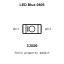
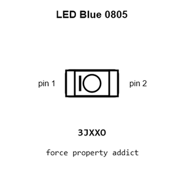
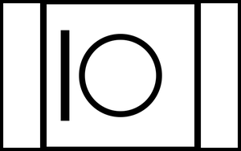
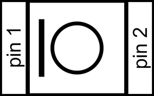
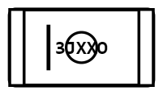
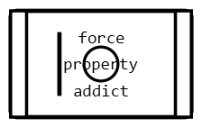
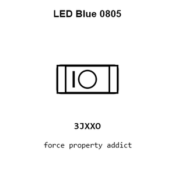
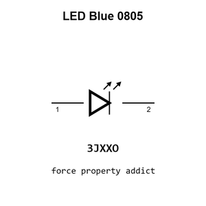
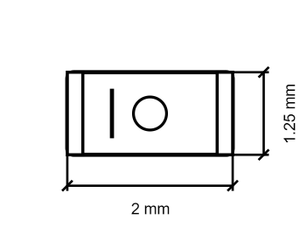

# LED Blue 0805

`electronic_led_0805_blue`

LED Blue 0805 is an OOMP electronic led definition. It uses the 0805 package or form factor. Its nominal drawing size is 2.0 &#x00D7; 1.25 mm.

## At a glance

| Detail | Value |
| --- | --- |
| OOMP ID | `electronic_led_0805_blue` |
| Type | Led |
| Package / style | 0805 |
| Nominal size | 2.0 &#x00D7; 1.25 mm |

## Classification

| Level | Value |
| --- | --- |
| 1 | `electronic` |
| 2 | `led` |
| 3 | `0805` |
| 4 | `blue` |

## Nominal dimensions

| Measurement | Value |
| --- | ---: |
| Length | 2.0 mm |
| Width | 1.25 mm |

## Used in projects

| Project | Quantity | References | Explore |
| --- | ---: | --- | --- |
| [Project adafruit/Adafruit-5-HDMI-Backpack-PCB Adafruit 5in HDMI Backpack current](https://github.com/adafruit/Adafruit-5-HDMI-Backpack-PCB/blob/master/Adafruit%205in%20HDMI%20Backpack.brd) | 1 | LED3 | [Board explorer](https://oomlout.github.io/oomp_electronic_version_5/parts/oomp_project_github_adafruit_adafruit_5_hdmi_backpack_pcb_adafruit_5in_hdmi_backpack_current/board_explorer.html) · [OOMP project](https://github.com/oomlout/oomp_electronic_version_5/tree/main/parts/oomp_project_github_adafruit_adafruit_5_hdmi_backpack_pcb_adafruit_5in_hdmi_backpack_current) |
| [Project adafruit/Adafruit-Bluefruit-LE-USB-Friend-and-Sniffer-PCB Adafrruit Bluefruit LE USB Friend CP2102 N current](https://github.com/adafruit/Adafruit-Bluefruit-LE-USB-Friend-and-Sniffer-PCB/blob/master/Adafrruit%20Bluefruit%20LE%20USB%20Friend%20CP2102N.brd) | 1 | LED4 | [Board explorer](https://oomlout.github.io/oomp_electronic_version_5/parts/oomp_project_github_adafruit_adafruit_bluefruit_le_usb_friend_and_sniffer_pcb_adafrruit_bluefruit_le_usb_friend_cp2102_n_current/board_explorer.html) · [OOMP project](https://github.com/oomlout/oomp_electronic_version_5/tree/main/parts/oomp_project_github_adafruit_adafruit_bluefruit_le_usb_friend_and_sniffer_pcb_adafrruit_bluefruit_le_usb_friend_cp2102_n_current) |
| [Project adafruit/Adafruit-Bluefruit-LE-USB-Friend-and-Sniffer-PCB Adafruit Bluefruit LE USB Friend current](https://github.com/adafruit/Adafruit-Bluefruit-LE-USB-Friend-and-Sniffer-PCB/blob/master/Adafruit%20Bluefruit%20LE%20USB%20Friend.brd) | 1 | LED4 | [Board explorer](https://oomlout.github.io/oomp_electronic_version_5/parts/oomp_project_github_adafruit_adafruit_bluefruit_le_usb_friend_and_sniffer_pcb_adafruit_bluefruit_le_usb_friend_current/board_explorer.html) · [OOMP project](https://github.com/oomlout/oomp_electronic_version_5/tree/main/parts/oomp_project_github_adafruit_adafruit_bluefruit_le_usb_friend_and_sniffer_pcb_adafruit_bluefruit_le_usb_friend_current) |
| [Project adafruit/Adafruit-FONA-800-GSM-Breakout-PCB Adafruit FONA 800 GSM Breakout current](https://github.com/adafruit/Adafruit-FONA-800-GSM-Breakout-PCB/blob/master/Adafruit-FONA-800-GSM-Breakout.brd) | 1 | NETSTAT0 | [Board explorer](https://oomlout.github.io/oomp_electronic_version_5/parts/oomp_project_github_adafruit_adafruit_fona_800_gsm_breakout_pcb_adafruit_fona_800_gsm_breakout_current/board_explorer.html) · [OOMP project](https://github.com/oomlout/oomp_electronic_version_5/tree/main/parts/oomp_project_github_adafruit_adafruit_fona_800_gsm_breakout_pcb_adafruit_fona_800_gsm_breakout_current) |
| [Project adafruit/Adafruit-nRF52-Bluefruit-Feather-PCB Adafruit n RF52 Bluefruit Feather current](https://github.com/adafruit/Adafruit-nRF52-Bluefruit-Feather-PCB/blob/master/Adafruit%20nRF52%20Bluefruit%20Feather.brd) | 1 | D2 | [Board explorer](https://oomlout.github.io/oomp_electronic_version_5/parts/oomp_project_github_adafruit_adafruit_n_rf52_bluefruit_feather_pcb_adafruit_n_rf52_bluefruit_feather_current/board_explorer.html) · [OOMP project](https://github.com/oomlout/oomp_electronic_version_5/tree/main/parts/oomp_project_github_adafruit_adafruit_n_rf52_bluefruit_feather_pcb_adafruit_n_rf52_bluefruit_feather_current) |

## Files

[KiCad symbol, machine-solder and hand-solder footprints](data/kicad/README.md) · [Availability and source masters](data/kicad/manifest.yaml)

[View this part on GitHub](https://github.com/oomlout/oomp_electronic_version_5/tree/main/parts/electronic_led_0805_blue)

[Browse this category](../../navigation/electronic/led/0805/README.md)

---

This page is generated from the OOMP part definition by a Roboclick Jinja template. Edit the source taxonomy or template rather than this generated file.