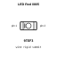
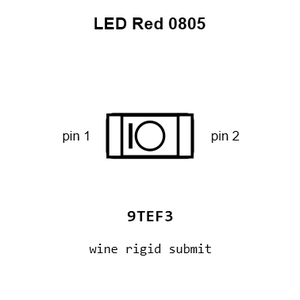
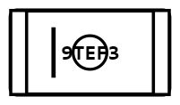
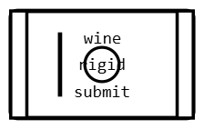
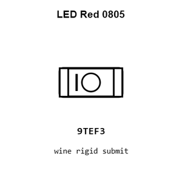
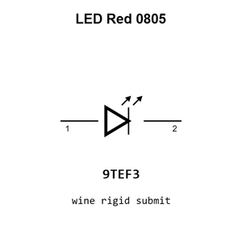
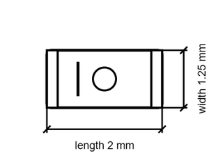

# LED Red 0805

`electronic_led_0805_red`

LED Red 0805 is an OOMP electronic led definition. It uses the 0805 package or form factor. Its nominal drawing size is 2.0 &#x00D7; 1.25 mm.

## At a glance

| Detail | Value |
| --- | --- |
| OOMP ID | `electronic_led_0805_red` |
| Type | Led |
| Package / style | 0805 |
| Nominal size | 2.0 &#x00D7; 1.25 mm |

## Classification

| Level | Value |
| --- | --- |
| 1 | `electronic` |
| 2 | `led` |
| 3 | `0805` |
| 4 | `red` |

## Nominal dimensions

| Measurement | Value |
| --- | ---: |
| Length | 2.0 mm |
| Width | 1.25 mm |

## Used in projects

| Project | Quantity | References | Explore |
| --- | ---: | --- | --- |
| [Project adafruit/Adafruit-16-channel-PWM-Servo-Shield Adafruit PWM Servo Shield current](https://github.com/adafruit/Adafruit-16-channel-PWM-Servo-Shield/blob/master/Adafruit%20PWM%20Servo%20Shield.brd) | 1 | LED1 | [Board explorer](https://oomlout.github.io/oomp_electronic_version_5/parts/oomp_project_github_adafruit_adafruit_16_channel_pwm_servo_shield_adafruit_pwm_servo_shield_current/board_explorer.html) · [OOMP project](https://github.com/oomlout/oomp_electronic_version_5/tree/main/parts/oomp_project_github_adafruit_adafruit_16_channel_pwm_servo_shield_adafruit_pwm_servo_shield_current) |
| [Project adafruit/Adafruit-50pin-to-40pin-TFT-with-AR1100-Adapter-PCB Adafruit 50pin to 40pin TFT with AR1100 Adapter current](https://github.com/adafruit/Adafruit-50pin-to-40pin-TFT-with-AR1100-Adapter-PCB/blob/master/Adafruit%2050pin%20to%2040pin%20TFT%20with%20AR1100%20Adapter.brd) | 1 | LED2 | [Board explorer](https://oomlout.github.io/oomp_electronic_version_5/parts/oomp_project_github_adafruit_adafruit_50pin_to_40pin_tft_with_ar1100_adapter_pcb_adafruit_50pin_to_40pin_tft_with_ar1100_adapter_current/board_explorer.html) · [OOMP project](https://github.com/oomlout/oomp_electronic_version_5/tree/main/parts/oomp_project_github_adafruit_adafruit_50pin_to_40pin_tft_with_ar1100_adapter_pcb_adafruit_50pin_to_40pin_tft_with_ar1100_adapter_current) |
| [Project adafruit/Adafruit-5-HDMI-Backpack-PCB Adafruit 5in HDMI Backpack current](https://github.com/adafruit/Adafruit-5-HDMI-Backpack-PCB/blob/master/Adafruit%205in%20HDMI%20Backpack.brd) | 1 | LED1 | [Board explorer](https://oomlout.github.io/oomp_electronic_version_5/parts/oomp_project_github_adafruit_adafruit_5_hdmi_backpack_pcb_adafruit_5in_hdmi_backpack_current/board_explorer.html) · [OOMP project](https://github.com/oomlout/oomp_electronic_version_5/tree/main/parts/oomp_project_github_adafruit_adafruit_5_hdmi_backpack_pcb_adafruit_5in_hdmi_backpack_current) |
| [Project adafruit/Adafruit_Atmega32u4_Breakout_Board ATmega32u4 Breakout current](https://github.com/adafruit/Adafruit_Atmega32u4_Breakout_Board/blob/master/atmega32u4bb.brd) | 1 | L0 | [Board explorer](https://oomlout.github.io/oomp_electronic_version_5/parts/oomp_project_github_adafruit_adafruit_atmega32u4_breakout_board_atmega32u4_breakout_current/board_explorer.html) · [OOMP project](https://github.com/oomlout/oomp_electronic_version_5/tree/main/parts/oomp_project_github_adafruit_adafruit_atmega32u4_breakout_board_atmega32u4_breakout_current) |
| [Project adafruit/Adafruit-Bluefruit-LE-USB-Friend-and-Sniffer-PCB Adafrruit Bluefruit LE USB Friend CP2102 N current](https://github.com/adafruit/Adafruit-Bluefruit-LE-USB-Friend-and-Sniffer-PCB/blob/master/Adafrruit%20Bluefruit%20LE%20USB%20Friend%20CP2102N.brd) | 1 | LED3 | [Board explorer](https://oomlout.github.io/oomp_electronic_version_5/parts/oomp_project_github_adafruit_adafruit_bluefruit_le_usb_friend_and_sniffer_pcb_adafrruit_bluefruit_le_usb_friend_cp2102_n_current/board_explorer.html) · [OOMP project](https://github.com/oomlout/oomp_electronic_version_5/tree/main/parts/oomp_project_github_adafruit_adafruit_bluefruit_le_usb_friend_and_sniffer_pcb_adafrruit_bluefruit_le_usb_friend_cp2102_n_current) |
| [Project adafruit/Adafruit-Bluefruit-LE-USB-Friend-and-Sniffer-PCB Adafruit Bluefruit LE USB Friend current](https://github.com/adafruit/Adafruit-Bluefruit-LE-USB-Friend-and-Sniffer-PCB/blob/master/Adafruit%20Bluefruit%20LE%20USB%20Friend.brd) | 1 | LED3 | [Board explorer](https://oomlout.github.io/oomp_electronic_version_5/parts/oomp_project_github_adafruit_adafruit_bluefruit_le_usb_friend_and_sniffer_pcb_adafruit_bluefruit_le_usb_friend_current/board_explorer.html) · [OOMP project](https://github.com/oomlout/oomp_electronic_version_5/tree/main/parts/oomp_project_github_adafruit_adafruit_bluefruit_le_usb_friend_and_sniffer_pcb_adafruit_bluefruit_le_usb_friend_current) |
| [Project adafruit/Adafruit-bq25185-Charger-Breakout-PCB Adafruit bq25185 Breakout1 current](https://github.com/adafruit/Adafruit-bq25185-Charger-Breakout-PCB/blob/main/Adafruit%20bq25185%20Breakout%20rev%20B1.brd) | 1 | FAULT0 | [Board explorer](https://oomlout.github.io/oomp_electronic_version_5/parts/oomp_project_github_adafruit_adafruit_bq25185_charger_breakout_pcb_adafruit_bq25185_breakout1_current/board_explorer.html) · [OOMP project](https://github.com/oomlout/oomp_electronic_version_5/tree/main/parts/oomp_project_github_adafruit_adafruit_bq25185_charger_breakout_pcb_adafruit_bq25185_breakout1_current) |
| [Project adafruit/Adafruit-bq25185-Charger-Breakout-PCB Adafruit bq25185 Breakout current](https://github.com/adafruit/Adafruit-bq25185-Charger-Breakout-PCB/blob/main/Adafruit%20bq25185%20Breakout.brd) | 1 | FAULT0 | [Board explorer](https://oomlout.github.io/oomp_electronic_version_5/parts/oomp_project_github_adafruit_adafruit_bq25185_charger_breakout_pcb_adafruit_bq25185_breakout_current/board_explorer.html) · [OOMP project](https://github.com/oomlout/oomp_electronic_version_5/tree/main/parts/oomp_project_github_adafruit_adafruit_bq25185_charger_breakout_pcb_adafruit_bq25185_breakout_current) |
| [Project adafruit/Adafruit-Circuit-Playground-Express-PCB Adafruit Circuit Playground Express current](https://github.com/adafruit/Adafruit-Circuit-Playground-Express-PCB/blob/master/Adafruit%20Circuit%20Playground%20Express.brd) | 1 | L0 | [Board explorer](https://oomlout.github.io/oomp_electronic_version_5/parts/oomp_project_github_adafruit_adafruit_circuit_playground_express_pcb_adafruit_circuit_playground_express_current/board_explorer.html) · [OOMP project](https://github.com/oomlout/oomp_electronic_version_5/tree/main/parts/oomp_project_github_adafruit_adafruit_circuit_playground_express_pcb_adafruit_circuit_playground_express_current) |
| [Project adafruit/Adafruit-ESP32-HUZZAH-Breakout-PCB Adafruit ESP32 Huzzah Breakout current](https://github.com/adafruit/Adafruit-ESP32-HUZZAH-Breakout-PCB/blob/master/Adafruit%20ESP32%20Huzzah%20Breakout.brd) | 1 | D3 | [Board explorer](https://oomlout.github.io/oomp_electronic_version_5/parts/oomp_project_github_adafruit_adafruit_esp32_huzzah_breakout_pcb_adafruit_esp32_huzzah_breakout_current/board_explorer.html) · [OOMP project](https://github.com/oomlout/oomp_electronic_version_5/tree/main/parts/oomp_project_github_adafruit_adafruit_esp32_huzzah_breakout_pcb_adafruit_esp32_huzzah_breakout_current) |
| [Project adafruit/Adafruit-Feather-32u4-Basic-Proto-PCB Adafruit Feather 32u4 Basic current](https://github.com/adafruit/Adafruit-Feather-32u4-Basic-Proto-PCB/blob/master/Adafruit%20Feather%2032u4%20Basic%20rev%20B.brd) | 1 | L0 | [Board explorer](https://oomlout.github.io/oomp_electronic_version_5/parts/oomp_project_github_adafruit_adafruit_feather_32u4_basic_proto_pcb_adafruit_feather_32u4_basic_current/board_explorer.html) · [OOMP project](https://github.com/oomlout/oomp_electronic_version_5/tree/main/parts/oomp_project_github_adafruit_adafruit_feather_32u4_basic_proto_pcb_adafruit_feather_32u4_basic_current) |
| [Project adafruit/Adafruit-Feather-32u4-RFM-LoRa-PCB Adafruit Feather 32u4 RFMxx current](https://github.com/adafruit/Adafruit-Feather-32u4-RFM-LoRa-PCB/blob/master/Adafruit%20Feather%2032u4%20RFMxx.brd) | 1 | L0 | [Board explorer](https://oomlout.github.io/oomp_electronic_version_5/parts/oomp_project_github_adafruit_adafruit_feather_32u4_rfm_lo_ra_pcb_adafruit_feather_32u4_rfmxx_current/board_explorer.html) · [OOMP project](https://github.com/oomlout/oomp_electronic_version_5/tree/main/parts/oomp_project_github_adafruit_adafruit_feather_32u4_rfm_lo_ra_pcb_adafruit_feather_32u4_rfmxx_current) |
| [Project adafruit/Adafruit-Feather-ESP8266-HUZZAH-PCB Adafruit ESP8266 Feather current](https://github.com/adafruit/Adafruit-Feather-ESP8266-HUZZAH-PCB/blob/master/Adafruit%20ESP8266%20Feather.brd) | 1 | D3 | [Board explorer](https://oomlout.github.io/oomp_electronic_version_5/parts/oomp_project_github_adafruit_adafruit_feather_esp8266_huzzah_pcb_adafruit_esp8266_feather_current/board_explorer.html) · [OOMP project](https://github.com/oomlout/oomp_electronic_version_5/tree/main/parts/oomp_project_github_adafruit_adafruit_feather_esp8266_huzzah_pcb_adafruit_esp8266_feather_current) |
| [Project adafruit/Adafruit-Feather-M0-Express-PCB Adafruit Feather M0 Express current](https://github.com/adafruit/Adafruit-Feather-M0-Express-PCB/blob/master/Adafruit%20Feather%20M0%20Express.brd) | 1 | L0 | [Board explorer](https://oomlout.github.io/oomp_electronic_version_5/parts/oomp_project_github_adafruit_adafruit_feather_m0_express_pcb_adafruit_feather_m0_express_current/board_explorer.html) · [OOMP project](https://github.com/oomlout/oomp_electronic_version_5/tree/main/parts/oomp_project_github_adafruit_adafruit_feather_m0_express_pcb_adafruit_feather_m0_express_current) |
| [Project adafruit/Adafruit-Feather-M0-RFM-LoRa-PCB Adafruit Feather M0 RFMxx current](https://github.com/adafruit/Adafruit-Feather-M0-RFM-LoRa-PCB/blob/master/Adafruit%20Feather%20M0%20RFMxx.brd) | 1 | L0 | [Board explorer](https://oomlout.github.io/oomp_electronic_version_5/parts/oomp_project_github_adafruit_adafruit_feather_m0_rfm_lo_ra_pcb_adafruit_feather_m0_rfmxx_current/board_explorer.html) · [OOMP project](https://github.com/oomlout/oomp_electronic_version_5/tree/main/parts/oomp_project_github_adafruit_adafruit_feather_m0_rfm_lo_ra_pcb_adafruit_feather_m0_rfmxx_current) |
| [Project adafruit/Adafruit-Feather-M4-Express-PCB Adafruit Feather M4 Express current](https://github.com/adafruit/Adafruit-Feather-M4-Express-PCB/blob/master/Adafruit%20Feather%20M4%20Express.brd) | 1 | L0 | [Board explorer](https://oomlout.github.io/oomp_electronic_version_5/parts/oomp_project_github_adafruit_adafruit_feather_m4_express_pcb_adafruit_feather_m4_express_current/board_explorer.html) · [OOMP project](https://github.com/oomlout/oomp_electronic_version_5/tree/main/parts/oomp_project_github_adafruit_adafruit_feather_m4_express_pcb_adafruit_feather_m4_express_current) |
| [Project adafruit/Adafruit-Feather-nRF52840-Sense-PCB Adafruit Feather n RF52840 Sense current](https://github.com/adafruit/Adafruit-Feather-nRF52840-Sense-PCB/blob/master/Adafruit%20Feather%20nRF52840%20Sense.brd) | 1 | D2 | [Board explorer](https://oomlout.github.io/oomp_electronic_version_5/parts/oomp_project_github_adafruit_adafruit_feather_n_rf52840_sense_pcb_adafruit_feather_n_rf52840_sense_current/board_explorer.html) · [OOMP project](https://github.com/oomlout/oomp_electronic_version_5/tree/main/parts/oomp_project_github_adafruit_adafruit_feather_n_rf52840_sense_pcb_adafruit_feather_n_rf52840_sense_current) |
| [Project adafruit/Adafruit-Feather-STM32F405-Express-PCB Adafruit Feather STM32 F405 Express current](https://github.com/adafruit/Adafruit-Feather-STM32F405-Express-PCB/blob/master/Adafruit%20Feather%20STM32F405%20Express.brd) | 1 | L0 | [Board explorer](https://oomlout.github.io/oomp_electronic_version_5/parts/oomp_project_github_adafruit_adafruit_feather_stm32_f405_express_pcb_adafruit_feather_stm32_f405_express_current/board_explorer.html) · [OOMP project](https://github.com/oomlout/oomp_electronic_version_5/tree/main/parts/oomp_project_github_adafruit_adafruit_feather_stm32_f405_express_pcb_adafruit_feather_stm32_f405_express_current) |
| [Project adafruit/Adafruit-FT232H-Breakout-PCB Adafruit FT232 H current](https://github.com/adafruit/Adafruit-FT232H-Breakout-PCB/blob/master/Adafruit%20FT232H.brd) | 1 | LED2 | [Board explorer](https://oomlout.github.io/oomp_electronic_version_5/parts/oomp_project_github_adafruit_adafruit_ft232_h_breakout_pcb_adafruit_ft232_h_current/board_explorer.html) · [OOMP project](https://github.com/oomlout/oomp_electronic_version_5/tree/main/parts/oomp_project_github_adafruit_adafruit_ft232_h_breakout_pcb_adafruit_ft232_h_current) |
| [Project adafruit/Adafruit-FT232H-Breakout-PCB Adafruit FT232 H Original current](https://github.com/adafruit/Adafruit-FT232H-Breakout-PCB/blob/master/Adafruit%20FT232H%20Original.brd) | 1 | LED2 | [Board explorer](https://oomlout.github.io/oomp_electronic_version_5/parts/oomp_project_github_adafruit_adafruit_ft232_h_breakout_pcb_adafruit_ft232_h_original_current/board_explorer.html) · [OOMP project](https://github.com/oomlout/oomp_electronic_version_5/tree/main/parts/oomp_project_github_adafruit_adafruit_ft232_h_breakout_pcb_adafruit_ft232_h_original_current) |
| [Project adafruit/Adafruit_FTDI-Friend-PCB FTDI Friend Rev A current](https://github.com/adafruit/Adafruit_FTDI-Friend-PCB/blob/master/Adafruit%20FTDI%20Friend%20Rev%20A.brd) | 1 | TX0 | [Board explorer](https://oomlout.github.io/oomp_electronic_version_5/parts/oomp_project_github_adafruit_adafruit_ftdi_friend_pcb_ftdi_friend_rev_a_current/board_explorer.html) · [OOMP project](https://github.com/oomlout/oomp_electronic_version_5/tree/main/parts/oomp_project_github_adafruit_adafruit_ftdi_friend_pcb_ftdi_friend_rev_a_current) |
| [Project adafruit/Adafruit_FTDI-Friend-PCB FTDI Friend Rev A rev_a](https://github.com/adafruit/Adafruit_FTDI-Friend-PCB/blob/master/Adafruit%20FTDI%20Friend%20Rev%20A.brd) | 1 | TX0 | [Board explorer](https://oomlout.github.io/oomp_electronic_version_5/parts/oomp_project_github_adafruit_adafruit_ftdi_friend_pcb_ftdi_friend_rev_a_rev_a/board_explorer.html) · [OOMP project](https://github.com/oomlout/oomp_electronic_version_5/tree/main/parts/oomp_project_github_adafruit_adafruit_ftdi_friend_pcb_ftdi_friend_rev_a_rev_a) |
| [Project adafruit/Adafruit-Gemma-PCB Adafruit Gemma current](https://github.com/adafruit/Adafruit-Gemma-PCB/blob/master/Adafruit%20Gemma.brd) | 1 | BOOT0 | [Board explorer](https://oomlout.github.io/oomp_electronic_version_5/parts/oomp_project_github_adafruit_adafruit_gemma_pcb_adafruit_gemma_current/board_explorer.html) · [OOMP project](https://github.com/oomlout/oomp_electronic_version_5/tree/main/parts/oomp_project_github_adafruit_adafruit_gemma_pcb_adafruit_gemma_current) |
| [Project adafruit/Adafruit-Grand-Central-PCB Adafruit Grand Central M4 Express current](https://github.com/adafruit/Adafruit-Grand-Central-PCB/blob/master/Adafruit%20Grand%20Central%20M4%20Express%20rev%20B.brd) | 1 | L0 | [Board explorer](https://oomlout.github.io/oomp_electronic_version_5/parts/oomp_project_github_adafruit_adafruit_grand_central_pcb_adafruit_grand_central_m4_express_current/board_explorer.html) · [OOMP project](https://github.com/oomlout/oomp_electronic_version_5/tree/main/parts/oomp_project_github_adafruit_adafruit_grand_central_pcb_adafruit_grand_central_m4_express_current) |
| [Project adafruit/Adafruit-HUZZAH32-ESP32-Feather-PCB Adafruit HUZZAH32 ESP32 Feather current](https://github.com/adafruit/Adafruit-HUZZAH32-ESP32-Feather-PCB/blob/master/Adafruit%20HUZZAH32%20ESP32%20Feather.brd) | 1 | D3 | [Board explorer](https://oomlout.github.io/oomp_electronic_version_5/parts/oomp_project_github_adafruit_adafruit_huzzah32_esp32_feather_pcb_adafruit_huzzah32_esp32_feather_current/board_explorer.html) · [OOMP project](https://github.com/oomlout/oomp_electronic_version_5/tree/main/parts/oomp_project_github_adafruit_adafruit_huzzah32_esp32_feather_pcb_adafruit_huzzah32_esp32_feather_current) |
| [Project adafruit/Adafruit-ItsyBitsy-32u4-PCB Itsy Bitsy 32u4 3 V current](https://github.com/adafruit/Adafruit-ItsyBitsy-32u4-PCB/blob/master/Itsy%20Bitsy%2032u4%203V.brd) | 1 | L0 | [Board explorer](https://oomlout.github.io/oomp_electronic_version_5/parts/oomp_project_github_adafruit_adafruit_itsy_bitsy_32u4_pcb_itsy_bitsy_32u4_3_v_current/board_explorer.html) · [OOMP project](https://github.com/oomlout/oomp_electronic_version_5/tree/main/parts/oomp_project_github_adafruit_adafruit_itsy_bitsy_32u4_pcb_itsy_bitsy_32u4_3_v_current) |
| [Project adafruit/Adafruit-ItsyBitsy-32u4-PCB Itsy Bitsy 32u4 5 V current](https://github.com/adafruit/Adafruit-ItsyBitsy-32u4-PCB/blob/master/Itsy%20Bitsy%2032u4%205V.brd) | 1 | L0 | [Board explorer](https://oomlout.github.io/oomp_electronic_version_5/parts/oomp_project_github_adafruit_adafruit_itsy_bitsy_32u4_pcb_itsy_bitsy_32u4_5_v_current/board_explorer.html) · [OOMP project](https://github.com/oomlout/oomp_electronic_version_5/tree/main/parts/oomp_project_github_adafruit_adafruit_itsy_bitsy_32u4_pcb_itsy_bitsy_32u4_5_v_current) |
| [Project adafruit/Adafruit-ItsyBitsy-nRF52840-Express-PCB Adafruit Itsy Bitsy n RF52840 Express current](https://github.com/adafruit/Adafruit-ItsyBitsy-nRF52840-Express-PCB/blob/master/Adafruit%20ItsyBitsy%20nRF52840%20Express.brd) | 1 | D2 | [Board explorer](https://oomlout.github.io/oomp_electronic_version_5/parts/oomp_project_github_adafruit_adafruit_itsy_bitsy_n_rf52840_express_pcb_adafruit_itsy_bitsy_n_rf52840_express_current/board_explorer.html) · [OOMP project](https://github.com/oomlout/oomp_electronic_version_5/tree/main/parts/oomp_project_github_adafruit_adafruit_itsy_bitsy_n_rf52840_express_pcb_adafruit_itsy_bitsy_n_rf52840_express_current) |
| [Project adafruit/Adafruit_MCP73833_PCB MCP73833 QFN current](https://github.com/adafruit/Adafruit_MCP73833_PCB/blob/master/MCP73833_QFN_v1.0.brd) | 1 | LED3 | [Board explorer](https://oomlout.github.io/oomp_electronic_version_5/parts/oomp_project_github_adafruit_adafruit_mcp73833_pcb_mcp73833_qfn_current/board_explorer.html) · [OOMP project](https://github.com/oomlout/oomp_electronic_version_5/tree/main/parts/oomp_project_github_adafruit_adafruit_mcp73833_pcb_mcp73833_qfn_current) |
| [Project adafruit/Adafruit-METRO-328-PCB Metro Mini current](https://github.com/adafruit/Adafruit-METRO-328-PCB/blob/master/Metro%20Mini%20Rev%20B.brd) | 1 | L0 | [Board explorer](https://oomlout.github.io/oomp_electronic_version_5/parts/oomp_project_github_adafruit_adafruit_metro_328_pcb_metro_mini_current/board_explorer.html) · [OOMP project](https://github.com/oomlout/oomp_electronic_version_5/tree/main/parts/oomp_project_github_adafruit_adafruit_metro_328_pcb_metro_mini_current) |
| [Project adafruit/Adafruit-METRO-328-PCB Metro THM+LDO CP2104 current](https://github.com/adafruit/Adafruit-METRO-328-PCB/blob/master/Metro%20THM%2BLDO%20Rev%20C%20-%20CP2104.brd) | 1 | L0 | [Board explorer](https://oomlout.github.io/oomp_electronic_version_5/parts/oomp_project_github_adafruit_adafruit_metro_328_pcb_metro_thm_ldo_cp2104_current/board_explorer.html) · [OOMP project](https://github.com/oomlout/oomp_electronic_version_5/tree/main/parts/oomp_project_github_adafruit_adafruit_metro_328_pcb_metro_thm_ldo_cp2104_current) |
| [Project adafruit/Adafruit-METRO-328-PCB Metro THM+LDO current](https://github.com/adafruit/Adafruit-METRO-328-PCB/blob/master/Metro%20THM%2BLDO%20Rev%20B.brd) | 1 | L0 | [Board explorer](https://oomlout.github.io/oomp_electronic_version_5/parts/oomp_project_github_adafruit_adafruit_metro_328_pcb_metro_thm_ldo_current/board_explorer.html) · [OOMP project](https://github.com/oomlout/oomp_electronic_version_5/tree/main/parts/oomp_project_github_adafruit_adafruit_metro_328_pcb_metro_thm_ldo_current) |
| [Project adafruit/Adafruit-MicroLipo-PCB Adafruit Micro USB Lipo current](https://github.com/adafruit/Adafruit-MicroLipo-PCB/blob/master/Adafruit%20MicroUSB%20Lipo.brd) | 1 | LED1 | [Board explorer](https://oomlout.github.io/oomp_electronic_version_5/parts/oomp_project_github_adafruit_adafruit_micro_lipo_pcb_adafruit_micro_usb_lipo_current/board_explorer.html) · [OOMP project](https://github.com/oomlout/oomp_electronic_version_5/tree/main/parts/oomp_project_github_adafruit_adafruit_micro_lipo_pcb_adafruit_micro_usb_lipo_current) |
| [Project adafruit/Adafruit-MicroLipo-PCB Adafruit Mini Lipo current](https://github.com/adafruit/Adafruit-MicroLipo-PCB/blob/master/Adafruit%20MiniLipo.brd) | 1 | LED1 | [Board explorer](https://oomlout.github.io/oomp_electronic_version_5/parts/oomp_project_github_adafruit_adafruit_micro_lipo_pcb_adafruit_mini_lipo_current/board_explorer.html) · [OOMP project](https://github.com/oomlout/oomp_electronic_version_5/tree/main/parts/oomp_project_github_adafruit_adafruit_micro_lipo_pcb_adafruit_mini_lipo_current) |
| [Project adafruit/Adafruit-MicroLipo-PCB Adafruit protrinket backpack current](https://github.com/adafruit/Adafruit-MicroLipo-PCB/blob/master/Adafruit%20protrinket%20backpack.brd) | 1 | CHG0 | [Board explorer](https://oomlout.github.io/oomp_electronic_version_5/parts/oomp_project_github_adafruit_adafruit_micro_lipo_pcb_adafruit_protrinket_backpack_current/board_explorer.html) · [OOMP project](https://github.com/oomlout/oomp_electronic_version_5/tree/main/parts/oomp_project_github_adafruit_adafruit_micro_lipo_pcb_adafruit_protrinket_backpack_current) |
| [Project adafruit/Adafruit-MicroLipo-PCB Adafruit USB C microlipo charger current](https://github.com/adafruit/Adafruit-MicroLipo-PCB/blob/master/Adafruit%20USB%20C%20microlipo%20charger.brd) | 1 | LED1 | [Board explorer](https://oomlout.github.io/oomp_electronic_version_5/parts/oomp_project_github_adafruit_adafruit_micro_lipo_pcb_adafruit_usb_c_microlipo_charger_current/board_explorer.html) · [OOMP project](https://github.com/oomlout/oomp_electronic_version_5/tree/main/parts/oomp_project_github_adafruit_adafruit_micro_lipo_pcb_adafruit_usb_c_microlipo_charger_current) |
| [Project adafruit/Adafruit_Microtouch Microtouch current](https://github.com/adafruit/Adafruit_Microtouch/blob/master/PCB/microtouch.brd) | 1 | LED1 | [Board explorer](https://oomlout.github.io/oomp_electronic_version_5/parts/oomp_project_github_adafruit_adafruit_microtouch_microtouch_current/board_explorer.html) · [OOMP project](https://github.com/oomlout/oomp_electronic_version_5/tree/main/parts/oomp_project_github_adafruit_adafruit_microtouch_microtouch_current) |
| [Project adafruit/Adafruit-MPR121-PCB Adafruit MPR121 Breakout current](https://github.com/adafruit/Adafruit-MPR121-PCB/blob/master/Adafruit%20MPR121%20Breakout.brd) | 1 | D1 | [Board explorer](https://oomlout.github.io/oomp_electronic_version_5/parts/oomp_project_github_adafruit_adafruit_mpr121_pcb_adafruit_mpr121_breakout_current/board_explorer.html) · [OOMP project](https://github.com/oomlout/oomp_electronic_version_5/tree/main/parts/oomp_project_github_adafruit_adafruit_mpr121_pcb_adafruit_mpr121_breakout_current) |
| [Project adafruit/Adafruit-nRF52-Bluefruit-Feather-PCB Adafruit n RF52 Bluefruit Feather current](https://github.com/adafruit/Adafruit-nRF52-Bluefruit-Feather-PCB/blob/master/Adafruit%20nRF52%20Bluefruit%20Feather.brd) | 1 | D1 | [Board explorer](https://oomlout.github.io/oomp_electronic_version_5/parts/oomp_project_github_adafruit_adafruit_n_rf52_bluefruit_feather_pcb_adafruit_n_rf52_bluefruit_feather_current/board_explorer.html) · [OOMP project](https://github.com/oomlout/oomp_electronic_version_5/tree/main/parts/oomp_project_github_adafruit_adafruit_n_rf52_bluefruit_feather_pcb_adafruit_n_rf52_bluefruit_feather_current) |

## Files

[KiCad symbol, machine-solder and hand-solder footprints](data/kicad/README.md) · [Availability and source masters](data/kicad/manifest.yaml)

[View this part on GitHub](https://github.com/oomlout/oomp_electronic_version_5/tree/main/parts/electronic_led_0805_red)

[Browse this category](../../navigation/electronic/led/0805/README.md)

---

This page is generated from the OOMP part definition by a Roboclick Jinja template. Edit the source taxonomy or template rather than this generated file.